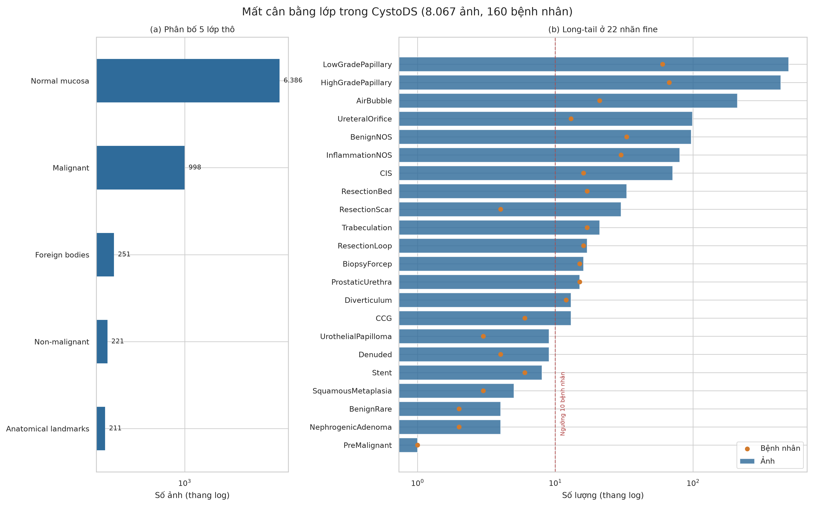
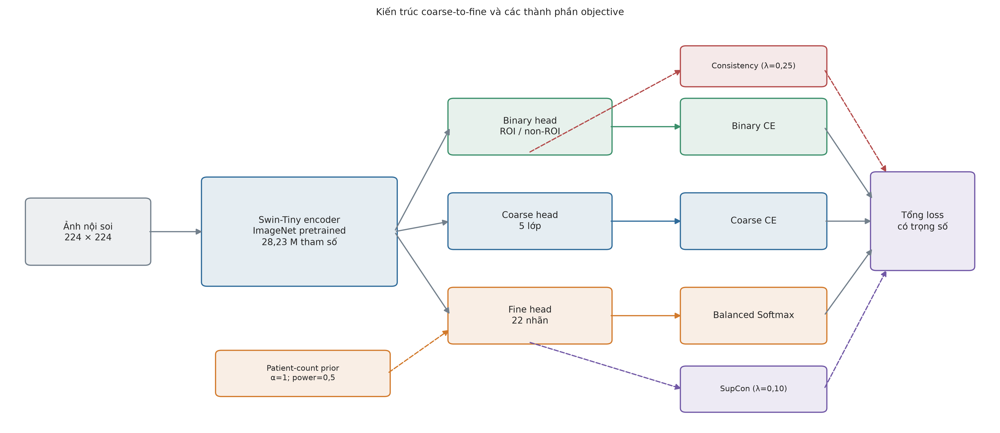
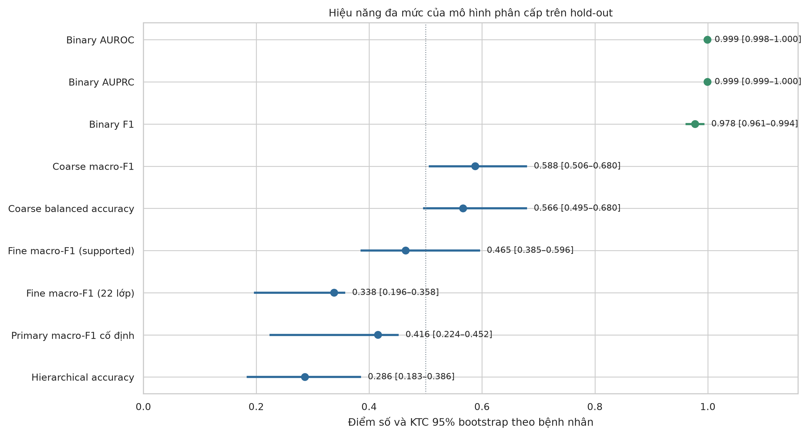
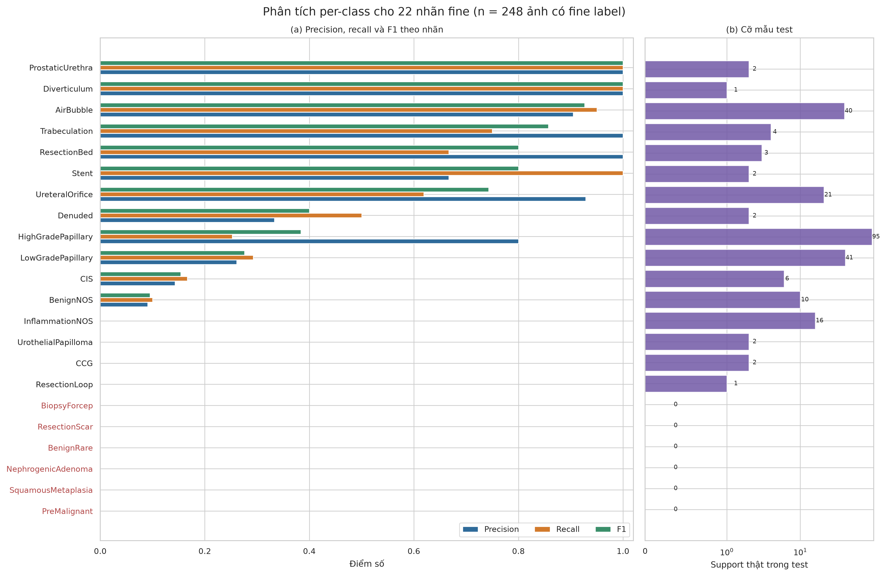
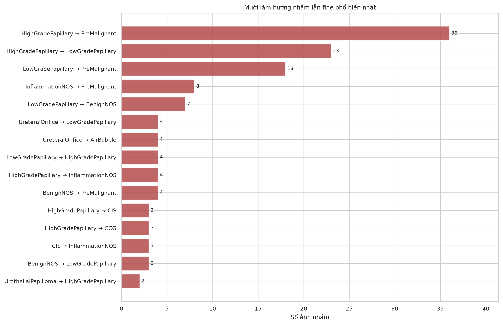
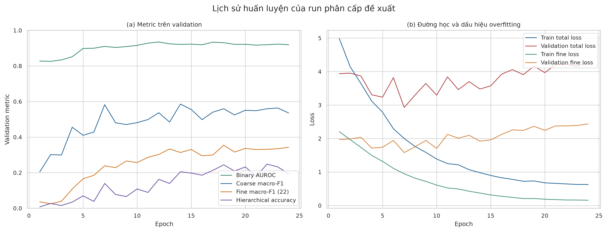
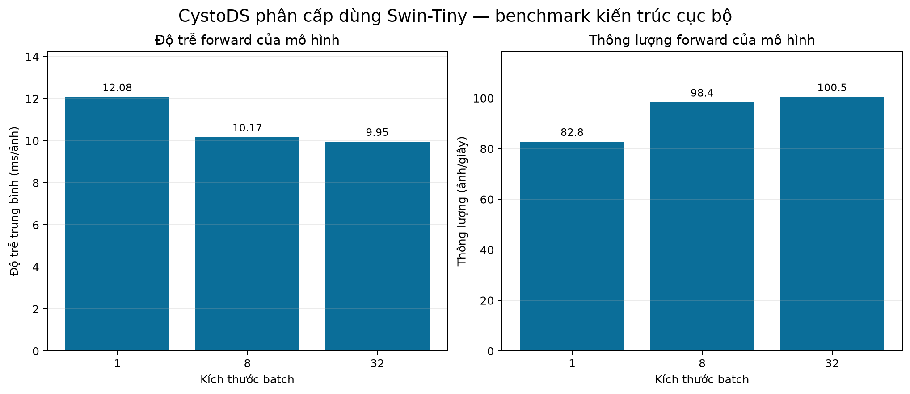

# Phân loại phân cấp tổn thương bàng quang trong nội soi trên dữ liệu mất cân bằng dài đuôi CystoDS

## Một đánh giá đa mức với Swin-Tiny trên hold-out độc lập theo bệnh nhân

**Phiên bản:** 03-08-2026 — bản comprehensive có hình, per-class và error analysis  
**Tình trạng:** bản thảo kết quả nội bộ (development hold-out); các mục chưa có artifact được đánh dấu *chưa đánh giá*, không nội suy hoặc điền kết quả giả

## Tóm tắt

**Bối cảnh.** CystoDS là bộ dữ liệu ảnh nội soi bàng quang công khai gồm 8.067 ảnh từ 160 bệnh nhân, cho phép đồng thời đánh giá phát hiện vùng quan tâm (ROI), phân loại 5 lớp lâm sàng và phân loại 22 nhãn phụ. Bài toán đặc biệt khó vì 79,2% ảnh là niêm mạc bình thường và nhiều nhãn phụ chỉ xuất hiện ở 1–6 bệnh nhân.

**Mục tiêu.** Nghiên cứu này thiết lập một đánh giá nội bộ nhất quán theo bệnh nhân cho ba mức độ hạt: nhị phân ROI/không-ROI, 5 lớp thô và 22 nhãn phụ. Chúng tôi khảo sát huấn luyện đa nhiệm, các loss xử lý long-tail và một mô hình phân cấp có ràng buộc nhất quán giữa các mức nhãn.

**Phương pháp.** Các run nội bộ dùng cùng backbone Swin-Tiny tiền huấn luyện và cùng hold-out 70/15/15, tách rời bệnh nhân; augmentation và lịch huấn luyện có khác biệt giữa một số suite nên so sánh chéo suite được xem là mô tả, còn ablation là nhóm đối chứng gần nhất. Tập benchmark materialized gồm 2.221 ảnh (1.553/339/329 ở train/validation/test), trong đó niêm mạc bình thường được giới hạn 540 ảnh theo giao thức paper-like. Phương pháp phân cấp dùng ba đầu ra nhị phân–thô–fine, Balanced Softmax ở mức fine, prior theo số bệnh nhân có làm trơn, loss nhất quán và supervised contrastive loss. Khoảng tin cậy được bootstrap ở cấp bệnh nhân (1.000 lần lặp).

**Kết quả.** Trên 329 ảnh test từ 24 bệnh nhân, mô hình phân cấp đạt AUROC nhị phân 0,9994 (KTC 95%: 0,9982–1,0000), AUPRC 0,9995 (0,9986–1,0000), F1 0,9775 (0,9606–0,9942), độ nhạy 1,0000 và độ đặc hiệu 0,9484. Ở mức 5 lớp, macro-F1 là 0,5880 (0,5057–0,6798). Ở mức fine, macro-F1 trên các lớp hiện diện trong test là 0,4647; nếu tính mẫu số cố định cho 22 lớp, chỉ số là 0,3380. Mặc dù tín hiệu nhị phân rất mạnh, kết quả fine còn chưa ổn định và mô hình phân cấp đã kích hoạt một cờ an toàn do dự đoán quá mức nhãn `PreMalignant` (69/248 dự đoán fine). Vì vậy, kết quả này cần được xem là bằng chứng khả thi và là mốc baseline trên fixed hold-out, chưa phải một hệ thống sẵn sàng triển khai.

**Kết luận.** Phân tách theo bệnh nhân cho thấy phát hiện ROI có thể đạt hiệu năng cao trong CystoDS, nhưng bài toán phân loại dưới lớp vẫn là thách thức chính do long-tail và cỡ mẫu nhỏ. Các kết quả ủng hộ việc báo cáo theo nhiều mức nhãn, dùng macro-F1 cùng khoảng tin cậy ở cấp bệnh nhân, và tách riêng phân tích nhãn cực hiếm thay vì diễn giải quá mức một con số macro-F1 duy nhất.

**Từ khóa:** nội soi bàng quang; ung thư bàng quang; thị giác máy tính y sinh; phân loại phân cấp; long-tail learning; Swin Transformer; đánh giá theo bệnh nhân.

---

## 1. Đặt vấn đề

Nội soi bàng quang là phương thức thiết yếu để khảo sát tổn thương bàng quang, nhưng ảnh nội soi chứa đồng thời niêm mạc bình thường, tổn thương ác tính, tổn thương không ác tính, mốc giải phẫu và dụng cụ. Vì thế, một mô hình chỉ tối ưu nhị phân ROI/không-ROI chưa phản ánh đầy đủ luồng suy luận lâm sàng: một hệ thống hữu ích còn phải định vị nguy cơ, phân biệt bối cảnh không tổn thương và gợi ý kiểu tổn thương ở độ hạt phù hợp.

CystoDS [1] cung cấp 8.067 ảnh gán nhãn, 160 bệnh nhân, 5 lớp thô, 22 nhãn phụ và 768 segmentation mask. Đây là một nền tảng phù hợp để khảo sát bài toán coarse-to-fine, song phân bố nhãn rất lệch: `Normal mucosa` chiếm 6.386/8.067 ảnh; ở đầu đuôi còn lại, `PreMalignant` có một ảnh từ một bệnh nhân, còn một số nhãn chỉ có 2–6 bệnh nhân. Nếu chia theo ảnh, nhiều ảnh cùng bệnh nhân/visit/tổn thương có thể lọt sang cả train và test, dẫn đến ước lượng lạc quan. Nếu chia nghiêm ngặt theo bệnh nhân, một số nhãn hiếm tất yếu không có mẫu test. Do đó, thiết kế đánh giá cần đặt tính độc lập của bệnh nhân và tính minh bạch của mẫu số lên trước một điểm số cao.

Nghiên cứu có ba câu hỏi: (i) Swin-Tiny có thể tái lập một mốc mạnh cho phát hiện ROI trên split độc lập theo bệnh nhân không? (ii) hiệu năng suy giảm thế nào khi đi từ nhị phân sang 5 lớp và fine-grained? và (iii) các thành phần long-tail/phân cấp cho thấy tín hiệu nào, đồng thời bộc lộ rủi ro nào?

### 1.1. Đóng góp

Nghiên cứu cung cấp bốn đóng góp có thể kiểm chứng. Thứ nhất, toàn bộ baseline, long-tail screen, mô hình đề xuất và ablation dùng cùng fixed patient-disjoint hold-out. Thứ hai, bài toán được đánh giá đồng thời ở ba mức nhị phân–coarse–fine thay vì chỉ ROI/non-ROI. Thứ ba, báo cáo công bố cả mẫu số cố định, support theo lớp, KTC bootstrap theo bệnh nhân và các cờ scientific gate. Thứ tư, mọi checkpoint và kết quả đều có provenance bằng hash/receipt, giúp phân biệt rõ kết quả đã đo với thí nghiệm còn thiếu.

### 1.2. Liên hệ với nghiên cứu trước

Bài báo CystoDS gốc [1] đánh giá bốn backbone ResNet, ResNeXt, HRNet và Swin-Transformer cho nhiệm vụ nhị phân ROI/non-ROI trên một split bệnh nhân riêng. Swin-Transformer được báo cáo tốt nhất với F1 nội bộ 0,856 và F1 ngoại bộ 0,862. Nghiên cứu hiện tại kế thừa động lực dùng hierarchical vision transformer [2] nhưng mở rộng sang 5 lớp và 22 nhãn. Balanced Softmax [3] được khảo sát để hiệu chỉnh tác động prior dài đuôi, còn supervised contrastive learning [4] được dùng như regularizer biểu diễn. Do split và inclusion manifest khác bài báo gốc, các con số giữa hai nghiên cứu chỉ cung cấp bối cảnh, không phải head-to-head comparison.

## 2. Dữ liệu và giao thức đánh giá

### 2.1. Kiểm định dữ liệu

Tệp metadata công khai có 8.067 dòng và 160 `pid` khác nhau. Phân bố ảnh theo lớp thô là: Malignant 998, Non-malignant 221, Normal mucosa 6.386, Anatomical landmarks 211 và Foreign bodies 251. Dữ liệu gồm 7.617 ảnh WLC và 450 ảnh BLC; 768 ảnh có mask segmentation. Kiểm định toàn bộ inventory không phát hiện nhóm ảnh trùng hash.

| Thuộc tính | Giá trị kiểm định |
|---|---:|
| Tổng số ảnh / bệnh nhân | 8.067 / 160 |
| Malignant / Non-malignant | 998 / 221 ảnh |
| Normal mucosa | 6.386 ảnh (79,16%) |
| Anatomical landmarks / Foreign bodies | 211 / 251 ảnh |
| WLC / BLC | 7.617 / 450 ảnh |
| Ảnh có segmentation JSON | 768 (9,52%) |
| Nhóm trùng ảnh theo hash | 0 |
| Nhãn fine | 22; `Normal mucosa` không có fine label |

Một chi tiết cần thiết để tái lập là 503 tên tệp trong CSV mang đuôi `.bmp`, `.jpg` hoặc `.tiff`, nhưng kho ảnh thực tế lưu bằng `.png`. Data loader ánh xạ bằng filename stem sang PNG chuẩn; không bỏ bản ghi và không sinh dữ liệu thay thế.

### 2.2. Taxonomy và long tail

Nhãn fine gồm 22 subclass dưới bốn lớp có tổn thương/bối cảnh; `Normal mucosa` không có nhãn fine và được mask khỏi fine loss. Một vài ví dụ cho thấy độ lệch mạnh: LowGradePapillary (493 ảnh/60 bệnh nhân), HighGradePapillary (433/67), AirBubble (210/21), trong khi PreMalignant (1/1), NephrogenicAdenoma (4/2), BenignRare (4/2) và Stent (8/6). Vì vậy, macro-F1 22 lớp phải luôn được đọc kèm số lớp có support trong tập test.

**Hình 1.** Phân bố 5 lớp thô và 22 nhãn fine. Trục log cho thấy độ chênh nhiều bậc độ lớn; dấu tròn biểu diễn số bệnh nhân, vì đây mới là đơn vị độc lập có ý nghĩa khi chia dữ liệu.

### 2.3. Hold-out khóa trước

Giao thức cố định dùng split 70/15/15 theo bệnh nhân, seed 20260729, với SHA-256 protocol `9b63fdb896ed2769e74b89c0949f97792ca6d9faba4eadd40186d40a7cb40c02`. Ba tập không dùng chung patient ID: train 112 bệnh nhân/1.553 ảnh, validation 24/339 và test 24/329. Đây là benchmark *paper-like*, không phải tái lập chính xác split trong bài báo CystoDS gốc vì danh sách bệnh nhân/tệp bị loại trong benchmark gốc không được công bố.

| Split | Bệnh nhân | Ảnh | Malignant | Non-malignant | Normal | Landmarks | Foreign bodies |
|---|---:|---:|---:|---:|---:|---:|---:|
| Train | 112 | 1.553 | 699 | 159 | 378 | 154 | 163 |
| Validation | 24 | 339 | 157 | 30 | 81 | 26 | 45 |
| Test | 24 | 329 | 142 | 32 | 81 | 31 | 43 |
| Tổng materialized | 160 | 2.221 | 998 | 221 | 540 | 211 | 251 |

Tỷ lệ dương tính nhị phân trong test là 174/329 (52,89%). Fine task chỉ dùng 248 ảnh có fine label; 81 ảnh `Normal mucosa` được mask đúng theo định nghĩa taxonomy. Việc số bệnh nhân cộng theo lớp lớn hơn số bệnh nhân toàn cục là bình thường vì một bệnh nhân có thể đóng góp nhiều lớp ảnh.

Để kiểm soát sự áp đảo của niêm mạc bình thường, giao thức materialize tối đa 540 ảnh Normal mucosa. Không mô hình nào trong Stage 10–40 được phép tự tạo split mới; tất cả bind vào chính protocol và fingerprint dữ liệu này.

## 3. Phương pháp

### 3.1. Backbone và tiền xử lý

Mọi so sánh trong dự án sử dụng `swin_tiny_patch4_window7_224.ms_in1k` tiền huấn luyện ImageNet (28,23 triệu tham số), input 224×224 và cùng split fingerprint. Đây không phải exact reproduction của Swin-Transformer-Large trong benchmark gốc. Việc dùng Swin-Tiny cho toàn bộ Stage 10–40 giữ cố định họ backbone với chi phí tính toán vừa phải, nhưng các suite không đồng nhất hoàn toàn về augmentation/lịch huấn luyện: simplified Stage 10 dùng augmentation bằng 0, trong khi run đề xuất dùng center crop theo trường nhìn (0,92), random resized crop (0,75–1,00), lật ngang/dọc, xoay ±15°, color jitter và random erasing. Vì vậy, so sánh chéo suite là benchmark mô tả; chỉ ablation được thiết kế gần hơn để quy tác động thành phần. Chuẩn hóa dùng thống kê ImageNet. Không có mô hình fallback, dữ liệu tổng hợp hoặc huấn luyện bổ sung ngoài các run đã lưu.

| Thành phần | Cấu hình run đề xuất |
|---|---|
| Backbone / input | Swin-Tiny ImageNet / 224×224 |
| Tổng / trainable parameters | 28.230.679 / 28.230.679 |
| Batch train / validation-test | 128 / 256 |
| Optimizer | fused AdamW; weight decay 0,05 |
| Learning rate head / encoder | 3×10⁻⁴ / 7,5×10⁻⁵ |
| Scheduler / warm-up | cosine / 2 epoch |
| Epoch tối đa / đã chạy | 25 / 24 |
| Precision | BF16; TF32 bật; channels-last |
| Seed | 20260729; deterministic=`false` |
| Early stopping | patience 6; composite hierarchical metric |
| Thiết bị huấn luyện | NVIDIA RTX PRO 6000 Blackwell Server Edition, 94,97 GiB |

Môi trường được ghi tự động tại thời điểm run gồm Linux x86-64, Python 3.13.11, PyTorch 2.11.0+cu130, torchvision 0.26.0+cu130, timm 1.0.28 và CUDA 13.0. Thông tin này thuộc provenance của run; benchmark inference hậu nghiệm trên Apple M4 dùng một môi trường khác và được tách riêng ở Mục 4.10.

### 3.2. Nhiệm vụ và mô hình đối chứng

Ba mức đánh giá được định nghĩa như sau:

| Mức | Đầu ra | Đích đánh giá |
|---|---|---|
| Nhị phân | ROI so với không-ROI | AUROC, AUPRC, F1, độ nhạy, độ đặc hiệu, MCC |
| Thô | 5 lớp lâm sàng | macro-F1, balanced accuracy, MCC, macro-AUROC one-vs-rest |
| Fine | 22 subclass (Normal mucosa được mask) | macro-F1 trên lớp được hỗ trợ và trên toàn bộ 22 lớp |

Các baseline gồm Swin-Tiny đơn nhiệm (binary, coarse, fine), đa nhiệm binary+coarse, đa nhiệm binary+coarse+fine, và 7 loss fine-level (CE, weighted CE, focal, Balanced Softmax, Balanced Softmax có smoothing, logit adjustment, LDAM). Như vậy, backbone và split được giữ cố định; thay đổi chính là cách đặt bài toán/loss.

### 3.3. Phương pháp phân cấp đề xuất

Mô hình đề xuất dùng encoder Swin-Tiny chia sẻ và ba head (h_b,h_c,h_f) cho nhị phân, coarse và fine. Objective là tổng có trọng số của loss nhị phân, cross-entropy coarse, Balanced Softmax fine, loss nhất quán taxonomy và supervised contrastive loss (SupCon) ở fine level:

\[
\mathcal{L}=\mathcal{L}_{bin}+\mathcal{L}_{coarse}+\mathcal{L}_{fine}+0{,}25\mathcal{L}_{cons}+0{,}10\mathcal{L}_{SupCon}.
\]

Prior fine được tính từ số bệnh nhân trong tập train, làm trơn Laplace \(\alpha=1\), lũy thừa 0,5 và bị chặn tỷ lệ 50. Mục đích là giảm ảnh hưởng của số ảnh lặp lại trong cùng bệnh nhân và giảm thiên lệch về lớp đầu. Dropout là 0,2; projection dimension của SupCon là 128; temperature 0,1. Mô hình được tối ưu AdamW (lr 3e-4, encoder multiplier 0,25, weight decay 0,05), tối đa 25 epoch và early stopping patience 6. Run đề xuất dừng sau 24 epoch.

**Hình 2.** Kiến trúc mô hình và các thành phần objective. Prior theo số bệnh nhân chỉ tác động fine head; loss nhất quán liên kết các tầng dự đoán. Sơ đồ mô tả code đã chạy, không hàm ý rằng từng thành phần đều được chứng minh có lợi thống kê.

### 3.4. Hiệu chỉnh fine inference

Prior-tau được chọn chỉ trên validation grid \(\{0;0{,}25;0{,}5;0{,}75;1\}\) theo primary macro-F1. Điểm validation tương ứng là 0,5236; 0,5314; 0,5353; 0,4993 và 0,4508, nên run chọn \(\tau=0{,}5\). Việc test cho thấy collapse về `PreMalignant` chứng minh rằng tối ưu một metric tổng hợp trên validation chưa đủ để kiểm soát lớp có một bệnh nhân; một constraint riêng theo predicted prevalence là cần thiết.

### 3.5. Đánh giá và bất định

Điểm ước lượng được tính ở image level. Với nhị phân, sensitivity = TP/(TP+FN), specificity = TN/(TN+FP), precision = TP/(TP+FP), F1 là trung bình điều hòa precision–recall, balanced accuracy là trung bình sensitivity–specificity, còn MCC tóm tắt cả bốn ô của ma trận nhầm lẫn. AUROC đo khả năng xếp hạng trên mọi threshold; AUPRC được ưu tiên báo cáo kèm AUROC vì nhạy với prevalence dương tính. Với đa lớp, macro-F1 cho mỗi lớp trọng số bằng nhau, weighted-F1 cân theo support, balanced accuracy là trung bình recall theo lớp, MCC là hệ số tương quan đa lớp, và macro-AUROC là trung bình one-vs-rest trên các lớp có cả dương và âm.

Fine macro-F1 được báo cáo theo hai cách: (i) chỉ các lớp có nhãn thật trong test, và (ii) mẫu số cố định 22 lớp, trong đó lớp không xuất hiện có F1 bằng 0 theo quy ước pipeline. Chỉ số thứ hai bảo thủ hơn nhưng không được diễn giải là khả năng khái quát hóa trên các nhãn không có bệnh nhân test. `Hierarchical accuracy` yêu cầu đồng thời coarse head đúng lớp cha và fine head đúng lớp con; `prediction consistency` đo coarse prediction có trùng lớp cha suy ra từ fine prediction; `cross-parent error` đo fine prediction rơi sang lớp cha sai. `Tail recall` là macro-recall trên các lớp có tối đa 20 ảnh train và thực sự hiện diện trong test.

Khoảng tin cậy 95% là percentile bootstrap, tái lấy mẫu theo bệnh nhân 1.000 lần—không tái lấy mẫu theo ảnh—để phản ánh tương quan trong bệnh nhân. Đây là KTC của từng mô hình, không phải KTC của chênh lệch ghép cặp. Không tính p-value khi thiếu vector dự đoán đồng hàng của mô hình đề xuất và baseline.

`Primary fine` là tập 11 class ID được đóng băng từ protocol dựa trên tối thiểu 10 bệnh nhân train: LowGradePapillary, HighGradePapillary, CIS, BenignNOS, InflammationNOS, ResectionBed, Trabeculation, ProstaticUrethra, AirBubble, ResectionLoop và BiopsyForcep. Trong test, BiopsyForcep không có support, vì vậy primary macro-F1 supported dùng 10 lớp, còn primary macro-F1 fixed-denominator vẫn chia cho 11. Danh sách này là canonical từ `taxonomy.json`/`test_metrics.json`; các báo cáo hậu nghiệm dùng danh sách 13 lớp không được dùng làm nguồn số liệu.

## 4. Kết quả

### 4.1. Phát hiện ROI nhị phân

Mô hình phân cấp đạt AUROC 0,9994, AUPRC 0,9995, F1 0,9775, độ nhạy 1,0000, độ đặc hiệu 0,9484, balanced accuracy 0,9742 và MCC 0,9522. Ma trận nhầm lẫn là TN=147, FP=8, FN=0, TP=174 trên 329 ảnh. Bootstrap theo bệnh nhân cho AUROC 0,9982–1,0000; AUPRC 0,9986–1,0000; F1 0,9606–0,9942. Đây là tín hiệu vững chắc cho nhiệm vụ sàng lọc ROI *trên hold-out hiện tại*, nhưng chưa chứng minh tổng quát hóa ngoài trung tâm hoặc giữa thiết bị.

| Cấu hình Swin-Tiny | Accuracy | AUROC | AUPRC | Precision | Sensitivity | Specificity | Balanced acc. | F1 | MCC |
|---|---:|---:|---:|---:|---:|---:|---:|---:|---:|
| Binary đơn nhiệm | 0,9362 | 0,9926 | 0,9936 | 0,9048 | 0,9828 | 0,8839 | 0,9333 | 0,9421 | 0,8749 |
| Multi-task binary+coarse | 0,9696 | 0,9971 | 0,9975 | 0,9556 | 0,9885 | **0,9484** | 0,9684 | 0,9718 | 0,9395 |
| Multi-task binary+coarse+fine | 0,9240 | 0,9903 | 0,9911 | 0,8782 | 0,9943 | 0,8452 | 0,9197 | 0,9326 | 0,8549 |
| **Phân cấp đề xuất** | **0,9757** | **0,9994** | **0,9995** | **0,9560** | **1,0000** | **0,9484** | **0,9742** | **0,9775** | **0,9522** |

So với baseline binary đơn nhiệm, phương pháp phân cấp tăng AUROC từ 0,9926 lên 0,9994 (+0,0068 tuyệt đối) và F1 từ 0,9421 lên 0,9775 (+0,0354). So với baseline đa nhiệm binary+coarse, AUROC tăng từ 0,9971 lên 0,9994 và F1 tăng từ 0,9718 lên 0,9775. Các so sánh này chỉ mang tính mô tả vì mỗi cấu hình mới có một seed và chưa thực hiện kiểm định ghép cặp trên prediction-level.

### 4.2. Kết quả đa mức

| Mức đánh giá của mô hình phân cấp | Điểm test | KTC 95% bootstrap theo bệnh nhân |
|---|---:|---:|
| Binary AUROC | 0,9994 | 0,9982–1,0000 |
| Binary AUPRC | 0,9995 | 0,9986–1,0000 |
| Binary F1 | 0,9775 | 0,9606–0,9942 |
| Coarse macro-F1 (5/5 lớp) | 0,5880 | 0,5057–0,6798 |
| Coarse balanced accuracy | 0,5665 | 0,4953–0,6797 |
| Fine macro-F1 (16 lớp có support test) | 0,4647 | 0,3848–0,5965 |
| Fine macro-F1 (mẫu số cố định 22 lớp) | 0,3380 | 0,1957–0,3578 |
| Primary fine macro-F1 (mẫu số cố định) | 0,4157 | 0,2235–0,4524 |
| Hierarchical accuracy | 0,2863 | 0,1831–0,3856 |

**Hình 3.** Điểm số đa mức và KTC 95% từ 1.000 patient-level bootstrap replicates. KTC của fine metrics rộng hơn nhiều so với binary metrics, phản ánh cỡ mẫu hiệu dụng nhỏ và dị biệt giữa bệnh nhân.

| Chỉ số phân cấp trên 248 ảnh có fine label | Giá trị |
|---|---:|
| Accuracy lớp cha từ coarse head | 0,6371 |
| Accuracy lớp cha suy ra từ fine head | 0,7782 |
| Fine child accuracy | 0,4032 |
| Hierarchical accuracy: cha coarse và con fine cùng đúng | 0,2863 |
| Coarse–fine prediction consistency | 0,7903 |
| Cross-parent error rate | 0,2218 |
| Tail-class macro-recall (8 lớp tail có support test) | 0,5313 |

Fine head suy ra đúng lớp cha ở 77,8% ảnh nhưng chỉ gọi đúng lớp con ở 40,3%; khoảng cách 37,5 điểm phần trăm định lượng phần lỗi xảy ra *trong cùng nhánh taxonomy*. Ngược lại, 22,2% fine predictions rơi sang nhánh cha sai. Coarse–fine consistency 79,0% cho thấy hai head chưa hoàn toàn đồng thuận dù đã có consistency loss; hierarchical accuracy 28,6% thấp hơn cả hai accuracy riêng lẻ vì yêu cầu đồng thời hai quyết định đúng.

Trên 218 ảnh thuộc 11 primary class ID khóa trước, accuracy là 0,3807; macro-F1 trên 10 lớp có support là 0,4573 và macro-F1 mẫu số cố định 11 lớp là 0,4157. Có 78/218 dự đoán (35,8%) rơi ra ngoài primary label set. Vì vậy, primary metric không nên được đọc tách khỏi tỷ lệ dự đoán ngoài tập này.

Sự chênh lệch giữa macro-F1 fine trên lớp có support (0,4647) và mẫu số 22 lớp (0,3380) không phải mâu thuẫn: test chỉ có nhãn thật ở 16/22 fine classes. Khi mẫu số cố định phạt các lớp không có test support, nó đo độ bao phủ theo taxonomy chứ không phải độ chính xác có thể ước lượng cho sáu lớp vắng mặt.

Ở coarse level, F1 cao nhất thuộc Malignant (0,8041), Normal mucosa (0,7813) và Foreign bodies (0,7324). Hai nút thắt chính là Non-malignant (F1 0,1935; recall 6/32 = 18,8%) và Anatomical landmarks (F1 0,4286; recall 9/31 = 29,0%). Điều này cho thấy mô hình nhị phân có thể tách ROI tốt nhưng không đồng nghĩa với việc phân loại đúng ngữ cảnh bệnh học/cấu trúc ở độ hạt cao.

### 4.3. Kết quả 5 lớp và per-class analysis

| Cấu hình | Accuracy | Macro-F1 | Weighted-F1 | Balanced accuracy | MCC | Macro-AUROC |
|---|---:|---:|---:|---:|---:|---:|
| Coarse đơn nhiệm | 0,7264 | 0,6531 | 0,7282 | 0,6543 | 0,6209 | 0,9152 |
| Multi-task binary+coarse | **0,7477** | **0,6710** | **0,7442** | **0,6518** | **0,6448** | 0,8969 |
| Multi-task binary+coarse+fine | 0,6170 | 0,4682 | 0,5922 | 0,4549 | 0,4460 | 0,8758 |
| Phân cấp đề xuất | 0,7082 | 0,5880 | 0,6943 | 0,5665 | 0,5887 | **0,9150** |

Mô hình đề xuất không đứng đầu coarse classification: multi-task binary+coarse cao hơn 0,0830 macro-F1 tuyệt đối. Điều này là một negative result có giá trị: thêm fine objective, consistency và SupCon không tự động cải thiện lớp cha. Macro-AUROC của mô hình đề xuất vẫn cao (0,9150), nhưng khoảng cách giữa ranking ability và quyết định argmax gợi ý cần calibration/thresholding theo lớp.

| Lớp coarse | Support thật | Dự đoán | Precision | Recall | F1 | AUROC OVR |
|---|---:|---:|---:|---:|---:|---:|
| Malignant | 142 | 149 | 0,7852 | 0,8239 | 0,8041 | 0,9175 |
| Non-malignant | 32 | 30 | 0,2000 | 0,1875 | 0,1935 | 0,8348 |
| Normal mucosa | 81 | 111 | 0,6757 | 0,9259 | 0,7813 | 0,9512 |
| Anatomical landmarks | 31 | 11 | 0,8182 | 0,2903 | 0,4286 | 0,9027 |
| Foreign bodies | 43 | 28 | 0,9286 | 0,6047 | 0,7324 | 0,9689 |

**Hình 4.** Ma trận nhầm lẫn 5 lớp chuẩn hóa theo hàng. Hai lỗi có ý nghĩa nhất là Non-malignant→Malignant (26/32; 81,2%) và Anatomical landmarks→Normal mucosa (20/31; 64,5%). Lỗi đầu tạo nguy cơ tăng cảnh báo/biopsy không cần thiết; lỗi sau phản ánh sự tương đồng nền hình ảnh nhưng ít nguy hiểm hơn về mặt bỏ sót ROI.

### 4.4. Fine-grained classification và phân tích 22 lớp

| Cấu hình | Accuracy | Macro-F1 supported | Macro-F1 22 lớp | Weighted-F1 | Balanced accuracy | MCC | Macro-AUROC | Primary F1 cố định |
|---|---:|---:|---:|---:|---:|---:|---:|---:|
| Fine đơn nhiệm | **0,5282** | 0,3756 | 0,2731 | **0,5285** | 0,3978 | **0,4135** | 0,8460 | 0,3423 |
| Multi-task binary+coarse+fine | 0,4597 | 0,4448 | 0,3235 | 0,4670 | **0,4824** | 0,3311 | 0,8575 | **0,4369** |
| Phân cấp đề xuất | 0,4032 | **0,4647** | **0,3380** | 0,4579 | 0,4561 | 0,3565 | **0,8613** | 0,4157 |

Phương pháp đề xuất cao nhất ở macro-F1 supported và fixed 22-class, nhưng thấp hơn fine đơn nhiệm về accuracy/weighted-F1 và thấp hơn multi-task ba head về primary fixed-denominator F1. Điều này cho thấy mục tiêu macro cải thiện độ bao phủ trung bình trong khi hy sinh hiệu quả ở các lớp đầu; không nên rút gọn kết quả thành tuyên bố “tốt nhất ở mọi metric”.

| ID | Fine class | Support thật | Dự đoán | Precision | Recall | F1 | AUROC OVR |
|---:|---|---:|---:|---:|---:|---:|---:|
| 0 | LowGradePapillary | 41 | 46 | 0,2609 | 0,2927 | 0,2759 | 0,7326 |
| 1 | HighGradePapillary | 95 | 30 | 0,8000 | 0,2526 | 0,3840 | 0,7338 |
| 2 | CIS | 6 | 7 | 0,1429 | 0,1667 | 0,1538 | 0,8767 |
| 3 | PreMalignant | 0 | 69 | N/A | N/A | N/A | N/A |
| 4 | BenignNOS | 10 | 11 | 0,0909 | 0,1000 | 0,0952 | 0,7599 |
| 5 | InflammationNOS | 16 | 7 | 0,0000 | 0,0000 | 0,0000 | 0,6569 |
| 6 | CCG | 2 | 6 | 0,0000 | 0,0000 | 0,0000 | 0,8333 |
| 7 | Denuded | 2 | 3 | 0,3333 | 0,5000 | 0,4000 | 0,7846 |
| 8 | UrothelialPapilloma | 2 | 0 | 0,0000 | 0,0000 | 0,0000 | 0,4187 |
| 9 | SquamousMetaplasia | 0 | 0 | N/A | N/A | N/A | N/A |
| 10 | NephrogenicAdenoma | 0 | 1 | N/A | N/A | N/A | N/A |
| 11 | BenignRare | 0 | 0 | N/A | N/A | N/A | N/A |
| 12 | UreteralOrifice | 21 | 14 | 0,9286 | 0,6190 | 0,7429 | 0,9885 |
| 13 | ResectionBed | 3 | 2 | 1,0000 | 0,6667 | 0,8000 | 1,0000 |
| 14 | ResectionScar | 0 | 0 | N/A | N/A | N/A | N/A |
| 15 | Trabeculation | 4 | 3 | 1,0000 | 0,7500 | 0,8571 | 1,0000 |
| 16 | ProstaticUrethra | 2 | 2 | 1,0000 | 1,0000 | 1,0000 | 1,0000 |
| 17 | Diverticulum | 1 | 1 | 1,0000 | 1,0000 | 1,0000 | 1,0000 |
| 18 | AirBubble | 40 | 42 | 0,9048 | 0,9500 | 0,9268 | 0,9959 |
| 19 | ResectionLoop | 1 | 0 | 0,0000 | 0,0000 | 0,0000 | 1,0000 |
| 20 | BiopsyForcep | 0 | 1 | N/A | N/A | N/A | N/A |
| 21 | Stent | 2 | 3 | 0,6667 | 1,0000 | 0,8000 | 1,0000 |

`N/A` được dùng thay vì 0 khi test không có mẫu thật, vì precision/recall/F1 không thể đánh giá cho một lớp vắng mặt. Pipeline lưu giá trị 0 để bảo toàn vector metric có mẫu số cố định, nhưng paper cần phân biệt “không quan sát” với “quan sát và thất bại”. Các AUROC bằng 1 ở lớp có 1–2 ảnh không chứng minh phân biệt hoàn hảo; chúng cực kỳ nhạy với một quan sát.

**Hình 5.** Precision–recall–F1 và support thật cho mọi nhãn fine. Chữ đỏ đánh dấu lớp không có support test. Sự tương phản giữa AirBubble (n=40, F1=0,9268) và các lớp đạt F1=1 với n=1–2 minh họa lý do phải luôn báo cáo cỡ mẫu.

Fine error matrix cho thấy 36 HighGradePapillary và 18 LowGradePapillary bị gán `PreMalignant`; riêng hai hướng này chiếm 54/148 lỗi fine (36,5%). Ngoài collapse hiếm, nhầm lẫn nội nhóm u nhú cũng đáng kể: 23 HighGradePapillary→LowGradePapillary và 4 theo chiều ngược lại. InflammationNOS→PreMalignant (8/16) và UrothelialPapilloma→HighGradePapillary (2/2) là các lỗi vượt lớp cha, có thể dẫn tới overcalling ác tính. Ngược lại, CIS có 3/6 ảnh bị nhầm thành InflammationNOS, là hướng undercalling cần ưu tiên trong đánh giá an toàn.

| Mẫu lỗi ưu tiên | Số ảnh / mẫu số liên quan | Kiểu lỗi | Diễn giải và hành động đề xuất |
|---|---:|---|---|
| Binary false positive | 8/155 ảnh âm | Overcalling ROI | Đo burden cảnh báo ở cấp video/bệnh nhân; hiệu chỉnh threshold theo use case |
| Non-malignant→Malignant | 26/32 | Overcalling lớp cha | Rà morphologic confounders và chi phí biopsy không cần thiết |
| Anatomical landmarks→Normal mucosa | 20/31 | Bỏ sót bối cảnh | Bổ sung phân tích theo vị trí giải phẫu/field of view |
| HighGradePapillary→PreMalignant | 36/95 | Rare-class collapse | Chặn model selection; hiệu chỉnh prior và predicted-prevalence guardrail |
| HighGradePapillary→LowGradePapillary | 23/95 | Nhầm trong cùng lớp cha | Cần pathology-aligned grading và đánh giá disagreement nhãn |
| CIS→InflammationNOS | 3/6 | Undercalling nguy cơ cao | Ưu tiên safety review; báo KTC vì support rất nhỏ |
| Fine prediction sang sai lớp cha | 55/248 | Cross-parent | Phân tích calibration theo nhánh và consistency constraint |

Đây là phân tích lỗi theo count aggregate, không phải chart review. Không có confidence, patient ID, modality hoặc ảnh tương ứng trong artifact proposed hiện tại, nên các giả thuyết hình thái trong cột cuối phải được kiểm chứng sau khi phục hồi prediction CSV.

**Hình 6.** Mười lăm hướng nhầm lẫn fine phổ biến nhất, trích trực tiếp từ ma trận canonical trong `test_metrics.json`. Do prediction CSV của run đề xuất hiện không còn trên disk, phân tích này ở mức aggregate; chưa thể gắn từng lỗi với ảnh cụ thể, confidence hoặc modality.

### 4.5. Benchmark baseline và long-tail screen

| Loss fine-level | Accuracy | Macro-F1 supported | Macro-F1 22 lớp | Weighted-F1 | Balanced accuracy | MCC | Macro-AUROC | Primary F1 cố định |
|---|---:|---:|---:|---:|---:|---:|---:|---:|
| Cross-entropy | 0,4597 | 0,1775 | 0,1291 | 0,4437 | 0,1946 | 0,3587 | 0,8378 | 0,2199 |
| Weighted CE | 0,3226 | 0,3248 | 0,2362 | 0,3440 | 0,3480 | 0,2559 | **0,8483** | 0,3607 |
| Focal | 0,4355 | 0,1916 | 0,1393 | 0,4269 | 0,1947 | 0,3171 | 0,8326 | 0,2410 |
| Balanced Softmax | 0,4274 | **0,3491** | **0,2539** | 0,4747 | **0,3722** | 0,3391 | 0,8404 | **0,4315** |
| Balanced Softmax + smoothing | 0,4516 | 0,1914 | 0,1392 | 0,4480 | 0,2164 | 0,3557 | 0,8347 | 0,2369 |
| Logit adjustment | 0,4274 | **0,3491** | **0,2539** | 0,4747 | **0,3722** | 0,3391 | 0,8404 | **0,4315** |
| LDAM | **0,5282** | 0,2089 | 0,1519 | **0,5177** | 0,2343 | **0,4010** | 0,8159 | 0,2942 |

Kết quả screen cho thấy accuracy và macro-F1 có thể xếp hạng loss theo hướng khác nhau: LDAM cao nhất về accuracy nhưng Balanced Softmax/logit adjustment cao nhất về macro-F1 và primary metric. Hai cấu hình sau cho kết quả giống nhau đến bốn chữ số trên run này; điều đó không chứng minh chúng tương đương nói chung. Smoothing làm giảm primary F1 từ 0,4315 xuống 0,2369 trong screen đơn nhiệm, cảnh báo rằng smoothing/prior phải được kiểm soát bằng ablation và calibration theo lớp.

**Hình 7.** So sánh loss và ablation trên fixed hold-out. Tất cả là một seed; chiều dài thanh và dấu chấm không kèm KTC chênh lệch, do đó chỉ dùng để phát sinh giả thuyết.

### 4.6. Ablation và phát hiện an toàn quan trọng

| Cấu hình | Binary F1 | Coarse macro-F1 | Fine F1 supported | Fine F1 22 lớp | Primary F1 cố định | Hierarchical accuracy |
|---|---:|---:|---:|---:|---:|---:|
| Proposed | 0,9775 | 0,5880 | 0,4647 | 0,3380 | 0,4157 | 0,2863 |
| Flat fine CE | — | — | 0,4227 | 0,3074 | 0,4037 | — |
| Multi-task, no hierarchy | 0,9609 | 0,5975 | 0,2376 | 0,1728 | 0,2306 | 0,3669 |
| Hierarchical CE | 0,9630 | 0,6017 | 0,3398 | 0,2472 | 0,3539 | **0,4113** |
| No binary auxiliary | — | 0,5766 | 0,4104 | 0,2985 | 0,3782 | 0,2863 |
| No consistency | **0,9797** | 0,5782 | 0,4632 | 0,3369 | 0,4539 | 0,3387 |
| No SupCon | 0,9742 | **0,6106** | 0,3887 | 0,2827 | 0,3208 | 0,1411 |
| Class-balanced sampler | 0,9647 | 0,5462 | 0,4861 | 0,3535 | 0,4690 | 0,1774 |
| Train WLC only† | 0,9683 | 0,5412 | **0,5053** | **0,3675** | **0,5075** | 0,3387 |
| Train all + WLC subanalysis† | 0,9719 | 0,5640 | 0,4738 | 0,3446 | 0,3927 | 0,2581 |

† Các giá trị trong bảng lớn vẫn là `test_metrics` trên full test 329 ảnh. Hai run còn xuất riêng WLC-only metric trên 265 ảnh (184 ảnh có fine label), trình bày dưới đây. Run `train WLC only` thay đổi population train nên không phải component ablation thuần túy.

| Training modality → WLC-only evaluation | Binary F1 | Coarse macro-F1 | Fine F1 supported | Fine F1 22 lớp | Primary F1 cố định |
|---|---:|---:|---:|---:|---:|
| All modalities → WLC test | 0,9610 | 0,5356 | 0,4505 | 0,3276 | 0,4196 |
| WLC only → WLC test | **0,9735** | **0,5548** | **0,5264** | **0,3828** | **0,5205** |

Trên split WLC này, huấn luyện WLC-only cao hơn ở mọi metric liệt kê; đây có thể là domain-specific benefit hoặc hệ quả cỡ mẫu/BLC shift. Chưa có paired CI/p-value và không nên suy rộng rằng loại BLC luôn có lợi.

Không thành phần nào thắng trên mọi metric. Bỏ consistency gần như giữ nguyên fine macro-F1 22 lớp (0,3369 so với 0,3380) và còn tăng primary F1; bỏ SupCon lại tăng coarse macro-F1 nhưng làm giảm fine/hierarchical metrics. Class-balanced sampler và WLC-only cao hơn proposed ở fine metrics nhưng thấp hơn ở binary/coarse hoặc thay đổi population. Vì không có nhiều seed hay paired CI, các chênh lệch này chưa đủ để gán hiệu quả nhân quả cho từng thành phần.

Quan trọng hơn, kiểm tra `rare_class_collapse` của chính run đề xuất có trạng thái **failed**. `PreMalignant` chỉ có một ảnh/một bệnh nhân train, không có mẫu test thật, nhưng được dự đoán ở 69/248 ảnh fine (27,8%), vượt ngưỡng guardrail nội bộ 11,2%. Do đó:

- Không thể dùng thành tích của mô hình đề xuất để tuyên bố cải thiện tin cậy ở `PreMalignant`.
- Không có cơ sở để diễn giải 100% sensitivity như bằng chứng mô hình phát hiện tốt subclass ác tính hiếm; chỉ có thể nói nó không bỏ sót ROI dương tính trong test này.
- Calibration/prior cho nhãn cực hiếm là một rủi ro kỹ thuật cần sửa trước khi chọn mô hình cuối cùng.

### 4.7. Learning dynamics và chi phí huấn luyện

Train loss giảm từ 4,99 xuống khoảng 0,64, trong khi validation loss đạt đáy quanh epoch 7–8 rồi tăng lên trên 4 ở cuối run. Train fine macro-F1 đạt 0,9228, cao hơn nhiều test fine macro-F1 0,3380; train hierarchical accuracy 0,8766 so với test 0,2863. Khoảng cách lớn xác nhận overfitting ở các head hạt mịn dù binary validation AUROC khá ổn định.

| Split | Binary AUROC | Binary F1 | Coarse macro-F1 | Coarse accuracy | Fine F1 22 lớp | Fine F1 supported | Fine accuracy | Hier. accuracy | Total loss |
|---|---:|---:|---:|---:|---:|---:|---:|---:|---:|
| Train | 1,0000 | 0,9977 | 0,9877 | 0,9897 | 0,9228 | 0,9228 | 0,8826 | 0,8766 | 0,1699 |
| Validation | 0,9306 | 0,8629 | 0,5594 | 0,6903 | 0,3548 | 0,4591 | 0,3411 | 0,2442 | 3,9087 |
| Test | 0,9994 | 0,9775 | 0,5880 | 0,7082 | 0,3380 | 0,4647 | 0,4032 | 0,2863 | 3,2075 |

Validation thấp hơn test ở binary task không phải bằng chứng leakage; hai split có 24 bệnh nhân nhưng thành phần bệnh nhân/ca khó khác nhau. Tuy vậy, sự chênh lớn nhấn mạnh rằng một hold-out duy nhất không đủ ước lượng độ ổn định.

**Hình 8.** Validation metrics và train/validation losses qua 24 epoch. Early stopping theo composite metric giảm rủi ro nhưng không loại bỏ divergence của fine loss.

| Thuộc tính compute của run đề xuất | Giá trị |
|---|---:|
| Epoch hoàn tất | 24 |
| Tổng thời gian train ghi nhận | 323,13 giây |
| Throughput train trung bình / tối đa | 115,47 / 121,97 ảnh/giây |
| CUDA peak allocated / reserved | 17.838,90 / 18.098,00 MiB |
| GPU | RTX PRO 6000 Blackwell, 94,97 GiB |
| Precision / batch | BF16 / 128 |
| Checkpoint size | 112.988.870 byte (~107,8 MiB) |

Các con số trên mô tả *training run*, không phải latency triển khai. Thời gian 323 giây không bao gồm toàn bộ overhead chuẩn bị dữ liệu, upload/xác minh checkpoint hoặc các stage khác.

### 4.8. Nhãn hiếm: điều gì có thể và không thể kết luận

Test fine có 248 ảnh và chỉ chứa 16/22 nhãn. Sáu lớp không có nhãn thật trong test gồm PreMalignant, SquamousMetaplasia, NephrogenicAdenoma, BenignRare, ResectionScar và BiopsyForcep. Hơn nữa, nhiều lớp hiện diện chỉ có 1–2 ảnh test (ví dụ Diverticulum, ResectionLoop; CCG, Denuded, UrothelialPapilloma và Stent). Một kết quả F1 bằng 0 hoặc 1 với 1–2 ảnh không có độ chính xác thống kê đủ để khẳng định năng lực lâm sàng.

Vì vậy, báo cáo chính nên giữ hai tầng: (a) task nhị phân và 5 lớp trên toàn test; (b) fine-grained với support và mẫu số nêu tường minh. Phân tích nhãn cực hiếm chỉ nên có tính mô tả—hướng nhầm lẫn, lớp cha dự đoán, phân bố xác suất—cho đến khi có cohort độc lập hay cross-validation bảo đảm mỗi nhãn được đánh giá trên nhiều bệnh nhân.

**Hình 9.** Mười ảnh thật từ fixed test hold-out, hai ảnh cho mỗi coarse class, chọn xác định theo filename. Hình chỉ minh họa biến thiên thị giác/modality; không phải các ca được chọn theo đúng/sai dự đoán vì prediction CSV của proposed run đang thiếu.

### 4.9. Explainability và Grad-CAM

**Trạng thái: chưa có kết quả Grad-CAM hợp lệ.** Checkpoint tốt nhất của run đề xuất là remote-only trong repository Hugging Face private; local checkpoint đã được xóa sau khi xác minh upload. Receipt ghi commit bất biến `2dc6122b0af33f605e30ef329baa3d81a4101db9`, kích thước 112.988.870 byte và SHA-256 `554abf5c42a3a1f0e049e9ddba97c02e4677341ce399aa728cfaa1a3ad3ad68d`. Môi trường phân tích hiện không có `HF_TOKEN`; tải ẩn danh trả HTTP 401. Tạo heatmap bằng random weights hoặc ImageNet-only weights sẽ không giải thích mô hình đã báo cáo, nên không được thực hiện.

Target layer phù hợp cho Swin đã được kiểm tra về hình dạng là `encoder.layers[-1].blocks[-1].norm1`, activation 7×7×768, với reshape-transform về spatial map. Khi checkpoint được cung cấp, protocol explainability không-training nên gồm:

1. Grad-CAM/LayerCAM riêng cho binary, coarse và fine logit, trên cùng ảnh để kiểm tra sự dịch chuyển vùng chú ý theo tầng taxonomy.
2. Chọn ca đúng tự tin cao, đúng tự tin thấp, false positive binary, lỗi cross-parent và lỗi `PreMalignant` collapse; không cherry-pick chỉ heatmap đẹp.
3. Định lượng trên 109 ảnh test có segmentation: LowGradePapillary 15, HighGradePapillary 33, UreteralOrifice 21 và AirBubble 40.
4. Báo cáo pointing-game accuracy, energy-inside-mask, IoU/Dice sau threshold và KTC bootstrap theo bệnh nhân; Grad-CAM chỉ là localization explanation, không phải causal explanation.
5. Sanity check bằng randomization trọng số/nhãn và so với center-bias baseline để tránh heatmap hợp lý về mặt thị giác nhưng không phụ thuộc mô hình.

### 4.10. Inference benchmark

Do checkpoint private chưa truy cập được, benchmark hiện có là **architecture-equivalent microbenchmark**, không phải benchmark checkpoint trained và không phải benchmark trên RTX PRO 6000. Kiến trúc được instantiate đúng graph/config và khớp 28.230.679 tham số; thay đổi giá trị weight không làm đổi số phép toán, nhưng có thể ảnh hưởng compile/cache và không cho phép kiểm tra output correctness.

| Thiết bị / precision | Batch | Forward latency trung bình | P95 | Throughput |
|---|---:|---:|---:|---:|
| Apple M4 MPS / FP32 | 1 | 12,081 ms/ảnh | 13,367 ms | 82,776 ảnh/giây |
| Apple M4 MPS / FP32 | 8 | 10,167 ms/ảnh | — | 98,360 ảnh/giây |
| Apple M4 MPS / FP32 | 32 | 9,954 ms/ảnh | — | 100,459 ảnh/giây |
| Apple M4 MPS / FP32, end-to-end warm cache | 1 | 15,000 ms/ảnh | 15,842 ms | 66,665 ảnh/giây |

Thời gian preprocessing batch-1 trung bình là 1,291 ms/ảnh. End-to-end ở đây gồm decode/resize/normalize và forward trong điều kiện warm-cache, không gồm I/O camera, truyền mạng, post-processing hệ thống hay concurrency lâm sàng.

**Hình 10.** Latency và throughput kiến trúc tương đương trên Apple M4 MPS/FP32. Con số không được chuyển đổi sang FPS của GPU huấn luyện hoặc dùng làm bằng chứng triển khai thời gian thực trên thiết bị khác.

### 4.11. Tính đầy đủ của artifact

Manifest của proposed run khai báo `predictions/holdout/{train,val,test}_image_predictions.csv`, trong đó test CSV có hash/kích thước kỳ vọng, nhưng thư mục `predictions/` hiện vắng mặt. Chỉ năm test prediction CSV hiện hữu đều thuộc Stage 10; toàn bộ 32 PNG gốc của pipeline cũng thuộc Stage 10. Hậu quả là summary/per-class/confusion analysis vẫn tái lập từ canonical JSON, nhưng chưa thể thực hiện paired significance, confidence calibration, error-by-modality, case-level gallery hoặc Grad-CAM gắn với lỗi cụ thể. Cần khôi phục CSV từ archive hoặc chạy inference lại bằng exact checkpoint; không cần training.

| Hạng mục bằng chứng | Trạng thái trong paper | Có cần training? | Đầu vào còn thiếu / giới hạn |
|---|---|---:|---|
| Binary, coarse, fine và hierarchy metrics | Đã báo cáo đầy đủ | Không | Canonical JSON hiện hữu |
| Per-class, confusion và aggregate error pairs | Đã báo cáo | Không | Thiếu prediction CSV nên chưa xem lỗi theo từng ảnh |
| Patient-level KTC 95% | Đã có, 1.000 bootstrap | Không | Là KTC từng model, chưa phải paired difference |
| Long-tail screen, ablation, WLC subanalysis | Đã có | Không | Một seed; một số suite khác augmentation/population |
| Learning curves, train compute và checkpoint size | Đã có | Không | Không đại diện latency triển khai |
| Calibration chọn prior-tau | Đã có trên validation | Không | Chưa có ECE, Brier, reliability diagram trên test |
| Grad-CAM/LayerCAM gallery | Chưa đánh giá | Không | Cần exact checkpoint và tái inference |
| Explainability định lượng trên mask | Protocol đã định nghĩa; chưa đánh giá | Không | Exact checkpoint; 109 test masks đã xác định |
| Inference latency | Đã có microbenchmark kiến trúc tương đương | Không | Cần exact checkpoint và target hardware cho benchmark triển khai |
| Paired statistical significance | Chưa đánh giá | Không | Cần proposed prediction CSV khớp từng ảnh với baseline |
| External validation của model dự án | Chưa đánh giá | Không | Cần external image root, patient manifest, label mapping và checkpoint |
| 5-fold CV, multi-seed và backbone/SOTA head-to-head | Chưa chạy | **Có** | Cần ngân sách training và protocol khóa trước |

## 5. Thảo luận

### 5.1. Ý nghĩa khoa học

Đóng góp thực nghiệm rõ nhất không phải là một mô hình có điểm số cao duy nhất, mà là một khung benchmark có provenance: taxonomy được đóng băng, split theo bệnh nhân được khóa bằng hash, checkpoints có receipt bất biến và metrics/predictions lưu theo từng run. Thiết kế này làm cho so sánh giữa binary, coarse, fine, long-tail và ablation có thể kiểm tra lại.

Kết quả xác nhận một khoảng cách quan trọng giữa sàng lọc và chẩn đoán hạt mịn. AUROC/F1 nhị phân rất cao đồng thời tồn tại với macro-F1 coarse chỉ 0,5880 và fine 0,3380 theo mẫu số taxonomy. Trong bối cảnh nội soi, đây là lập luận thực tế để không trình bày một kết quả ROI mạnh như thể hệ thống đã phân loại tin cậy mọi tổn thương.

### 5.2. Đối chiếu benchmark CystoDS đã công bố

| Nguồn/model | Miền test | Sensitivity | Specificity | Accuracy | Precision | F1 | AUROC / AUPRC |
|---|---|---:|---:|---:|---:|---:|---:|
| Published ResNet | CystoDS internal, 219 ảnh/17 BN | 0,692 | 0,787 | 0,731 | 0,826 | 0,753 | Không báo cáo |
| Published ResNeXt | Như trên | 0,754 | 0,787 | 0,767 | 0,838 | 0,794 | Không báo cáo |
| Published HRNet | Như trên | 0,692 | 0,910 | 0,781 | 0,918 | 0,789 | Không báo cáo |
| Published Swin-Transformer-Large | Như trên | 0,846 | 0,809 | 0,831 | 0,866 | 0,856 | Không báo cáo |
| Published ResNet | External Lazo | 0,664 | 0,746 | 0,708 | 0,694 | 0,678 | Không báo cáo |
| Published ResNeXt | External Lazo | 0,506 | 0,779 | 0,584 | 0,851 | 0,634 | Không báo cáo |
| Published HRNet | External Lazo | 0,555 | 0,575 | 0,561 | 0,764 | 0,643 | Không báo cáo |
| Published Swin-Transformer-Large | External Lazo | 0,853 | 0,890 | 0,873 | 0,870 | 0,862 | Không báo cáo |
| Project Swin-Tiny binary baseline | Internal paper-like, 329 ảnh/24 BN | 0,9828 | 0,8839 | 0,9362 | 0,9048 | 0,9421 | 0,9926 / 0,9936 |
| Project hierarchical Swin-Tiny | Cùng split dự án | 1,0000 | 0,9484 | 0,9757 | 0,9560 | 0,9775 | 0,9994 / 0,9995 |

Bảng trên cố ý không tô đậm “người thắng”. Benchmark công bố dùng 2.217 ảnh, 994 malignant và test 219 ảnh/17 bệnh nhân; dự án dùng 2.221 ảnh, 998 malignant và test 329 ảnh/24 bệnh nhân. Official author code cho thấy Swin-Transformer-Large, còn dự án dùng Swin-Tiny. Vì không có manifest bốn ảnh malignant bị loại và PID split gốc, so sánh numerical cross-row không tạo thành bằng chứng vượt SOTA.

### 5.3. Bối cảnh SOTA ngoài CystoDS

| Nghiên cứu | Nhiệm vụ/dữ liệu | Kết quả tiêu biểu được công bố | Lý do không xếp hạng trực tiếp |
|---|---|---|---|
| Shkolyar *et al.* [5] | Video WLC, detection/localization | Frame sensitivity 90,9%; specificity 98,6% | Video detection, không phải image classification |
| Wu *et al.* [6] | 69.204 ảnh/10.729 BN/6 trung tâm, cancer-control | Internal accuracy 0,977; external 0,978–0,991 | Cohort/prevalence/nhãn khác |
| Lazo *et al.* [7] | 1.754 ảnh/23 BN; 4 lớp WLI/NBI | WLI accuracy/precision/recall 0,90/0,88/0,89 | Taxonomy 4 lớp khác CystoDS |
| Jia *et al.* [8] | Object detection WLC | F1 0,964; AP 0,914 | Có bounding box, endpoint khác |
| Abd El-Aziz *et al.* [9] | EBTC/Lazo 4 lớp | EfficientNet-B3 accuracy 0,9903; F1 0,9736 | Không dùng CystoDS |
| Wang *et al.* [10] | NBI đa trung tâm, segmentation+cancer+grade | Cancer internal/external accuracy 0,919/0,931 | NBI, multitask và cohort khác |
| Zhang *et al.* [11] | Tumor/cystitis/scar | Classification AUC 0,872 | Nhãn và tiêu chí chọn model khác |

Lĩnh vực chưa có leaderboard chung cho CystoDS 5-class/22-subclass. “SOTA” chỉ có nghĩa khi cùng dataset version, manifest, split, task, metric và unit of analysis. Do đó, nghiên cứu hiện tại nên tự mô tả là *paper-like multi-level benchmark* thay vì SOTA.

### 5.4. External validation và statistical significance: trạng thái hiện tại

**External validation chưa chạy cho checkpoint dự án.** Các số external Lazo trong bảng là của tác giả CystoDS, không phải kết quả của mô hình này. Để chạy đúng, cần external manifest, mapping nhãn ROI/non-ROI được công bố trước, exact checkpoint và chính sách xử lý patient ID/ảnh trùng. Không fine-tune trên external test.

**Significance pairwise chưa tính được.** Patient bootstrap hiện tại cung cấp KTC cho từng metric của proposed run, không kiểm định chênh lệch với baseline. Paired McNemar cho binary cần hai prediction trên cùng ảnh; paired patient bootstrap/permutation cho macro-F1 cần vector dự đoán của cả hai mô hình. Baseline Stage 10 có CSV nhưng proposed CSV đang thiếu, nên mọi p-value hiện tại sẽ là bịa đặt. Sau khi khôi phục prediction, protocol nên báo cáo chênh lệch tuyệt đối, KTC 95%, p-value hai phía và hiệu chỉnh Holm cho nhiều so sánh; không chỉ báo cáo “p<0,05”.

### 5.5. Diễn giải lâm sàng và phạm vi sử dụng

Ở threshold 0,5, test nội bộ ghi nhận 0 false negative và 8 false positive ở mức ảnh. Kết quả này phù hợp hơn với vai trò *triage/second reader* ưu tiên độ nhạy hơn là chẩn đoán tự động. Tuy nhiên, ảnh không phải đơn vị quyết định cuối cùng: nhiều frame có thể đến từ cùng một bệnh nhân hoặc cùng một tổn thương, và paper hiện chưa có patient-/ROI-level aggregation. Vì thế không thể chuyển trực tiếp 100% image sensitivity thành xác suất không bỏ sót ung thư ở cấp bệnh nhân.

Coarse/fine errors cho thấy hai nguy cơ đối nghịch. Non-malignant→Malignant và nhiều dự đoán `PreMalignant` gây overcalling, có thể tăng thủ thuật không cần thiết; CIS→InflammationNOS gây undercalling và quan trọng hơn về an toàn. Một hệ thống triển khai cần hiển thị uncertainty, cho phép bác sĩ override, khóa cảnh báo khi out-of-distribution, và đánh giá workload do false positive—những endpoint chưa được đo ở đây.

### 5.6. Đạo đức, dữ liệu và tính công bằng

Đây là phân tích thứ cấp trên bộ dữ liệu công khai CystoDS; paper gốc [1] là nguồn cần tham chiếu cho quy trình thu thập, đồng thuận và quản trị dữ liệu ban đầu. Artifact dự án không cung cấp bằng chứng để ghi một mã phê duyệt hội đồng đạo đức mới, vì vậy bản thảo không tự tạo tuyên bố IRB/consent. Trước khi nộp bài, tác giả phải xác nhận yêu cầu của cơ sở chủ trì và tạp chí.

Metadata hiện có không đủ cho đánh giá fairness theo tuổi, giới, chủng tộc, trung tâm, thiết bị hoặc bác sĩ thao tác. External validation và phân tích subgroup phải báo cáo support, prevalence và KTC; không nên suy luận công bằng từ hiệu năng trung bình. Mô hình chỉ phục vụ nghiên cứu, không phải thiết bị y tế và chưa được thẩm định triển khai lâm sàng.

### 5.7. Hạn chế

1. Chỉ có một fixed hold-out và một seed cho mỗi cấu hình; bootstrap phản ánh bất định lấy mẫu bệnh nhân trong split này, không thay thế variance qua seed hoặc 5-fold CV.
2. Đây là đánh giá nội bộ trên một dataset; chưa có external validation, ROI-level aggregation hay đánh giá WLC-only được dùng để kết luận chính.
3. Benchmark là *paper-like* thay vì paper-exact, do paper gốc không công bố manifest các ca loại trừ khỏi binary benchmark.
4. Normal mucosa được subsample theo protocol; do đó hiệu năng nhị phân không phải ước lượng trực tiếp của prevalence thực tế khi dùng đủ 6.386 ảnh niêm mạc bình thường.
5. Fine taxonomy cực lệch; sáu lớp không có nhãn test và nhiều lớp chỉ có 1–2 ảnh test.
6. Guardrail over-prediction của `PreMalignant` đã thất bại. Đây là hạn chế trung tâm, không phải chi tiết phụ.
7. Deterministic mode của run đề xuất là `false`; tái lập tính toán tuyệt đối cần được kiểm tra bằng tái chạy có kiểm soát môi trường.
8. Proposed prediction CSV và local checkpoint không hiện diện; error analysis chỉ aggregate, Grad-CAM và paired tests chưa khả thi trong môi trường hiện tại.
9. Inference benchmark mới đo kiến trúc tương đương trên Apple M4 MPS/FP32, chưa đo exact trained checkpoint trên target deployment hardware.
10. So sánh chéo Stage 10/20/30 có khác biệt augmentation/lịch huấn luyện; không phải mọi chênh lệch đều quy cho loss hoặc hierarchy.

### 5.8. Các bước cần hoàn tất trước khi đưa ra tuyên bố mạnh hơn

Các việc sau **không cần training** và có thể hoàn tất ngay khi cung cấp checkpoint/prediction/external data:

1. Cung cấp `HF_TOKEN` quyền read hoặc file `best_model.pt` đúng SHA-256; tải tạm khoảng 107,8 MiB, tái inference test và phục hồi prediction CSV.
2. Chạy Grad-CAM/LayerCAM ba head, quantitative localization trên 109 mask test và gallery ca đúng/sai được chọn theo quy tắc định trước.
3. Chạy paired McNemar, patient bootstrap chênh lệch metric, calibration curve/ECE/Brier, threshold analysis và error-by-patient/modality.
4. Chạy exact-checkpoint latency trên phần cứng triển khai đã chỉ định (batch, precision, warm-up, end-to-end protocol).
5. Đánh giá external cohort không fine-tune, nếu có external image root + manifest + mapping nhãn được khóa.
6. Chạy ROI-level mean/vote aggregation từ image predictions hiện có; attention aggregation chỉ được xếp vào nhóm cần fit thêm nếu học attention weights.

Các việc sau **cần training thêm** trước khi có thể tuyên bố tổng quát hóa hoặc so sánh backbone/SOTA:

1. Stage 90: 5-fold patient-level cross-validation, tối thiểu 3 seed nếu ngân sách cho phép; báo cáo mean±SD và hierarchical patient-bootstrap CI.
2. Recalibrate/redesign rare-class prior trên validation để proposed model vượt `rare_class_collapse` gate, rồi đánh giá test một lần theo protocol khóa trước.
3. Backbone gần paper gốc: ResNet-152 và Swin-Large.
4. Nhóm parameter-matched: ResNet-50, Swin-Tiny, ConvNeXt-Tiny; thêm EfficientNet-B3 cho efficiency track.
5. Tùy ngân sách: ConvNeXt-Base hoặc ViT-B/16 trong nhóm capacity lớn, tách riêng khỏi parameter-matched comparison.
6. Mọi backbone phải giữ cùng manifest, preprocessing, head/loss, augmentation, early stopping, seed/fold và báo cáo parameters, MACs/FLOPs, peak VRAM, model size, latency và metric lâm sàng.
7. Thu thập cohort độc lập bổ sung cho các nhãn 1–6 bệnh nhân hoặc định nghĩa gộp nhãn có phê duyệt chuyên gia trước khi huấn luyện.

## 6. Kết luận

Trên CystoDS, một giao thức hold-out tách rời bệnh nhân cho thấy Swin-Tiny phân cấp có thể phát hiện ROI với AUROC 0,9994 và F1 0,9775 trên test nội bộ. Song hiệu năng giảm rõ rệt ở 5 lớp và 22 nhãn phụ, và guardrail cho nhãn `PreMalignant` phát hiện over-prediction đáng kể. Vì thế, thông điệp có sức thuyết phục nhất của nghiên cứu là tính trung thực phương pháp: mô hình phù hợp làm baseline mạnh cho sàng lọc ROI và nghiên cứu tiếp theo về hierarchy/long-tail; chưa đủ bằng chứng để khẳng định phân loại fine-grained đáng tin cậy hoặc sử dụng lâm sàng. Việc hoàn tất CV, calibration độc lập và external validation là điều kiện cần cho bước tiếp theo.

## 7. Tuyên bố nghiên cứu cần hoàn tất khi nộp bài

- **Dữ liệu:** CystoDS là dữ liệu công khai; đường dẫn và điều kiện sử dụng phải được trích từ nguồn gốc [1]. Không phân phối lại external cohort vì chưa có cohort này trong workspace.
- **Đạo đức và đồng thuận:** phân tích hiện tại không tuyển thêm bệnh nhân; tác giả phải xác nhận tuyên bố ethics/consent chính xác theo hồ sơ nghiên cứu và yêu cầu tạp chí, không sao chép hoặc suy đoán mã phê duyệt.
- **Code và kết quả:** protocol, source snapshot, config, metrics, reports, hashes và scripts tạo hình được liệt kê ở Mục 8.
- **Tài trợ, xung đột lợi ích và vai trò nhà tài trợ:** chưa có thông tin trong artifact; cần tác giả điền trước khi submit.
- **Đóng góp tác giả:** chưa có danh sách tác giả/CRediT roles trong workspace; cần xác nhận Conceptualization, Methodology, Software, Validation, Data curation, Writing và Supervision theo đóng góp thực tế.

## 8. Khả năng tái lập và truy xuất artifact

- Protocol, split và audit: [`result/stage_00_prepare_protocol_research_20260803-035933`](../result/stage_00_prepare_protocol_research_20260803-035933/).
- Báo cáo baseline: [`result/stage_10_simplified_baselines_research_20260803-112142/reports/stage_report.md`](../result/stage_10_simplified_baselines_research_20260803-112142/reports/stage_report.md).
- Báo cáo long-tail screen: [`result/stage_20_run_long_tail_screen_research_20260802-230424/reports/stage_report.md`](../result/stage_20_run_long_tail_screen_research_20260802-230424/reports/stage_report.md).
- Run phương pháp phân cấp, metrics, CI và holdout report: [`result/stage_30_run_proposed_method_research_20260803-001339__runs/proposed_hierarchical_swin_smoothed_seed_20260729_research_20260803-001340`](../result/stage_30_run_proposed_method_research_20260803-001339__runs/proposed_hierarchical_swin_smoothed_seed_20260729_research_20260803-001340/).
- Ablation: [`result/stage_40_run_ablations_research_20260803-064951/reports/stage_report.md`](../result/stage_40_run_ablations_research_20260803-064951/reports/stage_report.md).
- Evidence audit độc lập: [`CystoDS_Result_Artifact_Evidence_Audit.md`](CystoDS_Result_Artifact_Evidence_Audit.md).
- Script tái tạo Hình 1–9: [`generate_paper_assets.py`](generate_paper_assets.py); PNG/PDF nằm trong [`paper_assets/`](paper_assets/).
- Báo cáo/mã inference và explainability audit: [`paper_assets/explainability_inference_report.md`](paper_assets/explainability_inference_report.md).

Các run nghiên cứu sử dụng checkpoint đã được upload/xác minh bằng SHA-256 tại Hugging Face; receipt của run đề xuất ghi immutable commit `2dc6122b0af33f605e30ef329baa3d81a4101db9` và checksum checkpoint. Source pipeline canonical nằm tại [`notebook/`](../notebook/). Thứ tự ưu tiên nguồn khi có mâu thuẫn là: canonical `test_metrics.json`/split CSV/config → run summary/stage child-runs → báo cáo hậu nghiệm. File `rare_class_analysis_stage30.md` không được dùng làm nguồn metric vì chứa claim/p-value không có kiểm định và một số support không khớp canonical JSON.

## Tài liệu tham khảo

[1] Lee TJ, Qiu L, Long J, *et al.* CystoDS: a multiclass endoscopy image dataset for artificial intelligence-assisted bladder cancer detection. *Scientific Data*. 2026. doi: [10.1038/s41597-026-06887-z](https://doi.org/10.1038/s41597-026-06887-z).

[2] Liu Z, Lin Y, Cao Y, *et al.* Swin Transformer: Hierarchical Vision Transformer using Shifted Windows. *Proceedings of ICCV*. 2021. doi: [10.1109/ICCV48922.2021.00986](https://doi.org/10.1109/ICCV48922.2021.00986).

[3] Ren J, Yu C, Ma X, Zhao H, Yi S. Balanced Meta-Softmax for Long-Tailed Visual Recognition. *NeurIPS*. 2020.

[4] Khosla P, Teterwak P, Wang C, *et al.* Supervised Contrastive Learning. *NeurIPS*. 2020.

[5] Shkolyar E, Jia X, Chang TC, *et al.* Augmented Bladder Tumor Detection Using Deep Learning. *European Urology*. 2019;76(6):714–718. doi: [10.1016/j.eururo.2019.08.032](https://doi.org/10.1016/j.eururo.2019.08.032).

[6] Wu S, Chen X, Pan J, *et al.* An Artificial Intelligence System for the Detection of Bladder Cancer via Cystoscopy: A Multicenter Diagnostic Study. *Journal of the National Cancer Institute*. 2022;114(2):220–227. doi: [10.1093/jnci/djab179](https://doi.org/10.1093/jnci/djab179).

[7] Lazo Sanchez J, Rosa B, Cattellani M, *et al.* Semi-supervised Bladder Tissue Classification in Multi-Domain Endoscopic Images. *IEEE Transactions on Biomedical Engineering*. 2023;70(10):2822–2833. doi: [10.1109/TBME.2023.3265679](https://doi.org/10.1109/TBME.2023.3265679).

[8] Jia X, Shkolyar E, Laurie MA, *et al.* Tumor detection under cystoscopy with transformer-augmented deep learning algorithm. *Physics in Medicine & Biology*. 2023;68(16):165013. doi: [10.1088/1361-6560/ace499](https://doi.org/10.1088/1361-6560/ace499).

[9] Abd El-Aziz AA, Mahmood MA, Abd El-Ghany S. EfficientNet-B3-Based Automated Deep Learning Framework for Multiclass Endoscopic Bladder Tissue Classification. *Diagnostics*. 2025;15(19):2515. doi: [10.3390/diagnostics15192515](https://doi.org/10.3390/diagnostics15192515).

[10] Wang Y, Liang H, Zhang Y, *et al.* Artificial intelligence diagnostics for bladder tumor identification and grade prediction depend on narrow band imaging cystoscopy. *iScience*. 2026;29(2):114309. doi: [10.1016/j.isci.2025.114309](https://doi.org/10.1016/j.isci.2025.114309).

[11] Zhang F, An J, Zhao L, *et al.* Artificial Intelligence-Powered Cystoscopy Diagnostic Support System: Clinical Application of Multiarchitecture Deep Learning Models. *Journal of Endourology*. 2026;40(8):925–934. doi: [10.1177/08927790261450807](https://doi.org/10.1177/08927790261450807).

[12] He K, Zhang X, Ren S, Sun J. Deep Residual Learning for Image Recognition. *Proceedings of CVPR*. 2016. doi: [10.1109/CVPR.2016.90](https://doi.org/10.1109/CVPR.2016.90).

[13] Xie S, Girshick R, Dollár P, Tu Z, He K. Aggregated Residual Transformations for Deep Neural Networks. *Proceedings of CVPR*. 2017. doi: [10.1109/CVPR.2017.634](https://doi.org/10.1109/CVPR.2017.634).

[14] Sun K, Xiao B, Liu D, Wang J. Deep High-Resolution Representation Learning for Human Pose Estimation. *Proceedings of CVPR*. 2019. doi: [10.1109/CVPR.2019.00584](https://doi.org/10.1109/CVPR.2019.00584).

[15] Tan M, Le QV. EfficientNet: Rethinking Model Scaling for Convolutional Neural Networks. *Proceedings of ICML*. 2019. [Official proceedings](https://proceedings.mlr.press/v97/tan19a.html).

[16] Liu Z, Mao H, Wu CY, Feichtenhofer C, Darrell T, Xie S. A ConvNet for the 2020s. *Proceedings of CVPR*. 2022. doi: [10.1109/CVPR52688.2022.01167](https://doi.org/10.1109/CVPR52688.2022.01167).
