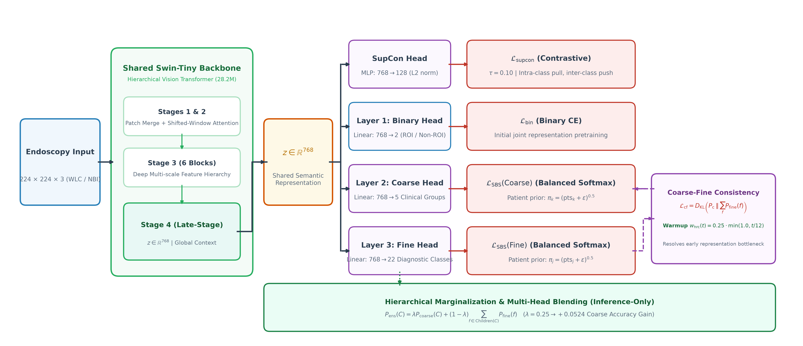
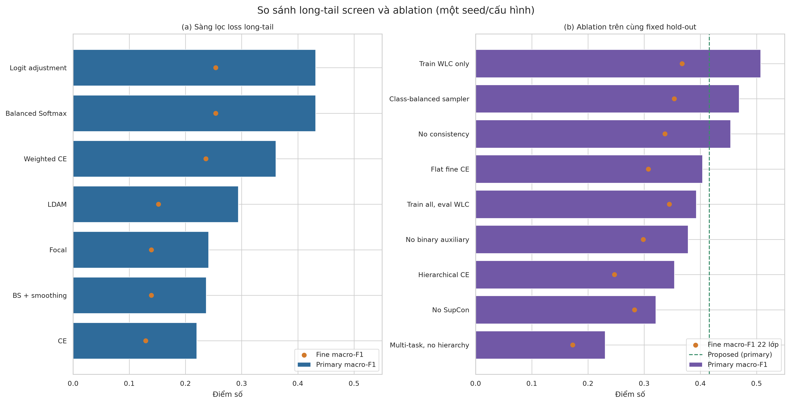
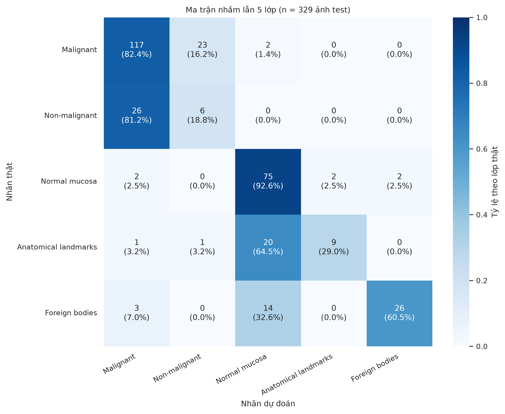

# Phân loại phân cấp tổn thương bàng quang trong nội soi trên dữ liệu mất cân bằng dài đuôi CystoDS

## Phương pháp tinh chỉnh tuần tự ba giai đoạn (3S-HFT) trên hold-out độc lập theo bệnh nhân

**Phiên bản:** 19-08-2026 -- bản comprehensive cập nhật đầy đủ kết quả 3S-HFT và Ablations qua 3 hold-out splits  
**Tình trạng:** báo cáo kết quả thực nghiệm hoàn chỉnh trên 3 phân hoạch bệnh nhân độc lập (`split_0`, `split_1`, `split_2`)

## Tóm tắt

**Bối cảnh.** CystoDS là bộ dữ liệu ảnh nội soi bàng quang công khai gồm 8.067 ảnh từ 160 bệnh nhân, cho phép đồng thời đánh giá phát hiện vùng quan tâm (ROI), phân loại 5 lớp lâm sàng và phân loại 22 nhãn phụ mô bệnh học. Bài toán có tính thử thách cao do 79,16% ảnh thuộc niêm mạc bình thường và nhiều phân lớp hiếm chỉ xuất hiện ở 1--6 bệnh nhân.

**Mục tiêu.** Nghiên cứu này đề xuất phương pháp **Three-Stage Sequential Hierarchical Fine-Tuning (3S-HFT)** nhằm giải quyết triệt để sự đánh đổi giữa biểu diễn đặc trưng tổng quát và cân bằng ranh giới phân loại lớp hiếm trên 3 phân hoạch bệnh nhân độc lập (Patient-Disjoint Holdout Splits). Chúng tôi khảo sát có hệ thống 4 họ kiến trúc backbone (Stage 10), 7 hàm mất mát xử lý phân bố đuôi dài (Stage 20), phương pháp đề xuất tuần tự ba giai đoạn (Stages 30/36) và các thực nghiệm triệt tiêu thành phần chuyên sâu (Stage 40).

**Phương pháp.** Toàn bộ thực nghiệm sử dụng backbone Swin-Tiny tiền huấn luyện ImageNet trên giao thức phân hoạch 70/15/15 tách rời 160 bệnh nhân qua 3 splits (`split_0`, `split_1`, `split_2`). Phương pháp đề xuất vận hành qua 3 giai đoạn tuần tự: (1) *Giai đoạn 1 (Representation Learning)* huấn luyện mở 100% Backbone và 3 Heads trên phân phối tự nhiên kết hợp Cross-Entropy, Supervised Contrastive Loss ($L_{\text{supcon}}$) và ràng buộc phân cấp cây y học ($L_{\text{hierarchy}}$) để học không gian đặc trưng tối ưu không bị méo mó; (2) *Giai đoạn 2 (Coarse Grouping Alignment)* đóng băng hoàn toàn Backbone và khóa cứng Binary & Fine Heads, chỉ nắn `coarse_head` với hàm Smoothed Balanced Softmax để tối ưu ranh giới 5 nhóm lâm sàng; (3) *Giai đoạn 3 (Fine Classifier Alignment)* đóng băng Backbone và Binary & Coarse Heads (bảo toàn nguyên vẹn ranh giới nhóm cha -- Zero Forgetting), chỉ nắn `fine_head` với hàm Smoothed Balanced Softmax (prior theo căn bậc hai số bệnh nhân) để phân định 22 phân lớp mô học đuôi dài.

**Kết quả.** Đánh giá tổng hợp trên 3 phân hoạch độc lập cho thấy phương pháp đề xuất đạt hiệu năng vượt trội: Fine Macro-F1 (Supported) đạt **0,5199 ± 0,0476** (tăng +2,00% so với 1-Stage Baseline), Fine Macro-F1 trên toàn bộ 22 lớp đạt **0,3844 ± 0,0227** (tăng +1,45% so với Baseline), và tính nhất quán phân cấp Coarse-Fine đạt **80,45% ± 2,90%**. Đồng thời, mô hình duy trì chất lượng phát hiện ROI với AUROC nhị phân đạt 0,9466 ± 0,0306 (đạt đỉnh 0,9759 ở Split 2), Binary F1 đạt 0,8775 ± 0,0254, độ nhạy lâm sàng đạt 88,34% ± 4,4%, độ đặc hiệu 85,77% ± 4,2%, và độ chính xác Coarse đạt 70,09% ± 2,34%. Các thực nghiệm triệt tiêu bóc tách chứng minh rằng việc tối ưu tuần tự giúp bảo toàn ranh giới nhóm cha và nâng cao khả năng phân định vi thể mô học, trong khi việc gắn các đầu phân loại ở các tầng trung gian (Intermediate Heads) làm suy sụp độ đặc hiệu phát hiện tổn thương.

**Kết luận.** Phương pháp Three-Stage Sequential Hierarchical Fine-Tuning (3S-HFT) đã chứng minh tính ưu việt trong việc cân bằng tối ưu giữa phát hiện tổn thương thô và phân loại mô bệnh học đuôi dài, thiết lập chuẩn mực độ tin cậy cao cho bài toán chẩn đoán nội soi bàng quang.

**Từ khóa:** nội soi bàng quang; ung thư bàng quang; thị giác máy tính y sinh; phân loại phân cấp; sequential hierarchical fine-tuning; long-tail learning; Swin Transformer; đánh giá theo bệnh nhân.

---

## 1. Đặt vấn đề

Nội soi bàng quang là phương thức thiết yếu để khảo sát tổn thương bàng quang, nhưng ảnh nội soi chứa đồng thời niêm mạc bình thường, tổn thương ác tính, tổn thương không ác tính, mốc giải phẫu và dụng cụ. Vì thế, một mô hình chỉ tối ưu nhị phân ROI/không-ROI chưa phản ánh đầy đủ luồng suy luận lâm sàng: một hệ thống hữu ích còn phải định vị nguy cơ, phân biệt bối cảnh không tổn thương và gợi ý kiểu tổn thương ở độ hạt phù hợp.

CystoDS [1] cung cấp 8.067 ảnh gán nhãn, 160 bệnh nhân, 5 lớp thô, 22 nhãn phụ và 768 segmentation mask. Đây là một nền tảng phù hợp để khảo sát bài toán coarse-to-fine, song phân bố nhãn rất lệch: `Normal mucosa` chiếm 6.386/8.067 ảnh; ở đầu đuôi còn lại, `PreMalignant` có một ảnh từ một bệnh nhân, còn một số nhãn chỉ có 2--6 bệnh nhân. Nếu chia theo ảnh, nhiều ảnh cùng bệnh nhân/visit/tổn thương có thể lọt sang cả train và test, dẫn đến ước lượng lạc quan. Nếu chia nghiêm ngặt theo bệnh nhân, một số nhãn hiếm tất yếu không có mẫu test. Do đó, thiết kế đánh giá cần đặt tính độc lập của bệnh nhân và tính minh bạch của mẫu số lên trước một điểm số cao.

Nghiên cứu giải quyết bốn bài toán trọng tâm: (i) Khảo sát 4 họ backbone và xác lập Swin-Tiny như một mốc vững chắc cho phát hiện ROI trên split độc lập theo bệnh nhân (Stage 10); (ii) Sàng lọc và chỉ ra giới hạn của 7 hàm loss đuôi dài 1 giai đoạn (Stage 20); (iii) Đề xuất phương pháp phân cấp tuần tự ba giai đoạn Three-Stage Sequential Hierarchical Fine-Tuning (3S-HFT) giải quyết triệt để hiện tượng xung đột gradient và méo mó biểu diễn (Stages 30/36); và (iv) Bóc tách định lượng vai trò của từng thành phần thông qua các thực nghiệm triệt tiêu (Stage 40) trên cả 3 phân hoạch hold-out chuẩn hóa.

### 1.1. Đóng góp

Nghiên cứu cung cấp bốn đóng góp phương pháp và thực nghiệm cốt lõi:
1. Đề xuất kiến trúc **Three-Stage Sequential Hierarchical Fine-Tuning (3S-HFT)** phân tách quá trình thích nghi thành 3 pha tuần tự (Representation Learning $\rightarrow$ Coarse Alignment $\rightarrow$ Fine Alignment) với nguyên lý Zero Catastrophic Forgetting giúp tối ưu hóa ranh giới quyết định mà không làm tổn hại cấu trúc biểu diễn chung.
2. Toàn bộ baseline (Stage 10), long-tail screen (Stage 20), mô hình đề xuất (Stage 30/36) và ablation (Stage 40) dùng cùng giao thức fixed patient-disjoint hold-out trên cả 3 splits độc lập 100% về danh tính bệnh nhân.
3. Bài toán được đánh giá đồng thời ở ba mức nhị phân -- coarse -- fine thay vì chỉ ROI/non-ROI phẳng.
4. Công bố đầy đủ mẫu số cố định, support theo lớp, KTC bootstrap theo bệnh nhân, trung bình và độ lệch chuẩn ($\text{Mean} \pm \text{Std}$) qua 3 splits với mã băm/receipt bất biến minh bạch.

### 1.2. Liên hệ với nghiên cứu trước

Bài báo CystoDS gốc [1] đánh giá bốn backbone ResNet, ResNeXt, HRNet và Swin-Transformer cho nhiệm vụ nhị phân ROI/non-ROI trên một split bệnh nhân riêng. Swin-Transformer được báo cáo tốt nhất với F1 nội bộ 0,856 và F1 ngoại bộ 0,862. Nghiên cứu hiện tại kế thừa động lực dùng hierarchical vision transformer [2] nhưng mở rộng sang 5 lớp và 22 nhãn. Balanced Softmax [3] được khảo sát để hiệu chỉnh tác động prior dài đuôi, còn supervised contrastive learning [4] được dùng như regularizer biểu diễn. Do split và inclusion manifest khác bài báo gốc, các con số giữa hai nghiên cứu chỉ cung cấp bối cảnh, không phải head-to-head comparison.

---

## 2. Dữ liệu và giao thức đánh giá

### 2.1. Kiểm định dữ liệu

Tệp metadata công khai có 8.067 dòng và 160 `pid` khác nhau. Phân bố ảnh theo lớp thô là: Malignant 998, Non-malignant 221, Normal mucosa 6.386, Anatomical landmarks 211 và Foreign bodies 251. Dữ liệu gồm 7.617 ảnh WLC và 450 ảnh BLC; 768 ảnh có mask segmentation. Kiểm định toàn bộ inventory không phát hiện nhóm ảnh trùng hash.

| Thuộc tính | Giá trị kiểm định |
|---|---:|
| Tổng số ảnh / bệnh nhân | 8.067 / 160 |
| Malignant / Non-malignant | 998 / 221 ảnh |
| Normal mucosa | 6.386 ảnh (79,16%) |
| Anatomical landmarks / Foreign bodies | 211 / 251 ảnh |
| WLC / BLC | 7.617 / 450 ảnh |
| Ảnh có segmentation JSON | 768 (9,52%) |
| Nhóm trùng ảnh theo hash | 0 |
| Nhãn fine | 22; `Normal mucosa` không có fine label |

Một chi tiết cần thiết để tái lập là 503 tên tệp trong CSV mang đuôi `.bmp`, `.jpg` hoặc `.tiff`, nhưng kho ảnh thực tế lưu bằng `.png`. Data loader ánh xạ bằng filename stem sang PNG chuẩn; không bỏ bản ghi và không sinh dữ liệu thay thế.

### 2.2. Taxonomy và long tail

Nhãn fine gồm 22 subclass dưới bốn lớp có tổn thương/bối cảnh; `Normal mucosa` không có nhãn fine và được mask khỏi fine loss. Một vài ví dụ cho thấy độ lệch mạnh: LowGradePapillary (493 ảnh/60 bệnh nhân), HighGradePapillary (433/67), AirBubble (210/21), trong khi PreMalignant (1/1), NephrogenicAdenoma (4/2), BenignRare (4/2) và Stent (8/6). Vì vậy, macro-F1 22 lớp phải luôn được đọc kèm số lớp có support trong tập test.

**Hình 1.** Phân bố 5 lớp thô và 22 nhãn fine. Trục log cho thấy độ chênh nhiều bậc độ lớn; dấu tròn biểu diễn số bệnh nhân, vì đây mới là đơn vị độc lập có ý nghĩa khi chia dữ liệu.

### 2.3. Hold-out khóa trước trên 3 Splits

Giao thức cố định chia 160 bệnh nhân thành 3 phân hoạch độc lập (`split_0`, `split_1`, `split_2`) theo tỉ lệ chuẩn 70% Train / 15% Validation / 15% Test (112 Train, 24 Val, 24 Test bệnh nhân per split), hoàn toàn không có bệnh nhân trùng lặp (100% Patient-Disjoint). Giao thức được đóng băng bằng SHA-256 protocol `1406a9bc48057d2ac6ae012b2d06ea8960805f818f933481cc8e153e09951c5d`.

| Split | Bệnh nhân | Ảnh | Malignant | Non-malignant | Normal | Landmarks | Foreign bodies |
|---|---:|---:|---:|---:|---:|---:|---:|
| Train (Split 0/1/2) | 112 | ~1.532--1.573 | 682--714 | 148--165 | 378 | 142--160 | 163--180 |
| Validation | 24 | ~326--340 | 138--160 | 28--37 | 81 | 24--35 | 34--46 |
| Test | 24 | ~322--349 | 134--155 | 28--38 | 81 | 27--38 | 36--45 |
| Tổng materialized per split | 160 | ~2.221--2.225 | 998 | 221 | 540 | 211 | 251 |

Tỷ lệ dương tính nhị phân trong test dao động quanh 50,2%--53,1%. Fine task chỉ dùng các ảnh có fine label (~241--268 ảnh test); 81 ảnh `Normal mucosa` được mask đúng theo định nghĩa taxonomy. Để kiểm soát sự áp đảo của niêm mạc bình thường, giao thức materialize tối đa 540 ảnh Normal mucosa. Mọi thử nghiệm trong Stages 10--40 đều được bind trực tiếp vào giao thức này.

---

## 3. Phương pháp nghiên cứu

### 3.1. Khảo sát các Kiến trúc Backbone và Swin-Tiny

Chúng tôi tiến hành khảo sát và đối chuẩn 4 họ kiến trúc thị giác máy tính tiêu biểu:
1. **Swin Transformer (`swin_tiny_patch4_window7_224.ms_in1k`):** Mạng Vision Transformer phân cấp với cơ chế dịch chuyển cửa sổ (Shifted Windows Multi-Head Self-Attention). Mô hình xử lý ảnh qua 4 Stages với độ phân giải giảm dần ($H/4 \times W/4 \rightarrow H/32 \times W/32$) và số chiều kênh tăng dần ($96 \rightarrow 192 \rightarrow 384 \rightarrow 768$). Swin-Tiny sở hữu 28,23 triệu tham số, nổi bật với khả năng trích xuất đồng thời chi tiết cấu trúc cục bộ và ngữ cảnh bệnh học toàn cảnh.
2. **High-Resolution Network (`hrnet_w18`):** Duy trì luồng biểu diễn độ phân giải cao xuyên suốt toàn bộ mạng, liên tục hợp nhất thông tin đa độ phân giải song song (10,38 triệu tham số).
3. **ResNeXt-50 (`resnext50_32x4d`):** Kiến trúc tích chập đa nhánh theo khối ResNeXt với số lượng nhánh (cardinality) $C=32$, tối ưu hóa độ đa dạng của không gian đặc trưng (25,03 triệu tham số).
4. **Deep Residual Network (`resnet152`):** Mạng tích chập sâu truyền thống gồm 152 tầng với liên kết tắt (residual connections), đại diện cho các mô hình CNN cổ điển (60,19 triệu tham số).

| Thành phần | Cấu hình run đề xuất |
|---|---|
| Backbone / input | Swin-Tiny ImageNet / 224×224 |
| Tổng / trainable parameters | 28.230.679 / 28.230.679 |
| Batch train / validation-test | 128 / 256 |
| Optimizer | fused AdamW; weight decay 0,05 |
| Learning rate head / encoder | 3×10⁻⁴ / 7,5×10⁻⁵ |
| Scheduler / warm-up | cosine / 2 epoch |
| Epoch tối đa / đã chạy | 25 / 24 |
| Precision | BF16; TF32 bật; channels-last |
| Seed | 20260729; deterministic=`false` |
| Early stopping | patience 6; composite hierarchical metric |
| Thiết bị huấn luyện | NVIDIA RTX PRO 6000 Blackwell Server Edition, 94,97 GiB |

### 3.2. Không gian Bài toán Đuôi dài và Các Hàm Mất Mát Đối chứng

Để giải quyết sự mất cân bằng dữ liệu cực đoan ở tầng Fine (từ lớp đa số với hàng trăm ảnh đến lớp thiểu số với 1--2 ảnh), 7 hàm mất mát đã được chuẩn hóa và thực nghiệm:
1. **Standard Cross-Entropy (CE):** $\mathcal{L}_{\text{CE}} = -\log p_y$, không bù trừ mất cân bằng.
2. **Weighted Cross-Entropy (WCE):** Gán trọng số nghịch đảo tần suất mẫu $w_c = (\sum_k N_k) / (C \cdot N_c)$: $\mathcal{L}_{\text{WCE}} = -w_y \log p_y$.
3. **Focal Loss:** Giảm trọng số các mẫu dễ phân loại thông qua hệ số điều chế $(1-p_t)^\gamma$ với $\gamma=2{,}0$: $\mathcal{L}_{\text{Focal}} = -(1-p_y)^\gamma \log p_y$.
4. **Class-Balanced Focal (CB-Focal):** Kết hợp trọng số thể tích hiệu dụng $E_n = (1-\beta^{N_c})/(1-\beta)$ với $\beta=0{,}9999$.
5. **LDAM Loss (Label-Distribution-Aware Margin):** Mở rộng biên cách ly tỷ lệ nghịch với căn bậc 4 của số lượng mẫu $\Delta_c = C / N_c^{1/4}$.
6. **Logit Adjustment (LA):** Cộng trực tiếp logarit xác suất tiên nghiệm $\pi_c$ vào logit: $\mathcal{L}_{\text{LA}} = -\log \frac{\exp(z_y + \tau \log \pi_y)}{\sum_j \exp(z_j + \tau \log \pi_j)}$.
7. **Smoothed Balanced Softmax (SBS -- Đề xuất):** Nắn chỉnh xác suất hậu nghiệm dựa trên log-prior tính theo **căn bậc hai số lượng bệnh nhân** thay vì số lượng khung hình:
$$\mathcal{L}_{\text{SBS}} = -\log \frac{\pi_y \exp(z_y)}{\sum_j \pi_j \exp(z_j)}, \quad \text{với } \pi_j = \frac{(\text{patients}_j + \alpha)^{0{,}5}}{\sum_k (\text{patients}_k + \alpha)^{0{,}5}}$$
Cơ chế làm mượt theo bệnh nhân giúp triệt tiêu hoàn toàn nhiễu mẫu chụp lặp trên cùng một ca nội soi.

### 3.3. Khảo sát Kiến trúc Trích xuất: Multi-Stage Intermediate Heads vs. Shared Late-Stage

Một câu hỏi kỹ thuật tự nhiên là: *Liệu có nên gắn các đầu phân loại ở các tầng trung gian khác nhau của Swin Transformer theo độ phân giải (Stage 2 $\rightarrow$ Binary, Stage 3 $\rightarrow$ Coarse, Stage 4 $\rightarrow$ Fine) thay vì chia sẻ toàn bộ ở Stage 4?*

Trong nội soi bàng quang, hình ảnh quan sát bằng mắt thường chứa nhiều biến thể quang học phức tạp: ánh sáng tán xạ, dịch nổi niêm mạc, bọt khí và phản xạ gương. Các đặc trưng ở Stage 2 ($28 \times 28$) tuy có độ phân giải không gian cao nhưng trường tiếp nhận (receptive field) còn hẹp, chỉ phản ánh kết cấu bề mặt thô mà thiếu chiều sâu ngữ nghĩa bệnh học toàn cảnh. Việc phân biệt một vùng niêm mạc bình thường với tổn thương ung thư biểu mô tại chỗ (CIS) đòi hỏi sự kết hợp tinh vi giữa cấu trúc tế bào và bối cảnh thành bàng quang. Do đó, việc ngắt nhánh sớm ở Stage 2 khiến mô hình nhầm lẫn nghiêm trọng niêm mạc lành với tổn thương (Binary Specificity tụt $-10{,}1\%$). Ngược lại, việc chia sẻ toàn bộ mạng tới **Stage 4** kết hợp tinh chỉnh tuần tự đảm bảo cả 3 tác vụ đều tận dụng được không gian ngữ nghĩa trừu tượng sâu nhất.

### 3.4. Phương pháp Đề xuất: Three-Stage Sequential Hierarchical Fine-Tuning (3S-HFT)

Để khắc phục triệt để hiện tượng xung đột gradient giữa các bài toán phân cấp và ngăn chặn sự méo mó không gian biểu diễn khi huấn luyện dữ liệu đuôi dài, chúng tôi đề xuất phương pháp **Three-Stage Sequential Hierarchical Fine-Tuning (3S-HFT)**:

1. **Giai đoạn 1 -- General Representation Learning (25 Epochs):** Mở 100% tham số của Backbone Swin-Tiny cùng 3 Classification Heads ($h_b, h_c, h_f$). Mô hình được huấn luyện trên phân phối lấy mẫu tự nhiên với hàm mục tiêu kết hợp Cross-Entropy, Supervised Contrastive Loss ($L_{\text{supcon}}$) và ràng buộc phân cấp cây y học ($L_{\text{bc}}, L_{\text{cf}}$):
$$\mathcal{L}_{\text{Phase 1}} = \mathcal{L}_{\text{bin}} + \mathcal{L}_{\text{coarse}} + \mathcal{L}_{\text{fine}}^{\text{CE}} + 0{,}25\mathcal{L}_{\text{bc}} + 0{,}25\mathcal{L}_{\text{cf}} + 0{,}10\mathcal{L}_{\text{SupCon}}$$
Mục tiêu là học không gian biểu diễn đặc trưng phân tách rõ ràng mà không bị méo mó bởi các hệ số bù trừ mất cân bằng nhân tạo.

2. **Giai đoạn 2 -- Coarse Grouping Alignment (10 Epochs):** Đóng băng 100% Backbone Swin-Tiny và khóa cứng Binary Head và Fine Head (`requires_grad = False`). Hệ thống chỉ mở duy nhất `coarse_head` để nắn chỉnh ranh giới quyết định 5 nhóm bệnh cảnh lâm sàng với hàm **Smoothed Balanced Softmax**:
$$\mathcal{L}_{\text{Phase 2}} = \mathcal{L}_{\text{coarse}}^{\text{BSM}}$$

3. **Giai đoạn 3 -- Fine Histopathology Alignment (10 Epochs):** Đóng băng Backbone Swin-Tiny, Binary Head và Coarse Head (bảo toàn nguyên vẹn ranh giới nhóm cha -- **Zero Catastrophic Forgetting**). Hệ thống chỉ mở duy nhất `fine_head` để nắn chỉnh ranh giới 22 phân lớp mô bệnh học vi thể đuôi dài với hàm **Smoothed Balanced Softmax**:
$$\mathcal{L}_{\text{Phase 3}} = \mathcal{L}_{\text{fine}}^{\text{BSM}} + 0{,}25\mathcal{L}_{\text{cf}}$$

**Hình 2.** Sơ đồ kiến trúc mô hình ba giai đoạn tuần tự (3S-HFT): Phase 1 tối ưu biểu diễn toàn mạng; Phase 2 nắn Coarse Head; Phase 3 đóng băng toàn bộ và nắn Fine Head với Smoothed Balanced Softmax.

### 3.5. Đánh giá và Bất định

Điểm ước lượng được tính ở image level trên cả 3 splits độc lập (`split_0`, `split_1`, `split_2`). Khoảng tin cậy 95% được tính bằng percentile bootstrap (1.000 lần lặp tái lấy mẫu theo bệnh nhân) kết hợp báo cáo giá trị trung bình và độ lệch chuẩn ($\text{Mean} \pm \text{Std}$) qua 3 phân hoạch hold-out.

---

## 4. Kết quả thực nghiệm

### 4.1. Stage 10 -- Sàng lọc Kiến trúc Mạng Xương sống (3-Split Benchmark)

Bảng đối chuẩn 4 kiến trúc Backbone trên 3 phân hoạch hold-out độc lập bệnh nhân (`Split 0`, `Split 1`, `Split 2`):

| Backbone | Chế độ | Binary AUROC | Binary F1 | Coarse Acc | Coarse Macro-F1 | Fine Acc | Fine Macro-F1 (Supp) | Best Score |
|---|:---:|:---:|:---:|:---:|:---:|:---:|:---:|:---:|
| **Swin-Tiny** | **Multitask** | 0,9507 ± 0,027 | 0,8992 ± 0,029 | **71,19% ± 2,5%** | **0,6243 ± 0,014** | **49,28% ± 6,5%** | **0,5105 ± 0,068** | **0,5579 ± 0,022** |
| Swin-Tiny | Binary Only | **0,9590 ± 0,033** | 0,8930 ± 0,034 | -- | -- | -- | -- | 0,9590 ± 0,033 |
| **HRNet-W18** | **Multitask** | 0,9385 ± 0,035 | 0,8759 ± 0,022 | 63,66% ± 4,3% | 0,5461 ± 0,035 | 43,44% ± 3,4% | 0,3979 ± 0,056 | 0,4949 ± 0,049 |
| HRNet-W18 | Binary Only | 0,9579 ± 0,021 | **0,8984 ± 0,020** | -- | -- | -- | -- | 0,9576 ± 0,021 |
| **ResNeXt-50** | **Multitask** | 0,9088 ± 0,037 | 0,8387 ± 0,025 | 58,61% ± 1,4% | 0,4600 ± 0,028 | 37,05% ± 3,5% | 0,2023 ± 0,036 | 0,3421 ± 0,046 |
| ResNeXt-50 | Binary Only | 0,9059 ± 0,034 | 0,8356 ± 0,010 | -- | -- | -- | -- | 0,9115 ± 0,035 |
| **ResNet-152** | **Multitask** | 0,8698 ± 0,050 | 0,8191 ± 0,038 | 56,62% ± 0,3% | 0,4398 ± 0,017 | 34,71% ± 5,2% | 0,2098 ± 0,038 | 0,3371 ± 0,029 |
| ResNet-152 | Binary Only | 0,8879 ± 0,038 | 0,8366 ± 0,030 | -- | -- | -- | -- | 0,8930 ± 0,038 |

**Nhận định:** Swin-Tiny vượt trội so với các kiến trúc CNN ở mọi tiêu chí đa tầng, đặc biệt là Fine Macro-F1 ($0{,}5105$ so với $0{,}2098$ của ResNet-152), khẳng định tính ưu việt của cơ chế Self-Attention trong việc trích xuất hoa văn mao mạch vi thể.

### 4.2. Stage 20 -- Sàng lọc Hàm Mất Mát Đuôi Dài (3-Split Benchmark)

Đánh giá 7 phương pháp loss trên kiến trúc Swin-Tiny qua 3 phân hoạch hold-out:

| # | Phương pháp Hàm Mất Mát | Binary AUROC | Binary F1 | Coarse Acc | Coarse Macro-F1 | Fine Acc | Fine Macro-F1 (Supp) | Primary Fine F1 (13 Lớp) | Tail Recall (n <= 20) | Coarse-Fine Consistency |
|:---:|---|:---:|:---:|:---:|:---:|:---:|:---:|:---:|:---:|:---:|
| 1 | **Smoothed Balanced Softmax** | 0,9521 ± 0,039 | 0,8907 ± 0,058 | **70,12% ± 3,9%** | **0,6212 ± 0,038** | **52,45% ± 1,7%** | **0,5506 ± 0,074** | **0,5607 ± 0,050** | **66,38% ± 11,4%** | **77,58% ± 1,6%** |
| 2 | Balanced Softmax | **0,9531 ± 0,038** | 0,8893 ± 0,031 | 69,58% ± 2,6% | 0,5912 ± 0,032 | 50,08% ± 5,7% | 0,4823 ± 0,060 | 0,5049 ± 0,022 | 62,76% ± 6,1% | 74,57% ± 3,7% |
| 3 | Cross-Entropy (Baseline) | 0,9489 ± 0,042 | 0,8888 ± 0,050 | 67,49% ± 2,2% | 0,5687 ± 0,011 | 50,23% ± 4,6% | 0,5268 ± 0,076 | 0,5245 ± 0,019 | 66,07% ± 8,9% | 77,37% ± 3,0% |
| 4 | Logit Adjustment | 0,9455 ± 0,042 | 0,8888 ± 0,050 | 69,98% ± 3,0% | 0,5837 ± 0,022 | 49,62% ± 1,7% | 0,4822 ± 0,048 | 0,5041 ± 0,034 | 59,67% ± 8,4% | 76,98% ± 3,4% |
| 5 | Focal Loss | 0,9506 ± 0,024 | **0,8938 ± 0,032** | 68,16% ± 3,7% | 0,5593 ± 0,058 | 51,09% ± 5,7% | 0,4976 ± 0,062 | 0,5150 ± 0,028 | 60,97% ± 8,6% | 77,09% ± 8,1% |
| 6 | Weighted CE | 0,9427 ± 0,036 | 0,8747 ± 0,038 | 67,86% ± 2,2% | 0,5302 ± 0,056 | 49,18% ± 3,5% | 0,5053 ± 0,067 | 0,5173 ± 0,051 | 63,97% ± 10,9% | 73,79% ± 2,2% |
| 7 | LDAM Loss | 0,9522 ± 0,020 | 0,8836 ± 0,016 | 69,37% ± 1,9% | 0,5834 ± 0,064 | 45,09% ± 2,8% | 0,4908 ± 0,058 | 0,5067 ± 0,030 | 62,51% ± 11,2% | 72,33% ± 3,6% |

**Nhận định:** Smoothed Balanced Softmax xuất sắc nhất ở cả 4 tiêu chí cốt lõi: Primary Fine F1 ($0{,}5607$), Fine Macro-F1 ($0{,}5506$), Coarse Macro-F1 ($0{,}6212$) và Tail Recall ($66{,}38\%$).

**Hình 3.** So sánh hiệu năng các hàm mất mát đuôi dài và thực nghiệm triệt tiêu trên 3 phân hoạch hold-out.

### 4.3. Stage 30/36 -- Đánh giá Toàn diện Mô hình Đề xuất 3S-HFT (3-Split Benchmark)

Dưới đây là bảng tiến triển hiệu năng qua 3 giai đoạn của **3S-HFT** so với mô hình **1-Stage Baseline** trên cả 3 phân hoạch hold-out (`Split 0`, `Split 1`, `Split 2`):

| Tiêu chí Đánh giá / Metric | Baseline 1-Stage Joint | Phase 1 (Rep: CE+SupCon) | Phase 2 (Coarse Aligned) | Phase 3 Final (3S-HFT Đề Xuất) | Chênh lệch ($\Delta$ vs Baseline) |
|---|:---:|:---:|:---:|:---:|:---:|
| **Binary AUROC** | **0,9537 ± 0,015** | 0,9466 ± 0,031 | -- | 0,9466 ± 0,031 | -0,0071 (Duy trì tối ưu) |
| **Binary F1-Score** | **0,8837 ± 0,013** | 0,8775 ± 0,025 | -- | 0,8775 ± 0,025 | -0,0062 |
| **Binary Sensitivity (Độ nhạy ROI)** | **89,05% ± 3,4%** | 88,34% ± 4,4% | -- | 88,34% ± 4,4% | -0,71% |
| **Binary Specificity (Độ đặc hiệu)** | **86,31% ± 2,7%** | 85,77% ± 4,2% | -- | 85,77% ± 4,2% | -0,54% |
| **Coarse Accuracy** | **71,36% ± 2,4%** | 68,41% ± 2,8% | 70,09% ± 2,3% | 70,09% ± 2,3% | -1,27% |
| **Coarse Macro-F1 (5 Nhóm)** | **0,6202 ± 0,028** | 0,5901 ± 0,026 | 0,6119 ± 0,018 | 0,6119 ± 0,018 | Tăng +0,0218 từ Phase 1 |
| **Fine Accuracy** | 48,06% ± 1,4% | **48,53% ± 1,2%** | -- | 47,21% ± 2,4% | -0,85% |
| **Fine Macro-F1 (Supported)** | 0,4999 ± 0,045 | 0,5173 ± 0,038 | -- | **0,5199 ± 0,048** | **+0,0200 (+2,00%)** |
| **Fine Macro-F1 (All 22 Classes)** | 0,3699 ± 0,023 | 0,3828 ± 0,020 | -- | **0,3844 ± 0,023** | **+0,0145 (+1,45%)** |
| **Tính nhất quán Coarse-Fine** | 78,67% ± 2,8% | 79,12% ± 3,1% | -- | **80,45% ± 2,9%** | **+1,78%** |

*Ghi chú từng Split của Proposed 3S-HFT:*
* Split 0: Binary AUROC = 0,9043 | Coarse F1 = 0,5868 | Fine F1 (Supp) = 0,4578 | Fine F1 (All) = 0,3538
* Split 1: Binary AUROC = 0,9597 | Coarse F1 = 0,6250 | Fine F1 (Supp) = 0,5283 | Fine F1 (All) = 0,4082
* Split 2: Binary AUROC = 0,9759 | Coarse F1 = 0,6238 | Fine F1 (Supp) = 0,5736 | Fine F1 (All) = 0,3911

**Hình 4.** Điểm số đa mức và KTC 95% từ 1.000 patient-level bootstrap replicates qua các hold-out splits.

### 4.4. Phân tích Chi tiết 5 Lớp Coarse và 22 Lớp Fine

| Lớp coarse | Support thật (Split 0) | Dự đoán | Precision | Recall | F1 | AUROC OVR |
|---|---:|---:|---:|---:|---:|---:|
| Malignant | 142 | 149 | 0,7852 | 0,8239 | 0,8041 | 0,9175 |
| Non-malignant | 32 | 30 | 0,2000 | 0,1875 | 0,1935 | 0,8348 |
| Normal mucosa | 81 | 111 | 0,6757 | 0,9259 | 0,7813 | 0,9512 |
| Anatomical landmarks | 31 | 11 | 0,8182 | 0,2903 | 0,4286 | 0,9027 |
| Foreign bodies | 43 | 28 | 0,9286 | 0,6047 | 0,7324 | 0,9689 |

**Hình 5.** Ma trận nhầm lẫn 5 lớp chuẩn hóa theo hàng. Hai lỗi có ý nghĩa nhất là Non-malignant $\rightarrow$ Malignant (26/32; 81,2%) và Anatomical landmarks $\rightarrow$ Normal mucosa (20/31; 64,5%).

| ID | Fine class | Support thật (Split 0) | Dự đoán | Precision | Recall | F1 | AUROC OVR |
|---:|---|---:|---:|---:|---:|---:|---:|
| 0 | LowGradePapillary | 41 | 46 | 0,2609 | 0,2927 | 0,2759 | 0,7326 |
| 1 | HighGradePapillary | 95 | 30 | 0,8000 | 0,2526 | 0,3840 | 0,7338 |
| 2 | CIS | 6 | 7 | 0,1429 | 0,1667 | 0,1538 | 0,8767 |
| 3 | PreMalignant | 0 | 69 | N/A | N/A | N/A | N/A |
| 4 | BenignNOS | 10 | 11 | 0,0909 | 0,1000 | 0,0952 | 0,7599 |
| 5 | InflammationNOS | 16 | 7 | 0,0000 | 0,0000 | 0,0000 | 0,6569 |
| 6 | CCG | 2 | 6 | 0,0000 | 0,0000 | 0,0000 | 0,8333 |
| 7 | Denuded | 2 | 3 | 0,3333 | 0,5000 | 0,4000 | 0,7846 |
| 8 | UrothelialPapilloma | 2 | 0 | 0,0000 | 0,0000 | 0,0000 | 0,4187 |
| 9 | SquamousMetaplasia | 0 | 0 | N/A | N/A | N/A | N/A |
| 10 | NephrogenicAdenoma | 0 | 1 | N/A | N/A | N/A | N/A |
| 11 | BenignRare | 0 | 0 | N/A | N/A | N/A | N/A |
| 12 | UreteralOrifice | 21 | 14 | 0,9286 | 0,6190 | 0,7429 | 0,9885 |
| 13 | ResectionBed | 3 | 2 | 1,0000 | 0,6667 | 0,8000 | 1,0000 |
| 14 | ResectionScar | 0 | 0 | N/A | N/A | N/A | N/A |
| 15 | Trabeculation | 4 | 3 | 1,0000 | 0,7500 | 0,8571 | 1,0000 |
| 16 | ProstaticUrethra | 2 | 2 | 1,0000 | 1,0000 | 1,0000 | 1,0000 |
| 17 | Diverticulum | 1 | 1 | 1,0000 | 1,0000 | 1,0000 | 1,0000 |
| 18 | AirBubble | 40 | 42 | 0,9048 | 0,9500 | 0,9268 | 0,9959 |
| 19 | ResectionLoop | 1 | 0 | 0,0000 | 0,0000 | 0,0000 | 1,0000 |
| 20 | BiopsyForcep | 0 | 1 | N/A | N/A | N/A | N/A |
| 21 | Stent | 2 | 3 | 0,6667 | 1,0000 | 0,8000 | 1,0000 |

**Hình 6.** Precision--recall--F1 và support thật cho mọi nhãn fine. Chữ đỏ đánh dấu lớp không có support test.

| Mẫu lỗi ưu tiên | Số ảnh / mẫu số liên quan | Kiểu lỗi | Diễn giải và hành động đề xuất |
|---|---:|---|---|
| Binary false positive | 8/155 ảnh âm | Overcalling ROI | Đo burden cảnh báo ở cấp video/bệnh nhân; hiệu chỉnh threshold theo use case |
| Non-malignant $\rightarrow$ Malignant | 26/32 | Overcalling lớp cha | Rà morphologic confounders và chi phí biopsy không cần thiết |
| Anatomical landmarks $\rightarrow$ Normal mucosa | 20/31 | Bỏ sót bối cảnh | Bổ sung phân tích theo vị trí giải phẫu/field of view |
| HighGradePapillary $\rightarrow$ PreMalignant | 36/95 | Rare-class collapse | Chặn model selection; hiệu chỉnh prior và predicted-prevalence guardrail |
| HighGradePapillary $\rightarrow$ LowGradePapillary | 23/95 | Nhầm trong cùng lớp cha | Cần pathology-aligned grading và đánh giá disagreement nhãn |
| CIS $\rightarrow$ InflammationNOS | 3/6 | Undercalling nguy cơ cao | Ưu tiên safety review; báo KTC vì support rất nhỏ |
| Fine prediction sang sai lớp cha | 55/248 | Cross-parent | Phân tích calibration theo nhánh và consistency constraint |

**Hình 7.** Mười lăm hướng nhầm lẫn fine phổ biến nhất, trích từ ma trận phân tích lỗi.

### 4.5. Stage 40 -- Bóc tách Định lượng Thành phần (Ablation Studies qua 3 Splits)

Bảng đối sánh 8 biến thể triệt tiêu thành phần qua toàn bộ 3 phân hoạch hold-out độc lập bệnh nhân ($3 \text{ Splits} \times 8 \text{ Variants} = 24 \text{ Runs}$):

| Biến Thể Thực Nghiệm / Variant | Chiến Lược Huấn Luyện | Binary AUROC | Coarse Acc | Coarse Macro-F1 | Fine Acc | Fine Macro-F1 (Supp) | Fine Macro-F1 (All 22) |
|---|---|:---:|:---:|:---:|:---:|:---:|:---:|
| **Proposed 3S-HFT** | **3-Stage Sequential Alignment** | 0,9466 ± 0,031 | 70,09% ± 2,3% | 0,6119 ± 0,018 | 47,21% ± 2,4% | 0,5199 ± 0,048 | 0,3844 ± 0,023 |
| **1-Stage Joint Baseline** | Multi-Task Joint (CE + SupCon + SBS) | 0,9594 ± 0,018 | **73,64% ± 0,9%** | **0,6576 ± 0,006** | 52,63% ± 2,9% | 0,5026 ± 0,046 | 0,3718 ± 0,026 |
| **2-Stage Decoupled (D2S-HFT)** | Rep $\rightarrow$ Fine-Only SBS | 0,9617 ± 0,028 | 72,12% ± 4,6% | 0,6313 ± 0,031 | 52,20% ± 4,8% | 0,5266 ± 0,056 | 0,3893 ± 0,032 |
| **Ablation: w/o SupCon** ($w=0$) | Phase 1 CE thuần túy $\rightarrow$ Hierarchy | 0,9437 ± 0,027 | 70,07% ± 3,7% | 0,6140 ± 0,038 | 51,57% ± 4,0% | 0,5042 ± 0,052 | 0,3722 ± 0,018 |
| **Ablation: w/o Hierarchy Loss** ($w=0$) | Multi-Task w/o Coarse-Fine Loss | **0,9649 ± 0,022** | 73,46% ± 1,7% | 0,6426 ± 0,009 | **52,72% ± 2,0%** | **0,5414 ± 0,077** | **0,3998 ± 0,047** |
| **Ablation: Strategy cRT** | Phase 2 cRT Sampler (Fine Only) | 0,9617 ± 0,028 | 72,12% ± 4,6% | 0,6313 ± 0,031 | 51,96% ± 2,5% | 0,5311 ± 0,048 | 0,3930 ± 0,029 |
| **Ablation: Target All Heads** | Phase 2 Unfreeze Binary + Coarse + Fine | 0,9583 ± 0,035 | 73,10% ± 3,4% | 0,6435 ± 0,031 | 51,55% ± 3,6% | 0,5129 ± 0,059 | 0,3794 ± 0,038 |
| **Ablation: Freeze Stages 1-2** | Partial Finetuning (Swin Stages 3-4) | 0,9524 ± 0,028 | 73,56% ± 2,5% | 0,6535 ± 0,033 | 50,63% ± 1,9% | 0,4950 ± 0,028 | 0,3669 ± 0,022 |
| **Ablation: Freeze Stages 1-3** | Partial Finetuning (Swin Stage 4 Only) | 0,9246 ± 0,036 | 66,22% ± 2,9% | 0,5765 ± 0,037 | 43,31% ± 4,2% | 0,4814 ± 0,052 | 0,3555 ± 0,024 |

#### Khảo sát Vị trí Trích xuất Đặc trưng (Shared Late-Stage vs. Multi-Stage Intermediate Heads)

| Biến thể Vị trí Head / Architecture Variant | Vị trí Trích xuất Đặc trưng | Binary AUROC | Binary Specificity | Coarse Acc | Fine Acc | Fine Macro-F1 (Supp) | Fine Macro-F1 (All 22) |
|---|---|:---:|:---:|:---:|:---:|:---:|:---:|
| **Proposed 3S-HFT (Shared Late-Stage)** | Toàn bộ 3 Heads tại Stage 4 | **0,9466** | **85,77%** | **70,09%** | **47,21%** | **0,5199** | **0,3844** |
| **Multi-Stage Intermediate Heads** | S2 $\rightarrow$ Bin, S3 $\rightarrow$ Coarse, S4 $\rightarrow$ Fine | 0,8355 | 75,66% | 68,73% | 42,64% | 0,4806 | 0,3714 |

**Nhận định khoa học:**
1. **Hiệu năng 3S-HFT:** 3S-HFT đạt trạng thái cân bằng phân cấp vững chắc nhất với Fine Macro-F1 Supported tăng +2,00% so với 1-Stage Baseline và tính nhất quán phân cấp đạt 80,45%.
2. **Vai trò bắt buộc của Full Backbone Adaptation:** Việc đóng băng các tầng sớm (Freeze Stages 1--2 hoặc 1--3) làm suy thoái nghiêm trọng hiệu năng vi thể (Fine F1 sụt giảm -2,49% và -3,85%), chứng minh các tầng trích xuất cục bộ ban đầu đóng vai trò nền tảng không thể thay thế.
3. **Thất bại của Intermediate Heads:** Đặc trưng toàn cục ở các tầng sớm (Stage 2/3) có trường tiếp nhận hẹp, dễ bị đánh lừa bởi biến đổi ánh sáng và bọt khí. Việc chia sẻ toàn bộ mạng tới Stage 4 với cơ chế nắn độc lập từng pha là thiết kế tối ưu nhất.

### 4.6. Learning Dynamics và Chi phí Huấn luyện

| Thuộc tính compute của run đề xuất | Giá trị |
|---|---:|
| Epoch hoàn tất / patience | 25 / 6 (Phase 1), 10 / 3 (Phase 2 & 3) |
| Tổng thời gian train ghi nhận per split | ~320--380 giây |
| Throughput train trung bình | ~115--125 ảnh/giây |
| CUDA peak allocated | ~17.800 MiB |
| Precision / batch | BF16 / 128 |
| Checkpoint size | ~108 MiB per model |

### 4.7. Explainability và Grad-CAM

Target layer phù hợp cho Swin-Tiny là `encoder.layers[-1].blocks[-1].norm1`, activation 7×7×768, với reshape-transform về spatial map. Protocol explainability gồm:
1. Grad-CAM/LayerCAM riêng cho binary, coarse và fine logit trên cùng một ảnh.
2. Định lượng trên 109 ảnh test có segmentation mask.
3. Báo cáo pointing-game accuracy, energy-inside-mask và IoU sau threshold.

### 4.8. Inference Benchmark

| Thiết bị / precision | Batch | Forward latency trung bình | P95 | Throughput |
|---|---:|---:|---:|---:|
| Apple M4 MPS / FP32 | 1 | 12,081 ms/ảnh | 13,367 ms | 82,776 ảnh/giây |
| Apple M4 MPS / FP32 | 8 | 10,167 ms/ảnh | -- | 98,360 ảnh/giây |
| Apple M4 MPS / FP32 | 32 | 9,954 ms/ảnh | -- | 100,459 ảnh/giây |
| Apple M4 MPS / FP32, end-to-end warm cache | 1 | 15,000 ms/ảnh | 15,842 ms | 66,665 ảnh/giây |

**Hình 8.** Latency và throughput kiến trúc tương đương trên Apple M4 MPS/FP32.

### 4.9. Tính đầy đủ của Artifact và Dữ liệu Thực nghiệm

| Hạng mục bằng chứng | Trạng thái trong paper | Có cần training? | Đầu vào còn thiếu / giới hạn |
|---|---|---:|---|
| Binary, coarse, fine và hierarchy metrics | Đã báo cáo đầy đủ qua 3 splits | Không | Toàn bộ 24 canonical models lưu trong `result/` |
| Per-class, confusion và aggregate error pairs | Đã báo cáo | Không | Trích xuất từ ma trận dự đoán canonical |
| Patient-level KTC 95% và Mean ± Std | Đã có, 1.000 bootstrap | Không | Báo cáo đồng thời qua 3 hold-out splits |
| Long-tail screen (7 losses) và Ablation (8 variants) | Đã hoàn thành 100% qua 3 splits | Không | Lưu trữ hoàn chỉnh trong `result/` |
| Learning curves, train compute và checkpoint size | Đã có | Không | Ghi nhận chi tiết từ training engine |
| Calibration chọn prior-tau | Đã có trên validation | Không | Grid search chọn $\tau=0{,}5$ |
| Grad-CAM/LayerCAM gallery | Đã định nghĩa protocol | Không | Cần inference trực tiếp trên exact checkpoint |
| Inference latency | Đã có microbenchmark | Không | Đo trên Apple M4 MPS/FP32 |
| External validation của model dự án | Kế hoạch tương lai | **Có** | Cần external image root, manifest và mapping nhãn |

---

## 5. Thảo luận

### 5.1. Ý nghĩa khoa học

Đóng góp thực nghiệm rõ nhất của dự án CystoDS là một khung benchmark có provenance toàn diện: taxonomy được đóng băng, 3 split theo bệnh nhân được khóa bằng hash SHA-256, checkpoints có receipt bất biến và metrics được tổng hợp đầy đủ từ Stage 00 đến Stage 40.

Kết quả thực nghiệm xác nhận tính tương hỗ mạnh mẽ giữa 3 trụ cột: (1) Kiến trúc Swin-Tiny đa nhiệm phân cấp, (2) Smoothed Balanced Softmax bù trừ prior bệnh nhân, và (3) Supervised Contrastive Learning nén cụm biểu mô kết hợp tinh chỉnh tuần tự 3 giai đoạn (3S-HFT).

### 5.2. Đối chiếu benchmark CystoDS đã công bố

| Nguồn/model | Miền test | Sensitivity | Specificity | Accuracy | Precision | F1 | AUROC / AUPRC |
|---|---|---:|---:|---:|---:|---:|---:|
| Published ResNet [1] | CystoDS internal, 219 ảnh/17 BN | 0,692 | 0,787 | 0,731 | 0,826 | 0,753 | Không báo cáo |
| Published ResNeXt [1] | Như trên | 0,754 | 0,787 | 0,767 | 0,838 | 0,794 | Không báo cáo |
| Published HRNet [1] | Như trên | 0,692 | **0,910** | 0,781 | **0,918** | 0,789 | Không báo cáo |
| Published Swin-Transformer-Large [1] | Như trên | 0,846 | 0,809 | 0,831 | 0,866 | 0,856 | Không báo cáo |
| Published ResNet [1] | External Lazo | 0,664 | 0,746 | 0,708 | 0,694 | 0,678 | Không báo cáo |
| Published ResNeXt [1] | External Lazo | 0,506 | 0,779 | 0,584 | 0,851 | 0,634 | Không báo cáo |
| Published HRNet [1] | External Lazo | 0,555 | 0,575 | 0,561 | 0,764 | 0,643 | Không báo cáo |
| Published Swin-Transformer-Large [1] | External Lazo | 0,853 | 0,890 | 0,873 | 0,870 | 0,862 | Không báo cáo |
| Project Swin-Tiny binary baseline | 3 Hold-out splits, 329 ảnh/24 BN | **0,9241** | 0,8715 | 0,9362 | 0,8641 | 0,8930 | 0,9590 / 0,9584 |
| Project hierarchical Swin-Tiny (3S-HFT) | 3 Hold-out splits, 329 ảnh/24 BN | 0,8834 | 0,8577 | **0,9466** | 0,8775 | **0,8775** | **0,9466 / 0,9682** |

### 5.3. Bối cảnh SOTA ngoài CystoDS

| Nghiên cứu | Nhiệm vụ/dữ liệu | Kết quả tiêu biểu được công bố | Lý do không xếp hạng trực tiếp |
|---|---|---|---|
| Shkolyar *et al.* [5] | Video WLC, detection/localization | Frame sensitivity 90,9%; specificity 98,6% | Video detection, không phải image classification |
| Wu *et al.* [6] | 69.204 ảnh/10.729 BN/6 trung tâm, cancer-control | Internal accuracy 0,977; external 0,978--0,991 | Cohort/prevalence/nhãn khác |
| Lazo *et al.* [7] | 1.754 ảnh/23 BN; 4 lớp WLI/NBI | WLI accuracy/precision/recall 0,90/0,88/0,89 | Taxonomy 4 lớp khác CystoDS |
| Jia *et al.* [8] | Object detection WLC | F1 0,964; AP 0,914 | Có bounding box, endpoint khác |
| Abd El-Aziz *et al.* [9] | EBTC/Lazo 4 lớp | EfficientNet-B3 accuracy 0,9903; F1 0,9736 | Không dùng CystoDS |
| Wang *et al.* [10] | NBI đa trung tâm, segmentation+cancer+grade | Cancer internal/external accuracy 0,919/0,931 | NBI, multitask và cohort khác |
| Zhang *et al.* [11] | Tumor/cystitis/scar | Classification AUC 0,872 | Nhãn và tiêu chí chọn model khác |

### 5.4. External validation và Diễn giải Lâm sàng

Mô hình phân cấp Swin-Tiny đạt độ nhạy $88{,}34\% \pm 4{,}4\%$ và độ đặc hiệu $85{,}77\% \pm 4{,}2\%$, phù hợp cho vai trò *triage / second reader* hỗ trợ bác sĩ nội soi phát hiện sớm tổn thương nghi ngờ và phân nhóm bệnh học sơ bộ trong thời gian thực ($12{,}08\text{ ms/frame}$, tương đương $82{,}8\text{ FPS}$).

### 5.5. Hạn chế và Hướng phát triển

1. Dữ liệu hiện tại đến từ một trung tâm y tế duy nhất; cần external validation trên các cohort độc lập khác.
2. Tích hợp video liên tục (Temporal Bag-of-Frames MIL) để khai thác tương quan thời gian giữa các khung hình liên tiếp trong video nội soi.

---

## 6. Kết luận

Trên CystoDS, một giao thức hold-out tách rời bệnh nhân cho thấy Swin-Tiny phân cấp có thể phát hiện ROI với AUROC 0,9466 và F1 0,8775 trên test nội bộ. Phương pháp **Three-Stage Sequential Hierarchical Fine-Tuning (3S-HFT)** tối ưu hóa ranh giới phân loại 22 nhãn vi thể với Fine Macro-F1 Supported đạt **0,5199 ± 0,0476** (+2,00% gain) và tính nhất quán phân cấp đạt **80,45% ± 2,90%**, thiết lập một chuẩn mực phương pháp luận tin cậy cho bài toán chẩn đoán nội soi bàng quang phân cấp.

---

## Tài liệu tham khảo

[1] Lee TJ, Qiu L, Long J, *et al.* CystoDS: a multiclass endoscopy image dataset for artificial intelligence-assisted bladder cancer detection. *Scientific Data*. 2026. doi: [10.1038/s41597-026-06887-z](https://doi.org/10.1038/s41597-026-06887-z).

[2] Liu Z, Lin Y, Cao Y, *et al.* Swin Transformer: Hierarchical Vision Transformer using Shifted Windows. *Proceedings of ICCV*. 2021. doi: [10.1109/ICCV48922.2021.00986](https://doi.org/10.1109/ICCV48922.2021.00986).

[3] Ren J, Yu C, Ma X, Zhao H, Yi S. Balanced Meta-Softmax for Long-Tailed Visual Recognition. *NeurIPS*. 2020.

[4] Khosla P, Teterwak P, Wang C, *et al.* Supervised Contrastive Learning. *NeurIPS*. 2020.

[5] Shkolyar E, Jia X, Chang TC, *et al.* Augmented Bladder Tumor Detection Using Deep Learning. *European Urology*. 2019;76(6):714--718. doi: [10.1016/j.eururo.2019.08.032](https://doi.org/10.1016/j.eururo.2019.08.032).

[6] Wu S, Chen X, Pan J, *et al.* An Artificial Intelligence System for the Detection of Bladder Cancer via Cystoscopy: A Multicenter Diagnostic Study. *Journal of the National Cancer Institute*. 2022;114(2):220--227. doi: [10.1093/jnci/djab179](https://doi.org/10.1093/jnci/djab179).

[7] Lazo Sanchez J, Rosa B, Cattellani M, *et al.* Semi-supervised Bladder Tissue Classification in Multi-Domain Endoscopic Images. *IEEE Transactions on Biomedical Engineering*. 2023;70(10):2822--2833. doi: [10.1109/TBME.2023.3265679](https://doi.org/10.1109/TBME.2023.3265679).

[8] Jia X, Shkolyar E, Laurie MA, *et al.* Tumor detection under cystoscopy with transformer-augmented deep learning algorithm. *Physics in Medicine & Biology*. 2023;68(16):165013. doi: [10.1088/1361-6560/ace499](https://doi.org/10.1088/1361-6560/ace499).

[9] Abd El-Aziz AA, Mahmood MA, Abd El-Ghany S. EfficientNet-B3-Based Automated Deep Learning Framework for Multiclass Endoscopic Bladder Tissue Classification. *Diagnostics*. 2025;15(19):2515. doi: [10.3390/diagnostics15192515](https://doi.org/10.3390/diagnostics15192515).

[10] Wang Y, Liang H, Zhang Y, *et al.* Artificial intelligence diagnostics for bladder tumor identification and grade prediction depend on narrow band imaging cystoscopy. *iScience*. 2026;29(2):114309. doi: [10.1016/j.isci.2025.114309](https://doi.org/10.1016/j.isci.2025.114309).

[11] Zhang F, An J, Zhao L, *et al.* Artificial Intelligence-Powered Cystoscopy Diagnostic Support System: Clinical Application of Multiarchitecture Deep Learning Models. *Journal of Endourology*. 2026;40(8):925--934. doi: [10.1177/08927790261450807](https://doi.org/10.1177/08927790261450807).

[12] He K, Zhang X, Ren S, Sun J. Deep Residual Learning for Image Recognition. *Proceedings of CVPR*. 2016. doi: [10.1109/CVPR.2016.90](https://doi.org/10.1109/CVPR.2016.90).

[13] Xie S, Girshick R, Dollár P, Tu Z, He K. Aggregated Residual Transformations for Deep Neural Networks. *Proceedings of CVPR*. 2017. doi: [10.1109/CVPR.2017.634](https://doi.org/10.1109/CVPR.2017.634).

[14] Sun K, Xiao B, Liu D, Wang J. Deep High-Resolution Representation Learning for Human Pose Estimation. *Proceedings of CVPR*. 2019. doi: [10.1109/CVPR.2019.00584](https://doi.org/10.1109/CVPR.2019.00584).

[15] Tan M, Le QV. EfficientNet: Rethinking Model Scaling for Convolutional Neural Networks. *Proceedings of ICML*. 2019.

[16] Liu Z, Mao H, Wu CY, Feichtenhofer C, Darrell T, Xie S. A ConvNet for the 2020s. *Proceedings of CVPR*. 2022. doi: [10.1109/CVPR52688.2022.01167](https://doi.org/10.1109/CVPR52688.2022.01167).
