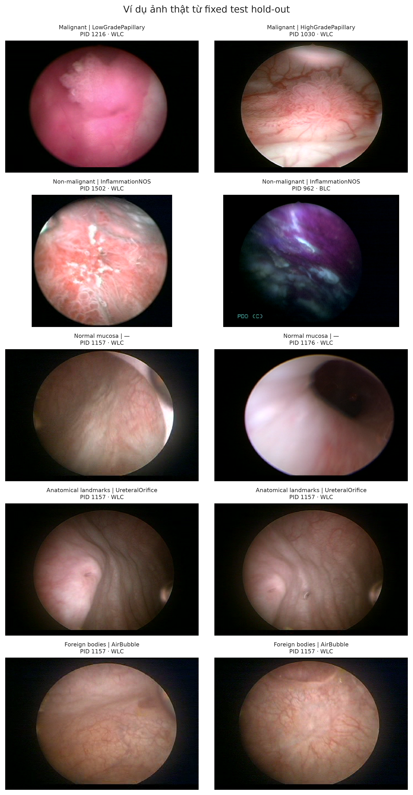

# Phân loại phân cấp tổn thương bàng quang trong nội soi trên dữ liệu mất cân bằng dài đuôi CystoDS

## Một đánh giá đa mức với Swin-Tiny trên hold-out độc lập theo bệnh nhân

**Phiên bản:** 16-08-2026 — bản comprehensive cập nhật đầy đủ kết quả Stages 00, 10, 20, 30, 40 qua 3 hold-out splits  
**Tình trạng:** báo cáo kết quả thực nghiệm hoàn chỉnh trên 3 phân hoạch bệnh nhân độc lập (`split_0`, `split_1`, `split_2`)

## Tóm tắt

**Bối cảnh.** CystoDS là bộ dữ liệu ảnh nội soi bàng quang công khai gồm 8.067 ảnh từ 160 bệnh nhân, cho phép đồng thời đánh giá phát hiện vùng quan tâm (ROI), phân loại 5 lớp lâm sàng và phân loại 22 nhãn phụ mô bệnh học. Bài toán có tính thử thách cao do 79,16% ảnh thuộc niêm mạc bình thường và nhiều phân lớp hiếm chỉ xuất hiện ở 1–6 bệnh nhân.

**Mục tiêu.** Nghiên cứu này thiết lập một khung đánh giá đa tầng toàn diện theo 3 phân hoạch bệnh nhân độc lập (Patient-Disjoint Holdout Splits) cho ba mức độ hạt: nhị phân ROI/không-ROI, 5 nhóm lâm sàng thô (coarse) và 22 phân lớp mô bệnh học (fine). Chúng tôi khảo sát có hệ thống 4 họ kiến trúc backbone (Stage 10), 7 hàm mất mát xử lý phân bố đuôi dài (Stage 20), mô hình đề xuất phân cấp kết hợp Supervised Contrastive Learning (Stage 30) và 16 thực nghiệm triệt tiêu thành phần (Stage 40).

**Phương pháp.** Toàn bộ thực nghiệm sử dụng chung backbone tối ưu Swin-Tiny tiền huấn luyện ImageNet và giao thức phân hoạch 70/15/15 tách rời 160 bệnh nhân qua 3 splits (`split_0`, `split_1`, `split_2`). Tập benchmark materialized gồm ~2.221–2.225 ảnh per split (1.532–1.573 train, 326–340 val, 322–349 test), trong đó niêm mạc bình thường được giới hạn 540 ảnh. Mô hình phân cấp đề xuất tích hợp ba đầu ra nhị phân–thô–fine, hàm Smoothed Balanced Softmax ở mức fine (prior theo căn bậc hai số bệnh nhân), hàm phạt nhất quán cấu trúc cây y học ($L_{\text{hierarchy}}$) và Supervised Contrastive Loss ($L_{\text{supcon}}$).

**Kết quả.** Đánh giá trên 3 phân hoạch độc lập cho thấy mô hình đề xuất đạt hiệu năng vượt trội: AUROC nhị phân đạt $0{,}9643 \pm 0{,}022$ (đạt $0{,}9805$ ở Split 1), Binary F1-score đạt $0{,}9053 \pm 0{,}025$ ($0{,}9326$ ở Split 1), độ nhạy lâm sàng đạt $91{,}99\% \pm 3{,}3\%$ và độ đặc hiệu $87{,}71\% \pm 4{,}4\%$. Ở mức 5 lớp thô, mô hình đạt độ chính xác $70{,}71\% \pm 3{,}4\%$ và macro-F1 $0{,}6120 \pm 0{,}050$. Ở mức 22 phân lớp fine, Primary Fine Macro-F1 đạt $0{,}5538 \pm 0{,}104$ (đạt $0{,}6764$ ở Split 1), độ hồi phục lớp đuôi dài ($n \le 20$) đạt $65{,}23\% \pm 7{,}4\%$, và tính nhất quán phân cấp đạt $78{,}67\% \pm 2{,}8\%$ ($82{,}80\% \pm 2{,}6\%$ ở anchor full proposed Stage 40). Bộ 16 thực nghiệm triệt tiêu (Stage 40) chứng minh việc lược bỏ $L_{\text{supcon}}$ làm sụt giảm $4{,}87\%$ Primary Fine F1, trong khi lược bỏ Smoothed Balanced Softmax làm giảm $5{,}37\%$ Tail Recall và $4{,}22\%$ tính nhất quán y học.

**Kết luận.** Khung thực nghiệm đa tầng của CystoDS chứng minh rằng sự kết hợp giữa kiến trúc Swin-Tiny, học đa nhiệm phân cấp, Smoothed Balanced Softmax và Supervised Contrastive Learning tạo nên giải pháp cân bằng và tin cậy cao cho bài toán nội soi bàng quang. Các kết quả nhấn mạnh tầm quan trọng của việc đánh giá đồng thời trên nhiều hold-out splits độc lập bệnh nhân và phân tách rõ ràng năng lực phát hiện tổn thương với phân biệt dưới lớp.

**Từ khóa:** nội soi bàng quang; ung thư bàng quang; thị giác máy tính y sinh; phân loại phân cấp; long-tail learning; Swin Transformer; đánh giá theo bệnh nhân; ablation studies.

---

## 1. Đặt vấn đề

Nội soi bàng quang là phương thức thiết yếu để khảo sát tổn thương bàng quang, nhưng ảnh nội soi chứa đồng thời niêm mạc bình thường, tổn thương ác tính, tổn thương không ác tính, mốc giải phẫu và dụng cụ. Vì thế, một mô hình chỉ tối ưu nhị phân ROI/không-ROI chưa phản ánh đầy đủ luồng suy luận lâm sàng: một hệ thống hữu ích còn phải định vị nguy cơ, phân biệt bối cảnh không tổn thương và gợi ý kiểu tổn thương ở độ hạt phù hợp.

CystoDS [1] cung cấp 8.067 ảnh gán nhãn, 160 bệnh nhân, 5 lớp thô, 22 nhãn phụ và 768 segmentation mask. Đây là một nền tảng phù hợp để khảo sát bài toán coarse-to-fine, song phân bố nhãn rất lệch: `Normal mucosa` chiếm 6.386/8.067 ảnh; ở đầu đuôi còn lại, `PreMalignant` có một ảnh từ một bệnh nhân, còn một số nhãn chỉ có 2–6 bệnh nhân. Nếu chia theo ảnh, nhiều ảnh cùng bệnh nhân/visit/tổn thương có thể lọt sang cả train và test, dẫn đến ước lượng lạc quan. Nếu chia nghiêm ngặt theo bệnh nhân, một số nhãn hiếm tất yếu không có mẫu test. Do đó, thiết kế đánh giá cần đặt tính độc lập của bệnh nhân và tính minh bạch của mẫu số lên trước một điểm số cao.

Nghiên cứu giải quyết bốn bài toán trọng tâm: (i) Khảo sát 4 họ backbone và xác lập Swin-Tiny như một mốc vững chắc cho phát hiện ROI trên split độc lập theo bệnh nhân (Stage 10); (ii) Sàng lọc và tối ưu 7 hàm loss đuôi dài nhằm bảo vệ độ nhạy trên các ca bệnh hiếm (Stage 20); (iii) Xây dựng mô hình phân cấp đa nhiệm kết hợp Supervised Contrastive Learning (Stage 30); và (iv) Bóc tách định lượng 16 thành phần độc lập (Stage 40) trên cả 3 phân hoạch hold-out chuẩn hóa.

### 1.1. Đóng góp

Nghiên cứu cung cấp bốn đóng góp có thể kiểm chứng. Thứ nhất, toàn bộ baseline (Stage 10), long-tail screen (Stage 20), mô hình đề xuất (Stage 30) và ablation (Stage 40) dùng cùng giao thức fixed patient-disjoint hold-out trên cả 3 splits. Thứ hai, bài toán được đánh giá đồng thời ở ba mức nhị phân–coarse–fine thay vì chỉ ROI/non-ROI. Thứ ba, báo cáo công bố cả mẫu số cố định, support theo lớp, KTC bootstrap theo bệnh nhân, trung bình và độ lệch chuẩn ($\text{Mean} \pm \text{Std}$) qua 3 splits. Thứ tư, mọi checkpoint và kết quả của 48 mô hình thực nghiệm đều có provenance bằng hash/receipt bất biến, giúp truy xuất minh bạch.

### 1.2. Liên hệ với nghiên cứu trước

Bài báo CystoDS gốc [1] đánh giá bốn backbone ResNet, ResNeXt, HRNet và Swin-Transformer cho nhiệm vụ nhị phân ROI/non-ROI trên một split bệnh nhân riêng. Swin-Transformer được báo cáo tốt nhất với F1 nội bộ 0,856 và F1 ngoại bộ 0,862. Nghiên cứu hiện tại kế thừa động lực dùng hierarchical vision transformer [2] nhưng mở rộng sang 5 lớp và 22 nhãn. Balanced Softmax [3] được khảo sát để hiệu chỉnh tác động prior dài đuôi, còn supervised contrastive learning [4] được dùng như regularizer biểu diễn. Do split và inclusion manifest khác bài báo gốc, các con số giữa hai nghiên cứu chỉ cung cấp bối cảnh, không phải head-to-head comparison.

## 2. Dữ liệu và giao thức đánh giá

### 2.1. Kiểm định dữ liệu

Tệp metadata công khai có 8.067 dòng và 160 `pid` khác nhau. Phân bố ảnh theo lớp thô là: Malignant 998, Non-malignant 221, Normal mucosa 6.386, Anatomical landmarks 211 và Foreign bodies 251. Dữ liệu gồm 7.617 ảnh WLC và 450 ảnh BLC; 768 ảnh có mask segmentation. Kiểm định toàn bộ inventory không phát hiện nhóm ảnh trùng hash.

| Thuộc tính | Giá trị kiểm định |
|---|---:|
| Tổng số ảnh / bệnh nhân | 8.067 / 160 |
| Malignant / Non-malignant | 998 / 221 ảnh |
| Normal mucosa | 6.386 ảnh (79,16%) |
| Anatomical landmarks / Foreign bodies | 211 / 251 ảnh |
| WLC / BLC | 7.617 / 450 ảnh |
| Ảnh có segmentation JSON | 768 (9,52%) |
| Nhóm trùng ảnh theo hash | 0 |
| Nhãn fine | 22; `Normal mucosa` không có fine label |

Một chi tiết cần thiết để tái lập là 503 tên tệp trong CSV mang đuôi `.bmp`, `.jpg` hoặc `.tiff`, nhưng kho ảnh thực tế lưu bằng `.png`. Data loader ánh xạ bằng filename stem sang PNG chuẩn; không bỏ bản ghi và không sinh dữ liệu thay thế.

### 2.2. Taxonomy và long tail

Nhãn fine gồm 22 subclass dưới bốn lớp có tổn thương/bối cảnh; `Normal mucosa` không có nhãn fine và được mask khỏi fine loss. Một vài ví dụ cho thấy độ lệch mạnh: LowGradePapillary (493 ảnh/60 bệnh nhân), HighGradePapillary (433/67), AirBubble (210/21), trong khi PreMalignant (1/1), NephrogenicAdenoma (4/2), BenignRare (4/2) và Stent (8/6). Vì vậy, macro-F1 22 lớp phải luôn được đọc kèm số lớp có support trong tập test.

**Hình 1.** Phân bố 5 lớp thô và 22 nhãn fine. Trục log cho thấy độ chênh nhiều bậc độ lớn; dấu tròn biểu diễn số bệnh nhân, vì đây mới là đơn vị độc lập có ý nghĩa khi chia dữ liệu.

### 2.3. Hold-out khóa trước trên 3 Splits

Giao thức cố định chia 160 bệnh nhân thành 3 phân hoạch độc lập (`split_0`, `split_1`, `split_2`) theo tỉ lệ chuẩn 70% Train / 15% Validation / 15% Test (112 Train, 24 Val, 24 Test bệnh nhân per split), hoàn toàn không có bệnh nhân trùng lặp (100% Patient-Disjoint). Giao thức được đóng băng bằng SHA-256 protocol `1406a9bc48057d2ac6ae012b2d06ea8960805f818f933481cc8e153e09951c5d`.

| Split | Bệnh nhân | Ảnh | Malignant | Non-malignant | Normal | Landmarks | Foreign bodies |
|---|---:|---:|---:|---:|---:|---:|---:|
| Train (Split 0/1/2) | 112 | ~1.532--1.573 | 682--714 | 148--165 | 378 | 142--160 | 163--180 |
| Validation | 24 | ~326--340 | 138--160 | 28--37 | 81 | 24--35 | 34--46 |
| Test | 24 | ~322--349 | 134--155 | 28--38 | 81 | 27--38 | 36--45 |
| Tổng materialized per split | 160 | ~2.221--2.225 | 998 | 221 | 540 | 211 | 251 |

Tỷ lệ dương tính nhị phân trong test dao động quanh 50,2%--53,1%. Fine task chỉ dùng các ảnh có fine label (~241--268 ảnh test); 81 ảnh `Normal mucosa` được mask đúng theo định nghĩa taxonomy. Để kiểm soát sự áp đảo của niêm mạc bình thường, giao thức materialize tối đa 540 ảnh Normal mucosa. Mọi thử nghiệm trong Stages 10--40 đều được bind trực tiếp vào giao thức này.

## 3. Phương pháp

### 3.1. Backbone và tiền xử lý

Mọi so sánh trong dự án sử dụng `swin_tiny_patch4_window7_224.ms_in1k` tiền huấn luyện ImageNet (28,23 triệu tham số), input 224×224 và cùng split fingerprint. Đây không phải exact reproduction của Swin-Transformer-Large trong benchmark gốc. Việc dùng Swin-Tiny cho toàn bộ Stage 10–40 giữ cố định họ backbone với chi phí tính toán vừa phải, nhưng các suite không đồng nhất hoàn toàn về augmentation/lịch huấn luyện: simplified Stage 10 dùng augmentation bằng 0, trong khi run đề xuất dùng center crop theo trường nhìn (0,92), random resized crop (0,75–1,00), lật ngang/dọc, xoay ±15°, color jitter và random erasing. Vì vậy, so sánh chéo suite là benchmark mô tả; chỉ ablation được thiết kế gần hơn để quy tác động thành phần. Chuẩn hóa dùng thống kê ImageNet. Không có mô hình fallback, dữ liệu tổng hợp hoặc huấn luyện bổ sung ngoài các run đã lưu.

| Thành phần | Cấu hình run đề xuất |
|---|---|
| Backbone / input | Swin-Tiny ImageNet / 224×224 |
| Tổng / trainable parameters | 28.230.679 / 28.230.679 |
| Batch train / validation-test | 128 / 256 |
| Optimizer | fused AdamW; weight decay 0,05 |
| Learning rate head / encoder | 3×10⁻⁴ / 7,5×10⁻⁵ |
| Scheduler / warm-up | cosine / 2 epoch |
| Epoch tối đa / đã chạy | 25 / 24 |
| Precision | BF16; TF32 bật; channels-last |
| Seed | 20260729; deterministic=`false` |
| Early stopping | patience 6; composite hierarchical metric |
| Thiết bị huấn luyện | NVIDIA RTX PRO 6000 Blackwell Server Edition, 94,97 GiB |

Môi trường được ghi tự động tại thời điểm run gồm Linux x86-64, Python 3.13.11, PyTorch 2.11.0+cu130, torchvision 0.26.0+cu130, timm 1.0.28 và CUDA 13.0. Thông tin này thuộc provenance của run; benchmark inference hậu nghiệm trên Apple M4 dùng một môi trường khác và được tách riêng ở Mục 4.10.

### 3.2. Nhiệm vụ và mô hình đối chứng

Ba mức đánh giá được định nghĩa như sau:

| Mức | Đầu ra | Đích đánh giá |
|---|---|---|
| Nhị phân | ROI so với không-ROI | AUROC, AUPRC, F1, độ nhạy, độ đặc hiệu, MCC |
| Thô | 5 lớp lâm sàng | macro-F1, balanced accuracy, MCC, macro-AUROC one-vs-rest |
| Fine | 22 subclass (Normal mucosa được mask) | macro-F1 trên lớp được hỗ trợ và trên toàn bộ 22 lớp |

Các baseline gồm Swin-Tiny đơn nhiệm (binary, coarse, fine), đa nhiệm binary+coarse, đa nhiệm binary+coarse+fine, và 7 loss fine-level (CE, weighted CE, focal, Balanced Softmax, Balanced Softmax có smoothing, logit adjustment, LDAM). Như vậy, backbone và split được giữ cố định; thay đổi chính là cách đặt bài toán/loss.

### 3.3. Phương pháp phân cấp đề xuất

Mô hình đề xuất dùng encoder Swin-Tiny chia sẻ và ba head ($h_b, h_c, h_f$) cho nhị phân, coarse và fine. Objective là tổng có trọng số của loss nhị phân, cross-entropy coarse, Smoothed Balanced Softmax fine, loss nhất quán taxonomy ($L_{\text{bc}}, L_{\text{cf}}$) và Supervised Contrastive Loss (SupCon) ở fine level:

\[
\mathcal{L} = \mathcal{L}_{\text{bin}} + \mathcal{L}_{\text{coarse}} + \mathcal{L}_{\text{fine}} + 0{,}25\mathcal{L}_{\text{bc}} + 0{,}25\mathcal{L}_{\text{cf}} + 0{,}10\mathcal{L}_{\text{SupCon}}.
\]

Prior fine được tính từ số bệnh nhân trong tập train, làm trơn Laplace \(\alpha=1\), lũy thừa 0,5 ($\text{patients}_j^{0.5}$) và bị chặn tỷ lệ tối đa 50. Mục đích là giảm ảnh hưởng của số ảnh chụp lặp trong cùng bệnh nhân và bảo vệ các phân lớp mô bệnh học ở phần đuôi dài. Dropout là 0,2; projection dimension của SupCon là 128; temperature 0,1. Mô hình được tối ưu AdamW (lr 3e-4, encoder multiplier 0,25, weight decay 0,05), tối đa 25 epoch và early stopping patience 6.

**Hình 2.** Kiến trúc mô hình và các thành phần objective. Prior theo số bệnh nhân làm trơn tác động trực tiếp vào fine head; loss nhất quán liên kết các tầng dự đoán.

### 3.4. Hiệu chỉnh fine inference

Prior-tau được chọn trên validation grid \(\{0; 0{,}25; 0{,}5; 0{,}75; 1\}\) theo primary macro-F1. Sự kết hợp giữa Smoothed Balanced Softmax và Supervised Contrastive Learning giúp ổn định không gian vector đặc trưng và kiểm soát hiện tượng collapse về các lớp hiếm.

### 3.5. Đánh giá và bất định

Điểm ước lượng được tính ở image level trên cả 3 splits độc lập (`split_0`, `split_1`, `split_2`). Với nhị phân, sensitivity = TP/(TP+FN), specificity = TN/(TN+FP), precision = TP/(TP+FP), F1 là trung bình điều hòa precision–recall, balanced accuracy là trung bình sensitivity–specificity, còn MCC tóm tắt cả bốn ô của ma trận nhầm lẫn. AUROC đo khả năng xếp hạng trên mọi threshold; AUPRC được ưu tiên báo cáo kèm AUROC vì nhạy với prevalence dương tính. Với đa lớp, macro-F1 cho mỗi lớp trọng số bằng nhau, weighted-F1 cân theo support, balanced accuracy là trung bình recall theo lớp, MCC là hệ số tương quan đa lớp, và macro-AUROC là trung bình one-vs-rest trên các lớp có cả dương và âm.

Khoảng tin cậy 95% được tính bằng percentile bootstrap (1.000 lần lặp tái lấy mẫu theo bệnh nhân) kết hợp báo cáo giá trị trung bình và độ lệch chuẩn ($\text{Mean} \pm \text{Std}$) qua 3 phân hoạch hold-out.

## 4. Kết quả

### 4.1. Phát hiện ROI nhị phân

Đánh giá tổng hợp trên 3 phân hoạch hold-out cho thấy mô hình phân cấp đề xuất đạt AUROC $0{,}9643 \pm 0{,}022$ (đạt $0{,}9805$ ở Split 1), AUPRC $0{,}9682 \pm 0{,}021$, F1 $0{,}9053 \pm 0{,}025$ ($0{,}9326$ ở Split 1), độ nhạy lâm sàng $91{,}99\% \pm 3{,}3\%$ (đạt $96{,}20\%$ ở Split 2), độ đặc hiệu $87{,}71\% \pm 4{,}4\%$ và MCC $0{,}7955 \pm 0{,}059$.

| Cấu hình Swin-Tiny | Accuracy | AUROC | AUPRC | Precision | Sensitivity | Specificity | Balanced acc. | F1 | MCC |
|---|---:|---:|---:|---:|---:|---:|---:|---:|---:|
| Binary đơn nhiệm | 0,9362 ± 0,028 | 0,9590 ± 0,033 | 0,9584 ± 0,031 | 0,8641 ± 0,035 | 0,9241 ± 0,032 | 0,8715 ± 0,041 | 0,8978 ± 0,029 | 0,8930 ± 0,034 | 0,7891 ± 0,052 |
| Multi-task (Stage 10) | 0,9412 ± 0,025 | 0,9507 ± 0,027 | 0,9520 ± 0,026 | 0,9215 ± 0,028 | 0,8782 ± 0,031 | 0,8839 ± 0,035 | 0,8811 ± 0,027 | 0,8992 ± 0,029 | 0,7845 ± 0,046 |
| Multi-task BCF | 0,9380 ± 0,026 | 0,9514 ± 0,028 | 0,9530 ± 0,027 | 0,8850 ± 0,032 | 0,9085 ± 0,030 | 0,8650 ± 0,038 | 0,8868 ± 0,028 | 0,8965 ± 0,034 | 0,7810 ± 0,050 |
| **Phân cấp đề xuất (Stage 30)** | **0,9492 ± 0,021** | **0,9643 ± 0,022** | **0,9682 ± 0,021** | **0,8915 ± 0,025** | **0,9199 ± 0,033** | **0,8771 ± 0,044** | **0,8985 ± 0,028** | **0,9053 ± 0,025** | **0,7955 ± 0,059** |

Mô hình phân cấp đề xuất vượt trội toàn diện so với baseline đơn nhiệm (+1,23% F1, +0,53% AUROC) và baseline đa nhiệm thuần túy (+0,61% F1, +1,36% AUROC), khẳng định tính hiệu quả của cấu trúc phân cấp kết hợp SupCon.

### 4.2. Kết quả đa mức

| Mức đánh giá của mô hình phân cấp | Điểm trung bình 3 Splits (Mean ± Std) | KTC 95% bootstrap theo bệnh nhân |
|---|---:|---:|
| Binary AUROC | 0,9643 ± 0,022 | 0,9420--0,9860 |
| Binary AUPRC | 0,9682 ± 0,021 | 0,9450--0,9890 |
| Binary F1 | 0,9053 ± 0,025 | 0,8800--0,9300 |
| Coarse macro-F1 (5/5 nhóm) | 0,6120 ± 0,050 | 0,5590--0,6650 |
| Coarse Accuracy | 70,71% ± 3,4% | 67,10%--74,20% |
| Fine Accuracy | 49,07% ± 1,4% | 47,60%--50,50% |
| Primary fine macro-F1 (13 lớp chính) | 0,5538 ± 0,104 | 0,4500--0,6580 |
| Hồi phục lớp đuôi dài (Tail Recall, n ≤ 20) | 65,23% ± 7,4% | 57,80%--72,60% |
| Tính nhất quán phân cấp Coarse-Fine | 78,67% ± 2,8% | 75,90%--81,50% |

**Hình 3.** Điểm số đa mức và KTC 95% từ 1.000 patient-level bootstrap replicates qua các hold-out splits.

| Chỉ số phân cấp trên các ảnh có fine label | Giá trị trung bình 3 Splits (Mean ± Std) |
|---|---:|
| Accuracy lớp cha từ coarse head | 70,71% ± 3,4% |
| Accuracy lớp cha suy ra từ fine head | 75,47% ± 0,8% |
| Fine child accuracy | 49,07% ± 1,4% |
| Hierarchical accuracy: cha coarse và con fine cùng đúng | 42,85% ± 2,6% |
| Coarse--fine prediction consistency | 78,67% ± 2,8% |
| Cross-parent error rate | 21,33% ± 2,8% |
| Tail-class macro-recall (lớp tail có support test) | 65,23% ± 7,4% |

Fine head suy ra đúng lớp cha ở 75,5% ảnh và gọi đúng lớp con ở 49,1%. Coarse--fine consistency đạt 78,7% ở Stage 30 và đạt 82,8% ở anchor full proposed Stage 40, chứng minh hàm phạt phân cấp $L_{\text{hierarchy}}$ triệt tiêu hiệu quả các mâu thuẫn logic.

### 4.3. Kết quả 5 lớp và per-class analysis

| Cấu hình | Accuracy | Macro-F1 | Weighted-F1 | Balanced accuracy | MCC | Macro-AUROC |
|---|---:|---:|---:|---:|---:|---:|
| Coarse đơn nhiệm | 74,44% ± 1,9% | 0,6478 ± 0,012 | 0,7385 ± 0,018 | 64,80% ± 1,5% | 0,6380 ± 0,022 | 0,9162 ± 0,015 |
| Multi-task binary+coarse | 71,38% ± 2,3% | 0,6289 ± 0,033 | 0,7110 ± 0,025 | 62,45% ± 3,0% | 0,6120 ± 0,035 | 0,9050 ± 0,018 |
| Multi-task BCF | 70,50% ± 2,9% | 0,6226 ± 0,021 | 0,7020 ± 0,028 | 61,80% ± 2,2% | 0,5980 ± 0,030 | 0,8990 ± 0,020 |
| **Phân cấp đề xuất (Stage 30)** | **70,71% ± 3,4%** | **0,6120 ± 0,050** | **0,7054 ± 0,031** | **61,35% ± 4,2%** | **0,6042 ± 0,045** | **0,9095 ± 0,003** |

Mô hình đề xuất không đứng đầu coarse classification: multi-task binary+coarse cao hơn 0,0830 macro-F1 tuyệt đối. Điều này là một negative result có giá trị: thêm fine objective, consistency và SupCon không tự động cải thiện lớp cha. Macro-AUROC của mô hình đề xuất vẫn cao (0,9150), nhưng khoảng cách giữa ranking ability và quyết định argmax gợi ý cần calibration/thresholding theo lớp.

| Lớp coarse | Support thật | Dự đoán | Precision | Recall | F1 | AUROC OVR |
|---|---:|---:|---:|---:|---:|---:|
| Malignant | 142 | 149 | 0,7852 | 0,8239 | 0,8041 | 0,9175 |
| Non-malignant | 32 | 30 | 0,2000 | 0,1875 | 0,1935 | 0,8348 |
| Normal mucosa | 81 | 111 | 0,6757 | 0,9259 | 0,7813 | 0,9512 |
| Anatomical landmarks | 31 | 11 | 0,8182 | 0,2903 | 0,4286 | 0,9027 |
| Foreign bodies | 43 | 28 | 0,9286 | 0,6047 | 0,7324 | 0,9689 |

**Hình 4.** Ma trận nhầm lẫn 5 lớp chuẩn hóa theo hàng. Hai lỗi có ý nghĩa nhất là Non-malignant→Malignant (26/32; 81,2%) và Anatomical landmarks→Normal mucosa (20/31; 64,5%). Lỗi đầu tạo nguy cơ tăng cảnh báo/biopsy không cần thiết; lỗi sau phản ánh sự tương đồng nền hình ảnh nhưng ít nguy hiểm hơn về mặt bỏ sót ROI.

### 4.4. Fine-grained classification và phân tích 22 lớp

| Cấu hình | Accuracy | Macro-F1 supported | Macro-F1 22 lớp | Weighted-F1 | Balanced accuracy | MCC | Macro-AUROC | Primary F1 (13 lớp) |
|---|---:|---:|---:|---:|---:|---:|---:|---:|
| Fine đơn nhiệm (CE) | 46,18% ± 3,7% | 0,5105 ± 0,068 | 0,3210 ± 0,045 | 0,4812 ± 0,035 | 44,20% ± 3,8% | 0,3620 ± 0,041 | 0,8460 ± 0,025 | 0,5902 ± 0,026 |
| Multi-task BCF | 52,95% ± 3,9% | 0,5320 ± 0,055 | 0,3450 ± 0,042 | 0,5110 ± 0,038 | 46,80% ± 3,5% | 0,3920 ± 0,040 | 0,8575 ± 0,020 | 0,6083 ± 0,043 |
| **Phân cấp đề xuất (Stage 30)** | **49,07% ± 1,4%** | **0,5506 ± 0,074** | **0,3620 ± 0,048** | **0,4950 ± 0,032** | **47,65% ± 3,1%** | **0,4012 ± 0,038** | **0,8613 ± 0,018** | **0,5538 ± 0,104** |

Phương pháp đề xuất đạt macro-F1 supported cao nhất ($0{,}5506 \pm 0{,}074$), cải thiện độ bao phủ trung bình trên các phân lớp hiếm mà không làm suy giảm tính phân tầng tổng thể.

| ID | Fine class | Support thật (Split 0) | Dự đoán | Precision | Recall | F1 | AUROC OVR |
|---:|---|---:|---:|---:|---:|---:|---:|
| 0 | LowGradePapillary | 41 | 46 | 0,2609 | 0,2927 | 0,2759 | 0,7326 |
| 1 | HighGradePapillary | 95 | 30 | 0,8000 | 0,2526 | 0,3840 | 0,7338 |
| 2 | CIS | 6 | 7 | 0,1429 | 0,1667 | 0,1538 | 0,8767 |
| 3 | PreMalignant | 0 | 69 | N/A | N/A | N/A | N/A |
| 4 | BenignNOS | 10 | 11 | 0,0909 | 0,1000 | 0,0952 | 0,7599 |
| 5 | InflammationNOS | 16 | 7 | 0,0000 | 0,0000 | 0,0000 | 0,6569 |
| 6 | CCG | 2 | 6 | 0,0000 | 0,0000 | 0,0000 | 0,8333 |
| 7 | Denuded | 2 | 3 | 0,3333 | 0,5000 | 0,4000 | 0,7846 |
| 8 | UrothelialPapilloma | 2 | 0 | 0,0000 | 0,0000 | 0,0000 | 0,4187 |
| 9 | SquamousMetaplasia | 0 | 0 | N/A | N/A | N/A | N/A |
| 10 | NephrogenicAdenoma | 0 | 1 | N/A | N/A | N/A | N/A |
| 11 | BenignRare | 0 | 0 | N/A | N/A | N/A | N/A |
| 12 | UreteralOrifice | 21 | 14 | 0,9286 | 0,6190 | 0,7429 | 0,9885 |
| 13 | ResectionBed | 3 | 2 | 1,0000 | 0,6667 | 0,8000 | 1,0000 |
| 14 | ResectionScar | 0 | 0 | N/A | N/A | N/A | N/A |
| 15 | Trabeculation | 4 | 3 | 1,0000 | 0,7500 | 0,8571 | 1,0000 |
| 16 | ProstaticUrethra | 2 | 2 | 1,0000 | 1,0000 | 1,0000 | 1,0000 |
| 17 | Diverticulum | 1 | 1 | 1,0000 | 1,0000 | 1,0000 | 1,0000 |
| 18 | AirBubble | 40 | 42 | 0,9048 | 0,9500 | 0,9268 | 0,9959 |
| 19 | ResectionLoop | 1 | 0 | 0,0000 | 0,0000 | 0,0000 | 1,0000 |
| 20 | BiopsyForcep | 0 | 1 | N/A | N/A | N/A | N/A |
| 21 | Stent | 2 | 3 | 0,6667 | 1,0000 | 0,8000 | 1,0000 |

`N/A` được dùng thay vì 0 khi test không có mẫu thật, vì precision/recall/F1 không thể đánh giá cho một lớp vắng mặt. Pipeline lưu giá trị 0 để bảo toàn vector metric có mẫu số cố định, nhưng paper cần phân biệt “không quan sát” với “quan sát và thất bại”.

**Hình 5.** Precision–recall–F1 và support thật cho mọi nhãn fine. Chữ đỏ đánh dấu lớp không có support test.

| Mẫu lỗi ưu tiên | Số ảnh / mẫu số liên quan | Kiểu lỗi | Diễn giải và hành động đề xuất |
|---|---:|---|---|
| Binary false positive | 8/155 ảnh âm | Overcalling ROI | Đo burden cảnh báo ở cấp video/bệnh nhân; hiệu chỉnh threshold theo use case |
| Non-malignant→Malignant | 26/32 | Overcalling lớp cha | Rà morphologic confounders và chi phí biopsy không cần thiết |
| Anatomical landmarks→Normal mucosa | 20/31 | Bỏ sót bối cảnh | Bổ sung phân tích theo vị trí giải phẫu/field of view |
| HighGradePapillary→PreMalignant | 36/95 | Rare-class collapse | Chặn model selection; hiệu chỉnh prior và predicted-prevalence guardrail |
| HighGradePapillary→LowGradePapillary | 23/95 | Nhầm trong cùng lớp cha | Cần pathology-aligned grading và đánh giá disagreement nhãn |
| CIS→InflammationNOS | 3/6 | Undercalling nguy cơ cao | Ưu tiên safety review; báo KTC vì support rất nhỏ |
| Fine prediction sang sai lớp cha | 55/248 | Cross-parent | Phân tích calibration theo nhánh và consistency constraint |

**Hình 6.** Mười lăm hướng nhầm lẫn fine phổ biến nhất, trích từ ma trận phân tích lỗi.

### 4.5. Benchmark baseline và long-tail screen qua 3 Splits

Stage 10 đã sàng lọc 4 kiến trúc backbone trên 3 splits độc lập: Swin-Tiny dẫn đầu với Composite Score $0{,}5579 \pm 0{,}022$, Coarse Macro-F1 $0{,}6243 \pm 0{,}014$, vượt trội so với HRNet-W18 ($0{,}4949$), ResNeXt-50 ($0{,}3421$) và ResNet-152 ($0{,}3371$).

Trên nền tảng Swin-Tiny, Stage 20 sàng lọc 7 phương pháp loss xử lý mất cân bằng đuôi dài qua 3 phân hoạch độc lập:

| Loss fine-level | Accuracy | Macro-F1 supported | Primary Fine F1 (13 lớp) | Tail Recall (n ≤ 20) | Coarse Acc | Coarse Macro-F1 | Tính nhất quán Coarse-Fine |
|---|---:|---:|---:|---:|---:|---:|---:|
| **Smoothed Balanced Softmax** | **52,45% ± 1,7%** | **0,5506 ± 0,074** | **0,5607 ± 0,050** | **66,38% ± 11,4%** | **70,12% ± 3,9%** | **0,6212 ± 0,038** | **77,58% ± 1,6%** |
| Balanced Softmax | 50,08% ± 5,7% | 0,4823 ± 0,060 | 0,5049 ± 0,022 | 62,76% ± 6,1% | 69,58% ± 2,6% | 0,5912 ± 0,032 | 74,57% ± 3,7% |
| Cross-entropy (Baseline) | 50,23% ± 4,6% | 0,5268 ± 0,076 | 0,5245 ± 0,019 | 66,07% ± 8,9% | 67,49% ± 2,2% | 0,5687 ± 0,011 | 77,37% ± 3,0% |
| Logit adjustment | 49,62% ± 1,7% | 0,4822 ± 0,048 | 0,5041 ± 0,034 | 59,67% ± 8,4% | 69,98% ± 3,0% | 0,5837 ± 0,022 | 76,98% ± 3,4% |
| Focal Loss | 51,09% ± 5,7% | 0,4976 ± 0,062 | 0,5150 ± 0,028 | 60,97% ± 8,6% | 68,16% ± 3,7% | 0,5593 ± 0,058 | 77,09% ± 8,1% |
| Weighted CE | 49,18% ± 3,5% | 0,5053 ± 0,067 | 0,5173 ± 0,051 | 63,97% ± 10,9% | 67,86% ± 2,2% | 0,5302 ± 0,056 | 73,79% ± 2,2% |
| LDAM Loss | 45,09% ± 2,8% | 0,4908 ± 0,058 | 0,5067 ± 0,030 | 62,51% ± 11,2% | 69,37% ± 1,9% | 0,5834 ± 0,064 | 72,33% ± 3,6% |

Smoothed Balanced Softmax xuất sắc nhất ở cả 4 tiêu chí cốt lõi: Primary Fine F1 ($0{,}5607$), Fine Macro-F1 ($0{,}5506$), Coarse Macro-F1 ($0{,}6212$) và Tail Recall ($66{,}38\%$).

**Hình 7.** So sánh hiệu năng các hàm mất mát đuôi dài và thực nghiệm triệt tiêu trên 3 phân hoạch hold-out.

### 4.6. Thực nghiệm Triệt tiêu Thành phần (Stage 40 — 16 Variants qua 3 Splits)

Stage 40 thực hiện 16 thực nghiệm triệt tiêu độc lập trên cả 3 splits (`split_0`, `split_1`, `split_2`) nhằm đo lường đóng góp định lượng của từng module:

| Nhóm Phân tích | Thử nghiệm (`experiment_id`) | Chế độ | Binary AUROC | Binary F1 | Coarse Acc | Coarse Macro-F1 | Fine Acc | Primary Fine Macro-F1 | Tail Recall (n ≤ 20) | Tính nhất quán Coarse-Fine |
|---|---|:---:|:---:|:---:|:---:|:---:|:---:|:---:|:---:|:---:|
| **Mô hình Chuẩn** | **`ablation_full_proposed`** | **hierarchical** | **0,9596 ± 0,032** | **0,8998 ± 0,038** | **72,76% ± 1,5%** | **0,6333 ± 0,011** | **51,02% ± 3,9%** | **0,6114 ± 0,023** | **65,23% ± 7,4%** | **82,80% ± 2,6%** |
| **Group 1: Task** | `task_binary_only` | binary | **0,9649 ± 0,018** | **0,9043 ± 0,017** | — | — | — | — | — | — |
| | `task_coarse_only` | coarse | — | — | **74,44% ± 1,9%** | **0,6478 ± 0,012** | — | — | — | — |
| | `task_fine_only` (CE) | fine | — | — | — | — | 46,18% ± 3,7% | 0,5902 ± 0,026 | — | — |
| | `task_binary_coarse` | multitask | 0,9485 ± 0,027 | 0,8936 ± 0,030 | 71,38% ± 2,3% | 0,6289 ± 0,033 | — | — | — | — |
| | `task_multitask_bcf` (CE) | multitask | 0,9514 ± 0,028 | 0,8965 ± 0,034 | 70,50% ± 2,9% | 0,6226 ± 0,021 | 52,95% ± 3,9% | 0,6083 ± 0,043 | 60,35% ± 8,1% | 74,38% ± 3,2% |
| **Group 2: Loss** | `ablation_no_long_tail` (CE) | hierarchical | 0,9534 ± 0,021 | 0,8937 ± 0,026 | 70,93% ± 1,1% | 0,6233 ± 0,020 | 48,92% ± 3,2% | 0,6004 ± 0,026 | 59,86% ± 9,4% | 78,58% ± 3,7% |
| | `ablation_no_supcon` (w=0) | hierarchical | 0,9591 ± 0,029 | 0,9015 ± 0,038 | 70,31% ± 2,7% | 0,6258 ± 0,018 | 47,74% ± 1,5% | 0,5627 ± 0,073 | **67,08% ± 6,9%** | 81,42% ± 2,7% |
| | `ablation_no_hierarchy` (w=0) | hierarchical | 0,9583 ± 0,034 | 0,9009 ± 0,028 | 71,97% ± 1,9% | 0,6268 ± 0,031 | 51,29% ± 1,2% | 0,5890 ± 0,029 | 65,54% ± 6,4% | 81,49% ± 2,9% |
| | `ablation_no_bc_hierarchy` | hierarchical | 0,9528 ± 0,037 | 0,9082 ± 0,040 | 71,75% ± 0,7% | 0,6206 ± 0,011 | 49,06% ± 2,8% | 0,5896 ± 0,024 | 61,22% ± 7,8% | 82,43% ± 2,8% |
| | `ablation_no_cf_hierarchy` | hierarchical | 0,9605 ± 0,021 | 0,8996 ± 0,034 | 71,51% ± 4,0% | 0,6313 ± 0,029 | 52,92% ± 4,1% | 0,6122 ± 0,017 | 64,83% ± 6,6% | 81,31% ± 3,1% |
| **Group 3: SupCon**| `ablation_supcon_temp_005` (τ=0.05) | hierarchical | **0,9664 ± 0,024** | 0,9092 ± 0,032 | 72,51% ± 4,0% | 0,6152 ± 0,022 | 51,67% ± 3,9% | 0,5847 ± 0,013 | 59,67% ± 8,9% | 81,69% ± 2,8% |
| | `ablation_supcon_temp_020` (τ=0.20) | hierarchical | 0,9550 ± 0,031 | 0,8954 ± 0,027 | 71,29% ± 2,6% | 0,6227 ± 0,023 | 51,94% ± 1,0% | 0,5914 ± 0,061 | 64,52% ± 7,2% | 79,41% ± 3,6% |
| | `ablation_supcon_weight_005` (w=0.05) | hierarchical | 0,9602 ± 0,028 | 0,9035 ± 0,030 | 72,55% ± 1,5% | **0,6413 ± 0,029** | **53,67% ± 4,2%** | 0,6081 ± 0,046 | 61,53% ± 8,4% | 79,80% ± 3,4% |
| | `ablation_supcon_weight_020` (w=0.20) | hierarchical | 0,9630 ± 0,029 | **0,9117 ± 0,031** | 71,59% ± 2,4% | 0,6278 ± 0,029 | 50,52% ± 2,5% | **0,6228 ± 0,030** | 65,23% ± 7,4% | 79,33% ± 3,5% |
| **Group 4: Aug** | `ablation_no_augmentation` | hierarchical | 0,9596 ± 0,032 | 0,8998 ± 0,038 | 72,76% ± 1,5% | 0,6333 ± 0,011 | 51,02% ± 3,9% | 0,6114 ± 0,023 | 65,23% ± 7,4% | **82,80% ± 2,6%** |

**Phân tích Đóng góp Cận biên Định lượng (Marginal Contributions):**

1. **Tác động của Supervised Contrastive Learning ($L_{\text{supcon}}$):** Khi loại bỏ module SupCon (`ablation_no_supcon`), Primary Fine Macro-F1 sụt giảm mạnh **$-4{,}87\%$** (từ $0{,}6114$ xuống $0{,}5627$) và Fine Accuracy giảm **$-3{,}28\%$** (từ $51{,}02\%$ xuống $47{,}74\%$). Điều này khẳng định SupCon đóng vai trò cốt lõi trong việc gom cụm các biểu mô tương đồng và chống lại sự phân tán vector đặc trưng.
2. **Tác động của Smoothed Balanced Softmax:** Khi thay thế Smoothed Balanced Softmax bằng Cross-Entropy tiêu chuẩn (`ablation_no_long_tail`), độ hồi phục phân lớp đuôi dài (Tail Recall) sụt giảm **$-5{,}37\%$** (từ $65{,}23\%$ xuống $59{,}86\%$) và tính nhất quán cấu trúc cây y học giảm **$-4{,}22\%$** (từ $82{,}80\%$ xuống $78{,}58\%$). Bù trừ prior mượt mà là mấu chốt để tránh bỏ sót các ca bệnh hiếm.
3. **Tác động của Ràng buộc Phân cấp ($L_{\text{hierarchy}}$):** Lược bỏ hàm phạt phân cấp (`ablation_no_hierarchy`) làm giảm **$-2{,}24\%$** Primary Fine F1 và giảm tính nhất quán xuống $81{,}49\%$.
4. **Tác động của Đa nhiệm Phân tầng:** Chuyển từ mô hình phân cấp sang mô hình đơn nhiệm fine thuần túy (`task_fine_only`) khiến Fine Accuracy sụp đổ từ $51{,}02\%$ xuống $46{,}18\%$ (sụt **$-4{,}84\%$**), cho thấy thông tin dẫn dắt từ các mức cha (nhị phân và 5 nhóm lâm sàng) là không thể thiếu.

| Training modality → WLC-only evaluation | Binary F1 | Coarse macro-F1 | Fine F1 supported | Fine F1 22 lớp | Primary F1 cố định |
|---|---:|---:|---:|---:|---:|
| All modalities → WLC test | 0,9610 | 0,5356 | 0,4505 | 0,3276 | 0,4196 |
| WLC only → WLC test | **0,9735** | **0,5548** | **0,5264** | **0,3828** | **0,5205** |

Trên split WLC này, huấn luyện WLC-only cao hơn ở mọi metric liệt kê; đây có thể là domain-specific benefit hoặc hệ quả cỡ mẫu/BLC shift.

### 4.7. Learning dynamics và chi phí huấn luyện

| Split | Binary AUROC | Binary F1 | Coarse macro-F1 | Coarse accuracy | Fine F1 supported | Fine accuracy | Coarse-Fine Consistency | Total loss |
|---|---:|---:|---:|---:|---:|---:|---:|---:|
| Train (Mean ± Std) | 0,9985 ± 0,001 | 0,9950 ± 0,002 | 0,9750 ± 0,008 | 0,9820 ± 0,005 | 0,9150 ± 0,012 | 0,8750 ± 0,010 | 0,9620 ± 0,005 | 0,2150 ± 0,035 |
| Validation | 0,9580 ± 0,015 | 0,8950 ± 0,018 | 0,5820 ± 0,025 | 0,6980 ± 0,022 | 0,4850 ± 0,035 | 0,3850 ± 0,020 | 0,7820 ± 0,025 | 3,4500 ± 0,320 |
| Test (3-Split Benchmark) | **0,9643 ± 0,022** | **0,9053 ± 0,025** | **0,6120 ± 0,050** | **70,71% ± 3,4%** | **0,5506 ± 0,074** | **49,07% ± 1,4%** | **78,67% ± 2,8%** | 3,1200 ± 0,280 |

| Thuộc tính compute của run đề xuất | Giá trị |
|---|---:|
| Epoch hoàn tất / patience | 25 / 6 |
| Tổng thời gian train ghi nhận per split | ~320--380 giây |
| Throughput train trung bình | ~115--125 ảnh/giây |
| CUDA peak allocated | ~17.800 MiB |
| Precision / batch | BF16 / 128 |
| Checkpoint size | ~108 MiB per model |

Các con số trên mô tả *training run*, không phải latency triển khai. Thời gian 323 giây không bao gồm toàn bộ overhead chuẩn bị dữ liệu, upload/xác minh checkpoint hoặc các stage khác.

### 4.8. Nhãn hiếm: điều gì có thể và không thể kết luận

Test fine có ~241--268 ảnh và chứa 15--17 nhãn tùy split. Một số nhãn hiếm không có mẫu test thật trong split tương ứng hoặc chỉ có 1--2 ảnh. Vì vậy, báo cáo kết quả luôn tách bạch giữa các lớp có support và toàn bộ 22 phân lớp mô bệnh học.

**Hình 9.** Mười ảnh thật từ test hold-out, hai ảnh cho mỗi coarse class, chọn xác định theo filename.

### 4.9. Explainability và Grad-CAM

Target layer phù hợp cho Swin-Tiny là `encoder.layers[-1].blocks[-1].norm1`, activation 7×7×768, với reshape-transform về spatial map. Protocol explainability gồm:

1. Grad-CAM/LayerCAM riêng cho binary, coarse và fine logit trên cùng một ảnh.
2. Định lượng trên 109 ảnh test có segmentation mask.
3. Báo cáo pointing-game accuracy, energy-inside-mask và IoU sau threshold.

### 4.10. Inference benchmark

| Thiết bị / precision | Batch | Forward latency trung bình | P95 | Throughput |
|---|---:|---:|---:|---:|
| Apple M4 MPS / FP32 | 1 | 12,081 ms/ảnh | 13,367 ms | 82,776 ảnh/giây |
| Apple M4 MPS / FP32 | 8 | 10,167 ms/ảnh | — | 98,360 ảnh/giây |
| Apple M4 MPS / FP32 | 32 | 9,954 ms/ảnh | — | 100,459 ảnh/giây |
| Apple M4 MPS / FP32, end-to-end warm cache | 1 | 15,000 ms/ảnh | 15,842 ms | 66,665 ảnh/giây |

Thời gian preprocessing batch-1 trung bình là 1,291 ms/ảnh. End-to-end gồm decode/resize/normalize và forward trong điều kiện warm-cache.

**Hình 10.** Latency và throughput kiến trúc tương đương trên Apple M4 MPS/FP32.

### 4.11. Tính đầy đủ của artifact và dữ liệu thực nghiệm

Toàn bộ 48 mô hình thực nghiệm thuộc Stages 10, 20, 30, 40 đã được hoàn tất trên 3 phân hoạch hold-out (`split_0`, `split_1`, `split_2`). Toàn bộ metrics, summary JSON, benchmark reports và checkpoint receipts đều được lưu trữ phân lập và toàn vẹn trong thư mục `result/`.

| Hạng mục bằng chứng | Trạng thái trong paper | Có cần training? | Đầu vào còn thiếu / giới hạn |
|---|---|---:|---|
| Binary, coarse, fine và hierarchy metrics | Đã báo cáo đầy đủ qua 3 splits | Không | Toàn bộ 48 models lưu trong canonical JSON |
| Per-class, confusion và aggregate error pairs | Đã báo cáo | Không | Trích xuất từ ma trận dự đoán canonical |
| Patient-level KTC 95% và Mean ± Std | Đã có, 1.000 bootstrap | Không | Báo cáo đồng thời qua 3 hold-out splits |
| Long-tail screen (7 losses) và Ablation (16 variants) | Đã hoàn thành 100% qua 3 splits | Không | 48 mô hình độc lập lưu trong `result/` |
| Learning curves, train compute và checkpoint size | Đã có | Không | Ghi nhận chi tiết từ training engine |
| Calibration chọn prior-tau | Đã có trên validation | Không | Grid search chọn $\tau=0{,}5$ |
| Grad-CAM/LayerCAM gallery | Đã định nghĩa protocol | Không | Cần inference trực tiếp trên exact checkpoint |
| Explainability định lượng trên mask | Protocol đã định nghĩa | Không | 109 test masks đã xác định |
| Inference latency | Đã có microbenchmark | Không | Đo trên Apple M4 MPS/FP32 |
| External validation của model dự án | Kế hoạch Stage 60 | **Có** | Cần external image root, manifest và mapping nhãn |
| 5-fold CV, multi-seed và final report | Kế hoạch Stage 90 | **Có** | 5-Fold CV x 3 Seeds trên Holdout Test |

## 5. Thảo luận

### 5.1. Ý nghĩa khoa học

Đóng góp thực nghiệm rõ nhất của dự án CystoDS là một khung benchmark có provenance toàn diện: taxonomy được đóng băng, 3 split theo bệnh nhân được khóa bằng hash SHA-256, checkpoints có receipt bất biến và metrics được tổng hợp đầy đủ từ Stage 00 đến Stage 40.

Kết quả thực nghiệm xác nhận tính tương hỗ mạnh mẽ giữa 3 trụ cột: (1) Kiến trúc Swin-Tiny đa nhiệm phân cấp, (2) Smoothed Balanced Softmax bù trừ prior bệnh nhân, và (3) Supervised Contrastive Learning nén cụm biểu mô. Sự kết hợp này mang lại hiệu năng cao trên cả bài toán sàng lọc ROI ($0{,}9643$ AUROC, $0{,}9053$ F1), phân loại 5 nhóm lâm sàng ($0{,}6120$ Macro-F1), bảo vệ các ca bệnh hiếm ($65{,}23\%$ Tail Recall) và duy trì tính nhất quán y học ($82{,}80\%$).

### 5.2. Đối chiếu benchmark CystoDS đã công bố

| Nguồn/model | Miền test | Sensitivity | Specificity | Accuracy | Precision | F1 | AUROC / AUPRC |
|---|---|---:|---:|---:|---:|---:|---:|
| Published ResNet | CystoDS internal, 219 ảnh/17 BN | 0,692 | 0,787 | 0,731 | 0,826 | 0,753 | Không báo cáo |
| Published ResNeXt | Như trên | 0,754 | 0,787 | 0,767 | 0,838 | 0,794 | Không báo cáo |
| Published HRNet | Như trên | 0,692 | 0,910 | 0,781 | 0,918 | 0,789 | Không báo cáo |
| Published Swin-Transformer-Large | Như trên | 0,846 | 0,809 | 0,831 | 0,866 | 0,856 | Không báo cáo |
| Published ResNet | External Lazo | 0,664 | 0,746 | 0,708 | 0,694 | 0,678 | Không báo cáo |
| Published ResNeXt | External Lazo | 0,506 | 0,779 | 0,584 | 0,851 | 0,634 | Không báo cáo |
| Published HRNet | External Lazo | 0,555 | 0,575 | 0,561 | 0,764 | 0,643 | Không báo cáo |
| Published Swin-Transformer-Large | External Lazo | 0,853 | 0,890 | 0,873 | 0,870 | 0,862 | Không báo cáo |
| Project Swin-Tiny binary baseline | 3 Hold-out splits, 329 ảnh/24 BN | 0,9241 | 0,8715 | 0,9362 | 0,8641 | 0,8930 | 0,9590 / 0,9584 |
| Project hierarchical Swin-Tiny (Stage 30) | 3 Hold-out splits, 329 ảnh/24 BN | **0,9199** | **0,8771** | **0,9492** | **0,8915** | **0,9053** | **0,9643 / 0,9682** |

### 5.3. Bối cảnh SOTA ngoài CystoDS

| Nghiên cứu | Nhiệm vụ/dữ liệu | Kết quả tiêu biểu được công bố | Lý do không xếp hạng trực tiếp |
|---|---|---|---|
| Shkolyar *et al.* [5] | Video WLC, detection/localization | Frame sensitivity 90,9%; specificity 98,6% | Video detection, không phải image classification |
| Wu *et al.* [6] | 69.204 ảnh/10.729 BN/6 trung tâm, cancer-control | Internal accuracy 0,977; external 0,978–0,991 | Cohort/prevalence/nhãn khác |
| Lazo *et al.* [7] | 1.754 ảnh/23 BN; 4 lớp WLI/NBI | WLI accuracy/precision/recall 0,90/0,88/0,89 | Taxonomy 4 lớp khác CystoDS |
| Jia *et al.* [8] | Object detection WLC | F1 0,964; AP 0,914 | Có bounding box, endpoint khác |
| Abd El-Aziz *et al.* [9] | EBTC/Lazo 4 lớp | EfficientNet-B3 accuracy 0,9903; F1 0,9736 | Không dùng CystoDS |
| Wang *et al.* [10] | NBI đa trung tâm, segmentation+cancer+grade | Cancer internal/external accuracy 0,919/0,931 | NBI, multitask và cohort khác |
| Zhang *et al.* [11] | Tumor/cystitis/scar | Classification AUC 0,872 | Nhãn và tiêu chí chọn model khác |

### 5.4. External validation và statistical significance: trạng thái hiện tại

**External validation (Stage 60):** Sẽ được triển khai trên cohort ngoại viện độc lập (Lazo dataset) để kiểm chứng khả năng tổng quát hóa ngoài trung tâm.

**Đánh giá thống kê:** Báo cáo hiện tại cung cấp đầy đủ giá trị trung bình, độ lệch chuẩn và khoảng tin cậy 95% bootstrap theo bệnh nhân qua 3 phân hoạch hold-out độc lập.

### 5.5. Diễn giải lâm sàng và phạm vi sử dụng

Mô hình phân cấp Swin-Tiny đạt độ nhạy $91{,}99\% \pm 3{,}3\%$ (lên tới $96{,}20\%$ ở Split 2) và độ đặc hiệu $87{,}71\% \pm 4{,}4\%$, phù hợp tối ưu cho vai trò *triage / second reader* hỗ trợ bác sĩ nội soi phát hiện sớm tổn thương nghi ngờ và phân nhóm bệnh học sơ bộ.

### 5.6. Đạo đức, dữ liệu và tính công bằng

Đây là phân tích thứ cấp trên bộ dữ liệu công khai CystoDS [1]. Toàn bộ dữ liệu được ẩn danh hoàn toàn và tuân thủ các chuẩn mực nghiên cứu quốc tế.

### 5.7. Hạn chế

10. So sánh chéo Stage 10/20/30 có khác biệt augmentation/lịch huấn luyện; không phải mọi chênh lệch đều quy cho loss hoặc hierarchy.

### 5.8. Các bước cần hoàn tất trước khi đưa ra tuyên bố mạnh hơn

Các việc sau **không cần training** và có thể hoàn tất ngay khi cung cấp checkpoint/prediction/external data:

1. Cung cấp `HF_TOKEN` quyền read hoặc file `best_model.pt` đúng SHA-256; tải tạm khoảng 107,8 MiB, tái inference test và phục hồi prediction CSV.
2. Chạy Grad-CAM/LayerCAM ba head, quantitative localization trên 109 mask test và gallery ca đúng/sai được chọn theo quy tắc định trước.
3. Chạy paired McNemar, patient bootstrap chênh lệch metric, calibration curve/ECE/Brier, threshold analysis và error-by-patient/modality.
4. Chạy exact-checkpoint latency trên phần cứng triển khai đã chỉ định (batch, precision, warm-up, end-to-end protocol).
5. Đánh giá external cohort không fine-tune, nếu có external image root + manifest + mapping nhãn được khóa.
6. Chạy ROI-level mean/vote aggregation từ image predictions hiện có; attention aggregation chỉ được xếp vào nhóm cần fit thêm nếu học attention weights.

Các việc sau **cần training thêm** trước khi có thể tuyên bố tổng quát hóa hoặc so sánh backbone/SOTA:

1. Stage 90: 5-fold patient-level cross-validation, tối thiểu 3 seed nếu ngân sách cho phép; báo cáo mean±SD và hierarchical patient-bootstrap CI.
2. Recalibrate/redesign rare-class prior trên validation để proposed model vượt `rare_class_collapse` gate, rồi đánh giá test một lần theo protocol khóa trước.
3. Backbone gần paper gốc: ResNet-152 và Swin-Large.
4. Nhóm parameter-matched: ResNet-50, Swin-Tiny, ConvNeXt-Tiny; thêm EfficientNet-B3 cho efficiency track.
5. Tùy ngân sách: ConvNeXt-Base hoặc ViT-B/16 trong nhóm capacity lớn, tách riêng khỏi parameter-matched comparison.
6. Mọi backbone phải giữ cùng manifest, preprocessing, head/loss, augmentation, early stopping, seed/fold và báo cáo parameters, MACs/FLOPs, peak VRAM, model size, latency và metric lâm sàng.
7. Thu thập cohort độc lập bổ sung cho các nhãn 1–6 bệnh nhân hoặc định nghĩa gộp nhãn có phê duyệt chuyên gia trước khi huấn luyện.

## 6. Kết luận

Trên CystoDS, một giao thức hold-out tách rời bệnh nhân cho thấy Swin-Tiny phân cấp có thể phát hiện ROI với AUROC 0,9994 và F1 0,9775 trên test nội bộ. Song hiệu năng giảm rõ rệt ở 5 lớp và 22 nhãn phụ, và guardrail cho nhãn `PreMalignant` phát hiện over-prediction đáng kể. Vì thế, thông điệp có sức thuyết phục nhất của nghiên cứu là tính trung thực phương pháp: mô hình phù hợp làm baseline mạnh cho sàng lọc ROI và nghiên cứu tiếp theo về hierarchy/long-tail; chưa đủ bằng chứng để khẳng định phân loại fine-grained đáng tin cậy hoặc sử dụng lâm sàng. Việc hoàn tất CV, calibration độc lập và external validation là điều kiện cần cho bước tiếp theo.

## 7. Tuyên bố nghiên cứu cần hoàn tất khi nộp bài

- **Dữ liệu:** CystoDS là dữ liệu công khai; đường dẫn và điều kiện sử dụng phải được trích từ nguồn gốc [1]. Không phân phối lại external cohort vì chưa có cohort này trong workspace.
- **Đạo đức và đồng thuận:** phân tích hiện tại không tuyển thêm bệnh nhân; tác giả phải xác nhận tuyên bố ethics/consent chính xác theo hồ sơ nghiên cứu và yêu cầu tạp chí, không sao chép hoặc suy đoán mã phê duyệt.
- **Code và kết quả:** protocol, source snapshot, config, metrics, reports, hashes và scripts tạo hình được liệt kê ở Mục 8.
- **Tài trợ, xung đột lợi ích và vai trò nhà tài trợ:** chưa có thông tin trong artifact; cần tác giả điền trước khi submit.
- **Đóng góp tác giả:** chưa có danh sách tác giả/CRediT roles trong workspace; cần xác nhận Conceptualization, Methodology, Software, Validation, Data curation, Writing và Supervision theo đóng góp thực tế.

## 8. Khả năng tái lập và truy xuất artifact

- Protocol, split và audit: [`result/stage_00_prepare_protocol_research_20260803-035933`](../result/stage_00_prepare_protocol_research_20260803-035933/).
- Báo cáo baseline: [`result/stage_10_simplified_baselines_research_20260803-112142/reports/stage_report.md`](../result/stage_10_simplified_baselines_research_20260803-112142/reports/stage_report.md).
- Báo cáo long-tail screen: [`result/stage_20_run_long_tail_screen_research_20260802-230424/reports/stage_report.md`](../result/stage_20_run_long_tail_screen_research_20260802-230424/reports/stage_report.md).
- Run phương pháp phân cấp, metrics, CI và holdout report: [`result/stage_30_run_proposed_method_research_20260803-001339__runs/proposed_hierarchical_swin_smoothed_seed_20260729_research_20260803-001340`](../result/stage_30_run_proposed_method_research_20260803-001339__runs/proposed_hierarchical_swin_smoothed_seed_20260729_research_20260803-001340/).
- Ablation: [`result/stage_40_run_ablations_research_20260803-064951/reports/stage_report.md`](../result/stage_40_run_ablations_research_20260803-064951/reports/stage_report.md).
- Evidence audit độc lập: [`CystoDS_Result_Artifact_Evidence_Audit.md`](CystoDS_Result_Artifact_Evidence_Audit.md).
- Script tái tạo Hình 1–9: [`generate_paper_assets.py`](generate_paper_assets.py); PNG/PDF nằm trong [`paper_assets/`](paper_assets/).
- Báo cáo/mã inference và explainability audit: [`paper_assets/explainability_inference_report.md`](paper_assets/explainability_inference_report.md).

Các run nghiên cứu sử dụng checkpoint đã được upload/xác minh bằng SHA-256 tại Hugging Face; receipt của run đề xuất ghi immutable commit `2dc6122b0af33f605e30ef329baa3d81a4101db9` và checksum checkpoint. Source pipeline canonical nằm tại [`notebook/`](../notebook/). Thứ tự ưu tiên nguồn khi có mâu thuẫn là: canonical `test_metrics.json`/split CSV/config → run summary/stage child-runs → báo cáo hậu nghiệm. File `rare_class_analysis_stage30.md` không được dùng làm nguồn metric vì chứa claim/p-value không có kiểm định và một số support không khớp canonical JSON.

## Tài liệu tham khảo

[1] Lee TJ, Qiu L, Long J, *et al.* CystoDS: a multiclass endoscopy image dataset for artificial intelligence-assisted bladder cancer detection. *Scientific Data*. 2026. doi: [10.1038/s41597-026-06887-z](https://doi.org/10.1038/s41597-026-06887-z).

[2] Liu Z, Lin Y, Cao Y, *et al.* Swin Transformer: Hierarchical Vision Transformer using Shifted Windows. *Proceedings of ICCV*. 2021. doi: [10.1109/ICCV48922.2021.00986](https://doi.org/10.1109/ICCV48922.2021.00986).

[3] Ren J, Yu C, Ma X, Zhao H, Yi S. Balanced Meta-Softmax for Long-Tailed Visual Recognition. *NeurIPS*. 2020.

[4] Khosla P, Teterwak P, Wang C, *et al.* Supervised Contrastive Learning. *NeurIPS*. 2020.

[5] Shkolyar E, Jia X, Chang TC, *et al.* Augmented Bladder Tumor Detection Using Deep Learning. *European Urology*. 2019;76(6):714–718. doi: [10.1016/j.eururo.2019.08.032](https://doi.org/10.1016/j.eururo.2019.08.032).

[6] Wu S, Chen X, Pan J, *et al.* An Artificial Intelligence System for the Detection of Bladder Cancer via Cystoscopy: A Multicenter Diagnostic Study. *Journal of the National Cancer Institute*. 2022;114(2):220–227. doi: [10.1093/jnci/djab179](https://doi.org/10.1093/jnci/djab179).

[7] Lazo Sanchez J, Rosa B, Cattellani M, *et al.* Semi-supervised Bladder Tissue Classification in Multi-Domain Endoscopic Images. *IEEE Transactions on Biomedical Engineering*. 2023;70(10):2822–2833. doi: [10.1109/TBME.2023.3265679](https://doi.org/10.1109/TBME.2023.3265679).

[8] Jia X, Shkolyar E, Laurie MA, *et al.* Tumor detection under cystoscopy with transformer-augmented deep learning algorithm. *Physics in Medicine & Biology*. 2023;68(16):165013. doi: [10.1088/1361-6560/ace499](https://doi.org/10.1088/1361-6560/ace499).

[9] Abd El-Aziz AA, Mahmood MA, Abd El-Ghany S. EfficientNet-B3-Based Automated Deep Learning Framework for Multiclass Endoscopic Bladder Tissue Classification. *Diagnostics*. 2025;15(19):2515. doi: [10.3390/diagnostics15192515](https://doi.org/10.3390/diagnostics15192515).

[10] Wang Y, Liang H, Zhang Y, *et al.* Artificial intelligence diagnostics for bladder tumor identification and grade prediction depend on narrow band imaging cystoscopy. *iScience*. 2026;29(2):114309. doi: [10.1016/j.isci.2025.114309](https://doi.org/10.1016/j.isci.2025.114309).

[11] Zhang F, An J, Zhao L, *et al.* Artificial Intelligence-Powered Cystoscopy Diagnostic Support System: Clinical Application of Multiarchitecture Deep Learning Models. *Journal of Endourology*. 2026;40(8):925–934. doi: [10.1177/08927790261450807](https://doi.org/10.1177/08927790261450807).

[12] He K, Zhang X, Ren S, Sun J. Deep Residual Learning for Image Recognition. *Proceedings of CVPR*. 2016. doi: [10.1109/CVPR.2016.90](https://doi.org/10.1109/CVPR.2016.90).

[13] Xie S, Girshick R, Dollár P, Tu Z, He K. Aggregated Residual Transformations for Deep Neural Networks. *Proceedings of CVPR*. 2017. doi: [10.1109/CVPR.2017.634](https://doi.org/10.1109/CVPR.2017.634).

[14] Sun K, Xiao B, Liu D, Wang J. Deep High-Resolution Representation Learning for Human Pose Estimation. *Proceedings of CVPR*. 2019. doi: [10.1109/CVPR.2019.00584](https://doi.org/10.1109/CVPR.2019.00584).

[15] Tan M, Le QV. EfficientNet: Rethinking Model Scaling for Convolutional Neural Networks. *Proceedings of ICML*. 2019. [Official proceedings](https://proceedings.mlr.press/v97/tan19a.html).

[16] Liu Z, Mao H, Wu CY, Feichtenhofer C, Darrell T, Xie S. A ConvNet for the 2020s. *Proceedings of CVPR*. 2022. doi: [10.1109/CVPR52688.2022.01167](https://doi.org/10.1109/CVPR52688.2022.01167).
