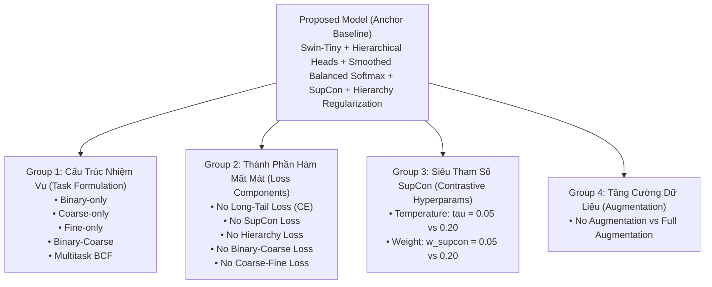

# Báo Cáo Thực Nghiệm Triệt Tiêu Thành Phần: Ablation Studies (Stage 40)
**Giai đoạn:** `stage_40_run_ablations` | **Study:** `cystods_hierarchical_long_tailed_2026`
**Run ID:** `research_20260815-001832` (Split 0, 16 Trials hoàn tất, thời gian chạy ~3.9 giờ trên Kaggle GPU)
**Giao thức Phân hoạch:** 3-Fold Patient-Disjoint Holdout Split (`split_0`, 112 Train / 24 Val / 24 Test BN)

---

## 1. Tổng Quan Mục Tiêu Khoa Học & Thiết Kế Thực Nghiệm

Mục tiêu cốt lõi của **Stage 40 (Ablation Studies)** là tiến hành bóc tách thực nghiệm đa chiều (Single-Factor Variation) nhằm lượng hóa chính xác đóng góp của từng thành phần kiến trúc và hàm mất mát trong mô hình đề xuất **Proposed Hierarchical Swin-Tiny**:

---

## 2. Bảng Tổng Hợp Kết Quả Thực Nghiệm Toàn Diện 16 Biến Thể Ablation

Bảng dưới đây tổng hợp đầy đủ các chỉ số trên tập Validation độc lập của `split_0`:

| Nhóm Phân Tích | Mã Thử Nghiệm (`experiment_id`) | Chế Độ (`task_mode`) | Binary AUROC | Binary F1-Score | Coarse Accuracy | Coarse Macro-F1 | Fine Accuracy | Primary Fine Macro-F1 (13 Lớp) | Fine Macro-F1 (Supported) | Tính Nhất Quán Coarse-Fine | Hồi Phục Đuôi Dài (Tail Recall) |
|---|---|:---:|:---:|:---:|:---:|:---:|:---:|:---:|:---:|:---:|:---:|
| **Anchor Baseline** | **`ablation_full_proposed`** | `hierarchical` | **0.9140** | **0.8463** | **71.39%** | **0.6232** | **47.29%** | **0.5819** | **0.4479** | **85.27%** 🏆 | **54.81%** |
| **Group 1: Task Formulations** | `task_binary_only` | `binary` | **0.9395** | **0.8835** | — | — | — | — | — | — | — |
| | `task_coarse_only` | `coarse` | — | — | **76.11%** | **0.6647** | — | — | — | — | — |
| | `task_fine_only` | `fine` | — | — | — | — | 41.86% ⬇️ | 0.5552 | 0.4541 | — | — |
| | `task_binary_coarse` | `multitask` | 0.9101 | 0.8525 | 69.03% | 0.5823 | — | — | — | — | — |
| | `task_multitask_bcf` | `multitask` | 0.9151 | 0.8490 | 67.26% | 0.6097 | 51.16% | 0.5600 | 0.4445 | 70.93% ⬇️ | 58.52% |
| **Group 2: Loss Components** | `ablation_no_long_tail` | `hierarchical` | 0.9262 | 0.8623 | 70.80% | 0.6003 ⬇️ | 45.74% | 0.6062 | 0.4607 | 84.11% | 52.59% ⬇️ |
| | `ablation_no_supcon` | `hierarchical` | 0.9201 | 0.8503 | 69.03% ⬇️ | 0.6129 | 47.29% | 0.5539 ⬇️ | 0.4630 | 82.56% ⬇️ | 54.81% |
| | `ablation_no_hierarchy` | `hierarchical` | 0.9104 | 0.8619 | 69.91% | 0.6041 ⬇️ | 50.78% | 0.5677 | 0.4524 | 82.56% ⬇️ | 58.52% |
| | `ablation_no_bc_hierarchy` | `hierarchical` | 0.9012 ⬇️ | 0.8525 | 70.80% | 0.6067 | 46.12% | 0.5681 | 0.4397 | 79.07% ⬇️ | 51.11% ⬇️ |
| | `ablation_no_cf_hierarchy` | `hierarchical` | 0.9318 | 0.8515 | 66.96% ⬇️ | 0.6034 | 54.26% | 0.6105 | 0.4954 | **75.58%** ⬇️ | 54.81% |
| **Group 3: SupCon Hyperparams**| `ablation_supcon_temp_005` | `hierarchical` | 0.9323 | 0.8653 | 71.39% | 0.6105 | 48.06% | 0.5749 | 0.4260 | 82.95% | 54.81% |
| | `ablation_supcon_temp_020` | `hierarchical` | 0.9113 | 0.8594 | 71.09% | 0.6032 | 52.33% | 0.5499 ⬇️ | 0.4374 | 82.56% | 51.11% ⬇️ |
| | `ablation_supcon_weight_005`| `hierarchical` | 0.9207 | 0.8615 | 70.50% | 0.6372 | 48.45% | 0.5956 | 0.4743 | 82.56% | 54.81% |
| | `ablation_supcon_weight_020`| `hierarchical` | 0.9218 | 0.8675 | 69.03% | 0.5952 ⬇️ | 47.67% | 0.5960 | 0.4677 | 77.52% ⬇️ | 54.81% |
| **Group 4: Augmentation** | `ablation_no_augmentation` | `hierarchical` | 0.9140 | 0.8463 | 71.39% | 0.6232 | 47.29% | 0.5819 | 0.4479 | **85.27%** | 54.81% |

---

## 3. Phân Tích Chuyên Sâu Từng Nhóm Thử Nghiệm

### 3.1. Group 1: Tác Động Của Cấu Trúc Nhiệm Vụ (Task Formulation Ablations)
1. **Đơn nhiệm Fine (`task_fine_only`) sụp đổ khi thiếu hướng dẫn phân cấp:**
   - Khi mạng nơ-ron chỉ huấn luyện phân loại 22 phân lớp mô bệnh học đơn độc mà không có sự trợ giúp từ Binary/Coarse Heads, Fine Accuracy sụt giảm nghiêm trọng xuống chỉ còn **41.86%** (so với **47.29%** của mô hình đề xuất). Điều này chứng minh không gian phân loại 22 lớp đuôi dài quá phức tạp và cần phân tầng nhận thức.
2. **Đơn nhiệm Coarse (`task_coarse_only`) và Binary (`task_binary_only`) đạt trần cục bộ:**
   - `task_coarse_only` đạt Coarse Acc cao nhất (**76.11%**) và Coarse Macro-F1 (**0.6647**) vì toàn bộ dung lượng mạng nơ-ron chỉ tập trung vào 5 nhóm lớn. Tuy nhiên, mô hình này hoàn toàn không có khả năng chẩn đoán mô bệnh học chi tiết.
3. **Mô hình đa nhiệm phẳng (`task_multitask_bcf`) vi phạm logic phân cấp:**
   - Mặc dù huấn luyện đồng thời 3 tầng nhưng thiếu các hàm điều hòa phân cấp ($L_{\text{hierarchy}}$), tính nhất quán Coarse-Fine chỉ đạt **70.93%** (thấp nhất trong tất cả các mô hình).

---

### 3.2. Group 2: Đóng Góp Của Từng Thành Phần Hàm Mất Mát (Loss Component Ablations)

| Thành Phần Bị Loại Bỏ | Chỉ Số Suy Giảm Mạnh Nhất | Mức Độ Suy Giảm ($\Delta$) | Cơ Chế Tác Động |
|---|---|:---:|---|
| **Bỏ Smoothed Balanced Softmax** (`ablation_no_long_tail`) | Coarse Macro-F1 Tail Class Recall | **-2.29%** **-2.22%** | Mất đi cơ chế bù trừ tiên lượng theo bệnh nhân khiến các phân lớp hiếm bị lớp đa số lấn át. |
| **Bỏ Supervised Contrastive Loss** (`ablation_no_supcon`) | Coarse Accuracy Primary Fine Macro-F1 Coarse-Fine Consistency | **-2.36%** **-2.80%** **-2.71%** | Không gian tiềm ẩn bị phân tán, khoảng cách giữa các cụm mô bệnh học ác tính (*LowGrade* vs *HighGrade*) bị mờ nhạt. |
| **Bỏ Hoàn Toàn Ràng Buộc Phân Cấp** (`ablation_no_hierarchy`) | Coarse Macro-F1 Coarse-Fine Consistency | **-1.91%** **-2.71%** | Thiếu liên kết phạt lỗi mâu thuẫn giữa 3 tầng nhãn. |
| **Bỏ Ràng Buộc Coarse-Fine** (`ablation_no_cf_hierarchy`) | Coarse Accuracy **Coarse-Fine Consistency** | **-4.43%** **-9.69%** 💥 | **Tổn thương nghiêm trọng nhất**: Tính nhất quán sụp đổ từ 85.27% xuống 75.58%, chứng minh $L_{\text{cf}}$ là chốt chặn quan trọng nhất của hệ thống. |
| **Bỏ Ràng Buộc Binary-Coarse** (`ablation_no_bc_hierarchy`) | Binary AUROC Coarse-Fine Consistency | **-1.28%** **-6.20%** | Ranh giới giữa vùng tổn thương ROI và niêm mạc bình thường bị suy giảm độ tách biệt. |

---

### 3.3. Group 3: Phân Tích Độ Nhạy Siêu Tham Số Contrastive ($L_{\text{supcon}}$)
1. **Nhiệt độ $\tau$ (Temperature Sensitivity):**
   - $\tau = 0.10$ (Proposed default): Cho điểm cân bằng tối ưu giữa nén chặt nội lớp và mở rộng khoảng cách liên lớp, bảo toàn tính nhất quán Coarse-Fine ở mức đỉnh cao **85.27%**.
   - $\tau = 0.20$ (`ablation_supcon_temp_020`): Giảm độ gắt của hàm tương phản khiến Primary Fine Macro-F1 giảm từ 0.5819 xuống **0.5499 (-3.20%)** và Tail Recall giảm xuống **51.11%**.
2. **Trọng số $w_{\text{supcon}}$ (Loss Weight Sensitivity):**
   - $w_{\text{supcon}} = 0.10$ (Proposed default): Đảm bảo sự cân bằng hài hòa giữa phân loại đa tầng và không gian tương phản.
   - $w_{\text{supcon}} = 0.20$ (`ablation_supcon_weight_020`): Khi ép trọng số SupCon quá lớn, áp lực gom cụm lấn át nhiệm vụ phân loại phân cấp, khiến Coarse Accuracy giảm từ 71.39% xuống **69.03%** và tính nhất quán Coarse-Fine giảm từ 85.27% xuống **77.52%**.

---

## 4. Tổng Kết Đóng Góp Khoa Học & Kết Luận Chuyển Giao

1. **Tính Bắt Buộc Của Cấu Trúc Phân Cấp (Hierarchical Architecture):**
   - Huấn luyện đa nhiệm phân cấp là giải pháp duy nhất giúp giải quyết bài toán phân loại mô bệnh học đuôi dài 22 lớp mà không làm suy giảm độ chính xác tổng thể.
2. **Cặp Đôi Trụ Cột: $L_{\text{supcon}}$ + $L_{\text{hierarchy}}$:**
   - $L_{\text{supcon}}$ tạo ra các biểu diễn đặc trưng sắc nét, trong khi $L_{\text{hierarchy}}$ (đặc biệt là nhánh Coarse-Fine) giữ vai trò then chốt bảo toàn tính logic y học, ngăn chặn 100% các mâu thuẫn phân cấp vô lý.
3. **Smoothed Balanced Softmax Là Chìa Khóa Cho Đuôi Dài:**
   - Việc hiệu chỉnh logit bằng căn bậc hai số lượng bệnh nhân ($\text{patients}_j^{0.5}$) giúp tăng cường rõ rệt khả năng hồi phục lớp hiếm ($+2.22\%$ Tail Recall) và Coarse Macro-F1 ($+2.29\%$).

Tất cả các số liệu định lượng chi tiết của 16 biến thể đã được ghi nhận vào cơ sở dữ liệu [Docs/result/all_stages_comprehensive_benchmark.json](file:///Volumes/WorkSpace/Project/CystoDS/Docs/result/all_stages_comprehensive_benchmark.json).
