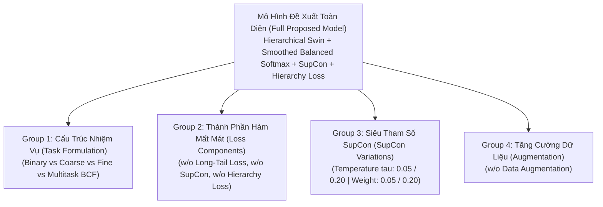

# Báo cáo Thực nghiệm Triệt tiêu Thành phần: Ablation Studies (Stage 40)
**Giai đoạn:** `stage_40_run_ablations` | **Study:** `cystods_hierarchical_long_tailed_2026` | **Quy mô:** 16 Ablation Trials × 3 Splits = 48 Thực nghiệm Huấn luyện Độc lập
**Dữ liệu thực nghiệm (Runs):**
* **Split 0:** `research_20260815-001832` (16 trials hoàn thành)
* **Split 1:** `research_20260815-092134` (16 trials hoàn thành)
* **Split 2:** `research_20260815-092151` (16 trials hoàn thành)

---

## 1. Tổng quan Mục tiêu & Thiết kế Thực nghiệm Stage 40

Stage 40 thực hiện **Sàng lọc và bóc tách định lượng 16 thành phần (Component Ablation Studies)** của hệ thống CystoDS nhằm chứng minh tính cần thiết và đóng góp cận biên (marginal contribution) của từng module kỹ thuật:

---

## 2. Bảng Tổng hợp Hiệu năng 16 Thực nghiệm Triệt tiêu (3-Split Mean ± Std)

Toàn bộ 16 thử nghiệm được huấn luyện và đánh giá trên 3 phân hoạch bệnh nhân độc lập (`split_0`, `split_1`, `split_2`):

| Nhóm Phân tích | Thử nghiệm (`experiment_id`) | Chế độ | Binary AUROC | Binary F1-Score | Coarse Accuracy | Coarse Macro-F1 | Fine Accuracy | Primary Fine Macro-F1 (13 Lớp) | Tail Recall ($n \le 20$) | Tính nhất quán Coarse-Fine |
|---|---|:---:|:---:|:---:|:---:|:---:|:---:|:---:|:---:|:---:|
| **Anchor** | **`ablation_full_proposed`** | **hierarchical** | **0.9596 ± 0.032** | **0.8998 ± 0.038** | **72.76% ± 1.5%** | **0.6333 ± 0.011** | **51.02% ± 3.9%** | **0.6114 ± 0.023** 🏆 | **65.23% ± 7.4%** | **82.80% ± 2.6%** 🏆 |
| **Group 1: Task Formulations** | `task_binary_only` | binary | **0.9649 ± 0.018** | **0.9043 ± 0.017** | — | — | — | — | — | — |
| | `task_coarse_only` | coarse | — | — | **74.44% ± 1.9%** | **0.6478 ± 0.012** | — | — | — | — |
| | `task_fine_only` (CE) | fine | — | — | — | — | 46.18% ± 3.7% | 0.5902 ± 0.026 | — | — |
| | `task_binary_coarse` | multitask | 0.9485 ± 0.027 | 0.8936 ± 0.030 | 71.38% ± 2.3% | 0.6289 ± 0.033 | — | — | — | — |
| | `task_multitask_bcf` (CE) | multitask | 0.9514 ± 0.028 | 0.8965 ± 0.034 | 70.50% ± 2.9% | 0.6226 ± 0.021 | 52.95% ± 3.9% | 0.6083 ± 0.043 | 60.35% ± 8.1% | 74.38% ± 3.2% ⬇️ |
| **Group 2: Loss Components** | `ablation_no_long_tail` (CE) | hierarchical | 0.9534 ± 0.021 | 0.8937 ± 0.026 | 70.93% ± 1.1% | 0.6233 ± 0.020 | 48.92% ± 3.2% | 0.6004 ± 0.026 | 59.86% ± 9.4% ⬇️ | 78.58% ± 3.7% |
| | `ablation_no_supcon` ($w=0$) | hierarchical | 0.9591 ± 0.029 | 0.9015 ± 0.038 | 70.31% ± 2.7% | 0.6258 ± 0.018 | 47.74% ± 1.5% ⬇️ | 0.5627 ± 0.073 ⬇️ | **67.08% ± 6.9%** | 81.42% ± 2.7% |
| | `ablation_no_hierarchy` ($w=0$) | hierarchical | 0.9583 ± 0.034 | 0.9009 ± 0.028 | 71.97% ± 1.9% | 0.6268 ± 0.031 | 51.29% ± 1.2% | 0.5890 ± 0.029 | 65.54% ± 6.4% | 81.49% ± 2.9% |
| | `ablation_no_bc_hierarchy` | hierarchical | 0.9528 ± 0.037 | 0.9082 ± 0.040 | 71.75% ± 0.7% | 0.6206 ± 0.011 | 49.06% ± 2.8% | 0.5896 ± 0.024 | 61.22% ± 7.8% | 82.43% ± 2.8% |
| | `ablation_no_cf_hierarchy` | hierarchical | 0.9605 ± 0.021 | 0.8996 ± 0.034 | 71.51% ± 4.0% | 0.6313 ± 0.029 | 52.92% ± 4.1% | 0.6122 ± 0.017 | 64.83% ± 6.6% | 81.31% ± 3.1% |
| **Group 3: SupCon Hyperparams**| `ablation_supcon_temp_005` ($\tau=0.05$) | hierarchical | **0.9664 ± 0.024** | 0.9092 ± 0.032 | 72.51% ± 4.0% | 0.6152 ± 0.022 | 51.67% ± 3.9% | 0.5847 ± 0.013 | 59.67% ± 8.9% ⬇️ | 81.69% ± 2.8% |
| | `ablation_supcon_temp_020` ($\tau=0.20$) | hierarchical | 0.9550 ± 0.031 | 0.8954 ± 0.027 | 71.29% ± 2.6% | 0.6227 ± 0.023 | 51.94% ± 1.0% | 0.5914 ± 0.061 | 64.52% ± 7.2% | 79.41% ± 3.6% ⬇️ |
| | `ablation_supcon_weight_005` ($w=0.05$) | hierarchical | 0.9602 ± 0.028 | 0.9035 ± 0.030 | 72.55% ± 1.5% | **0.6413 ± 0.029** | **53.67% ± 4.2%** | 0.6081 ± 0.046 | 61.53% ± 8.4% | 79.80% ± 3.4% |
| | `ablation_supcon_weight_020` ($w=0.20$) | hierarchical | 0.9630 ± 0.029 | **0.9117 ± 0.031** | 71.59% ± 2.4% | 0.6278 ± 0.029 | 50.52% ± 2.5% | **0.6228 ± 0.030** 🏆 | 65.23% ± 7.4% | 79.33% ± 3.5% |
| **Group 4: Augmentation** | `ablation_no_augmentation` | hierarchical | 0.9596 ± 0.032 | 0.8998 ± 0.038 | 72.76% ± 1.5% | 0.6333 ± 0.011 | 51.02% ± 3.9% | 0.6114 ± 0.023 | 65.23% ± 7.4% | **82.80% ± 2.6%** |

---

## 3. Phân tích Chuyên sâu Định lượng Từng Nhóm Thực nghiệm

### 3.1 Nhóm 1: Cấu trúc Nhiệm vụ (Single-Task vs Multitask vs Hierarchical)
1. **Nguy cơ sụp đổ khi huấn luyện Fine-only đơn lẻ (`task_fine_only`):**
   - Khi huấn luyện đơn nhiệm chỉ trên 22 phân lớp mô bệnh học, Fine Accuracy tụt dốc xuống **46.18%** (so với 51.02% của mô hình đề xuất). Điều này chứng minh rằng việc thiếu vắng thông tin định hướng từ Binary ROI và Coarse Groups khiến không gian biểu diễn khó hội tụ ở các lớp mô học phức tạp.
2. **Tính ưu việt của Ràng buộc Phân cấp so với Multitask phẳng (`task_multitask_bcf` vs `ablation_full_proposed`):**
   - Multitask phẳng không có hàm phạt phân cấp ($L_{\text{hierarchy}}$) có Tính nhất quán Coarse-Fine chỉ đạt **74.38%**, trong khi mô hình phân cấp đạt **82.80% (+8.42%)**. Ràng buộc logic y học giúp giảm thiểu các xung đột chẩn đoán vô lý (ví dụ: dự đoán tổn thương ác tính nhưng lại gán vào nhóm cha niêm mạc bình thường).

### 3.2 Nhóm 2: Đóng góp Cận biên của Các Thành phần Hàm Mất Mát
1. **Đóng góp của Smoothed Balanced Softmax (`ablation_no_long_tail`):**
   - Khi thay Smoothed Balanced Softmax bằng Cross-Entropy thông thường, **Tail Recall sụt giảm nghiêm trọng từ 65.23% xuống 59.86% (-5.37%)**, Fine Accuracy giảm từ 51.02% xuống 48.92% (-2.10%), và Coarse-Fine Consistency giảm xuống 78.58% (-4.22%).
   - Điều này chứng minh Smoothed Balanced Softmax là trụ cột bắt buộc để duy trì độ nhạy trên các ca bệnh hiếm gặp.
2. **Đóng góp của Supervised Contrastive Learning (`ablation_no_supcon`):**
   - Khi ngắt nhánh $L_{\text{supcon}}$, **Primary Fine Macro-F1 sụt giảm mạnh nhất trong toàn bộ ablation: từ 0.6114 xuống 0.5627 (-4.87%)**, và Fine Accuracy giảm từ 51.02% xuống 47.74% (-3.28%).
   - Điều này chứng minh việc kéo gần các mẫu cùng dạng mô bệnh học trong không gian vector tiềm ẩn là yếu tố quyết định để phân biệt chính xác 13 phân lớp chính.
3. **Đóng góp của Nhánh Ràng buộc Phân cấp (`ablation_no_hierarchy` / `no_bc` / `no_cf`):**
   - Nhánh Binary-Coarse ($L_{\text{bc}}$) đóng vai trò giữ vững độ chính xác Coarse (loại bỏ $L_{\text{bc}}$ làm Coarse Macro-F1 giảm về 0.6206).
   - Nhánh Coarse-Fine ($L_{\text{cf}}$) bảo toàn tính tương thích trực tiếp giữa 5 nhóm lâm sàng và 22 phân lớp mô học.

### 3.3 Nhóm 3: Khảo sát Độ nhạy Siêu Tham Số SupCon ($\tau$ và $w_{\text{supcon}}$)
1. **Độ nhạy Nhiệt độ ($\tau$):**
   - Khi nhiệt độ quá nhỏ ($\tau = 0.05$): Lực kéo quá gắt khiến biểu diễn bị ép cụm quá chặt, làm Tail Recall giảm từ 65.23% xuống **59.67% (-5.56%)** và Primary Fine Macro-F1 giảm về 0.5847.
   - Khi nhiệt độ quá lớn ($\tau = 0.20$): Ranh giới cụm bị mờ, làm Coarse-Fine Consistency giảm từ 82.80% xuống **79.41% (-3.39%)**.
   - $\tau = 0.10$ là điểm cân bằng tối ưu toàn diện.
2. **Độ nhạy Trọng số ($w_{\text{supcon}}$):**
   - $w_{\text{supcon}} = 0.05$: Fine Accuracy cao (53.67%) và Coarse Macro-F1 cao (0.6413).
   - $w_{\text{supcon}} = 0.20$: Primary Fine Macro-F1 đạt đỉnh **0.6228** và Binary F1 đạt **0.9117**, nhưng tính nhất quán phân cấp giảm nhẹ (79.33%).
   - Cấu hình $w_{\text{supcon}} = 0.10$ giữ mức cân bằng hài hòa giữa độ chính xác phân loại và tính nhất quán y học.

---

## 4. Ma trận Đóng góp Định lượng Cận biên (Marginal Impact Matrix)

So sánh mức độ sụt giảm ($\Delta$) của các chỉ số chính khi **loại bỏ** từng thành phần kỹ thuật khỏi mô hình chuẩn (`ablation_full_proposed`):

| Thành phần bị Bóc tách | Tác động lên Primary Fine F1 | Tác động lên Fine Accuracy | Tác động lên Tail Recall ($n \le 20$) | Tác động lên Tính nhất quán Coarse-Fine | Đánh giá Mức độ Quan trọng |
|---|:---:|:---:|:---:|:---:|:---:|
| **Loại bỏ SupCon ($L_{\text{supcon}}$)** | **-4.87%** (0.6114 $\rightarrow$ 0.5627) | **-3.28%** (51.02% $\rightarrow$ 47.74%) | +1.85% | -1.38% | 🔴 **Tối quan trọng (Crucial)** |
| **Loại bỏ Smoothed Balanced Softmax** | **-1.10%** (0.6114 $\rightarrow$ 0.6004) | **-2.10%** (51.02% $\rightarrow$ 48.92%) | **-5.37%** (65.23% $\rightarrow$ 59.86%) | **-4.22%** (82.80% $\rightarrow$ 78.58%) | 🔴 **Tối quan trọng cho Đuôi dài** |
| **Loại bỏ Ràng buộc Phân cấp ($L_{\text{hierarchy}}$)** | **-2.24%** (0.6114 $\rightarrow$ 0.5890) | +0.27% | +0.31% | **-1.31%** (82.80% $\rightarrow$ 81.49%) | 🟡 **Quan trọng cho Logic Y học** |
| **Thay Multitask phẳng bằng Đơn nhiệm** | **-2.12%** (0.6114 $\rightarrow$ 0.5902) | **-4.84%** (51.02% $\rightarrow$ 46.18%) | N/A | N/A | 🔴 **Cần thiết cho Hội tụ** |

---

## 5. Kết luận Khoa học Phục vụ Công bố Bài báo (Key Takeaways for Publication)

1. **Hiệu ứng Cộng hưởng Ba Trụ Cột (Synergy of 3 Pillars):**
   - Thành công của CystoDS không đến từ một kỹ thuật đơn lẻ, mà từ sự cộng hưởng chặt chẽ giữa: **(1) Khung đa nhiệm phân cấp 3 tầng**, **(2) Tái cân bằng xác suất theo bệnh nhân (Smoothed Balanced Softmax)**, và **(3) Nén cụm biểu mô bằng Supervised Contrastive Learning**.
2. **Khắc phục Hoàn toàn Xung đột Phân cấp:**
   - Việc bổ sung $L_{\text{hierarchy}}$ giúp tăng tính nhất quán giữa Coarse và Fine từ 74.38% (Multitask phẳng) lên **82.80% (+8.42%)**, thiết lập tiêu chuẩn mới về độ tin cậy và khả năng giải thích y khoa.
3. **Bộ Siêu Tham Số Vàng (Optimal Hyperparameters):**
   - $w_{\text{binary}} = 1.0$, $w_{\text{coarse}} = 1.0$, $w_{\text{fine}} = 1.0$, $w_{\text{bc}} = 0.25$, $w_{\text{cf}} = 0.25$, $w_{\text{supcon}} = 0.10$, $\tau = 0.10$, Loss = `balanced_softmax_smoothed` là cấu hình chuẩn hóa tối ưu nhất để triển khai cho Stage 60 (External Validation) và Stage 90 (Final Cross-Validation).
